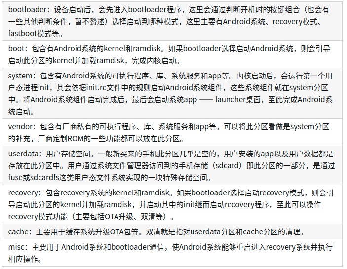
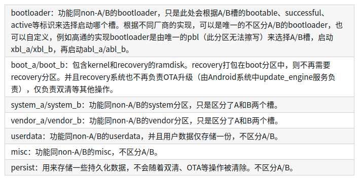

## 存储

Android 一直在不断发展，以期支持各种存储设备类型和功能。所有 Android 版本均支持配有传统存储空间（包括便携式存储空间和模拟存储空间）的设备。

便携式存储空间是指物理介质（例如 SD 卡或 USB 设备），用于进行临时数据传输/文件存储。物理介质可以随设备一起保留更长时间，但并非固定在设备上，可以移除。

自 Android 1.0 开始，SD 卡已可用作便携式存储；Android 6.0 增加了对 USB 的支持。模拟存储空间可通过将部分内部存储空间暴露于模拟层来实现，

从 Android 3.0 开始便已支持此功能。

从 Android 6.0 开始，Android 支持可合并的存储设备，这种存储设备是指可以像内部存储设备那样进行加密和格式化的物理介质（例如 SD 卡或 USB 设备）。

可合并的存储设备可存储各类应用数据。

分区存储

bookmark_border
分区存储会限制应用访问外部存储空间。在 Android 11 或更高版本中，以 API 30 或更高版本为目标平台的应用必须使用分区存储。之前，在 Android 10 中，应用可以选择停用分区存储。

应用访问限制
分区存储的目标是保护应用和用户数据的隐私。这包括保护用户信息（例如照片元数据）、防止应用在未经明确许可的情况下修改或删除用户文件，以及保护下载到“下载”或其他文件夹的敏感用户文档。

使用分区存储的应用可具有以下访问权限级别（实际访问权限因实现而异）。

对自己的文件拥有读取和写入访问权限（没有权限限制）
对其他应用的媒体文件拥有读取访问权限（需要具备 READ_EXTERNAL_STORAGE 权限）
只有在用户直接同意的情况下，才允许对其他应用的媒体文件拥有写入访问权限（系统图库以及符合“所有文件访问权限”获取条件的应用除外）
对其他应用的外部应用数据目录没有读取或写入访问权限

## 一、传统分区结构(non-A/B)
首先简单梳理一下Android传统的分区结构。

传统分区结构下，系统的OTA升级流程比较简单，主要过程如下：

Android系统收到服务端下发的OTA推送，将OTA包下载至cache分区。

OTA包下载完成后，将向misc分区写入指令，表明下次启动时进入recovery模式并使用该OTA包进行升级。

重启手机。

重启后最先进入bootloader，bootloader会先判断按键组合、电源寄存器等，随后会读取misc分区的内容并解析。由于步骤2中已经向misc分区写入了指令，此处bootloader读取指令后会引导启动recovery系统。

进入recovery，读取cache分区中的OTA包，并解析其中的升级脚本，按照其指令对系统各个分区进行升级。如果recovery自身也需要升级，会在此过程中向system中写入recovery-from-boot.p文件，这是一个recovery升级所需要的patch。

recovery会清除misc分区。

重启手机。

重启后最先进入bootloader，判断按键组合、电源寄存器、misc分区内容等，默认情况会启动Android系统，此时已经是OTA升级后的新版本系统。

新版本Android系统启动后，会检查是否存在recovery-from-boot.p文件，如果存在，则会对recovery进行升级。

## 二、A/B分区结构

在Android O之后，Google引入了一种新的分区结构，称为A/B分区，与之对应，传统分区结构被称为non-A/B分区。

A/B分区结构，顾名思义，将系统分区分成了A和B两个槽(slot)，手机启动时会选择A槽或者B槽启动，运行过程中仅使用当前槽位的分区。一旦当前运行的槽出现问题，系统仍可以选择另一个槽进行启动，从而保证系统良好的可用性。

采用A/B分区结构，能够实现无缝升级。例如用户正在运行A槽，此时收到OTA推送，则系统会在后台一边下载OTA数据，一边同时对B槽进行升级。当B槽系统升级完成，用户会收到重启提示，

此时重启手机将自动切换到B槽的新版本系统。在此过程中，仅重启操作是会被用户感知的，这个重启与普通重启的耗时没有什么区别。

如果OTA失败，也仅仅是待升级的槽出现问题，可以重新尝试OTA，并不会影响用户当前运行的系统。

由于A/B分区结构可以实现一边从服务端获取OTA数据，一边直接写入待升级的槽，不需要临时存储OTA包的空间，因此不再需要在cache或userdata分区预留足够空间。

Google定义了A/B槽的几种标识：

bootable：标识该槽的系统是否可以启动。有时也用unbootable来标识（例如高通），含义与bootable相反。
successful：标识该槽的系统是否成功启动过，仅当该槽系统能够启动、运行、进行OTA升级时，才会从用户态标记该槽为successful。
active：标识该槽是否是当前运行的系统，两个槽中只有一个能标记为active。

系统重启后，在zygote启动前，init会调用update_verifier服务通过dm-verity机制校验本次升级的镜像， 通过后则会被标记为successful。

如果系统当前active的槽反复多次启动都没能标记为successful，则将该槽标记为unbootable，并将另外一个槽标记为active。

下面看看A/B分区结构发生了哪些变化：

这里需要说明一下，recovery集成在boot中，是由TARGET_NO_RECOVERY和BOARD_USES_RECOVERY_AS_BOOT等变量决定的。

如下图所示为Google官方对于A/B分区结构的配置：

动态分区
自Android Q(10.0)以后，系统支持动态分区（dynamic partition），

它将多个系统只读分区（包括system、product、vendor、odm或者其他厂商自定义分区）合并为一个super分区。

物理分区只有super分区的概念，而没有system等分区。因此使用fastboot刷机时，是无法直接通过命令