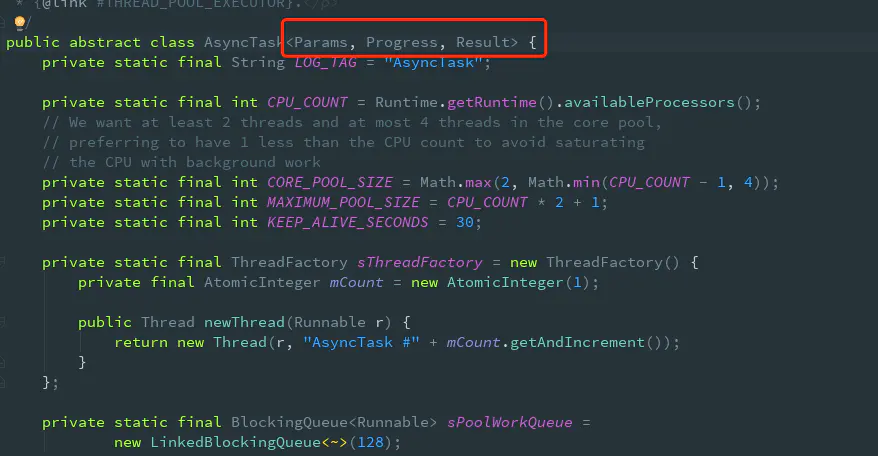
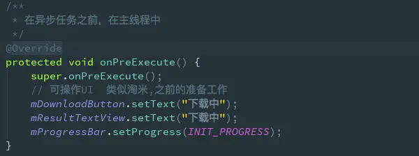
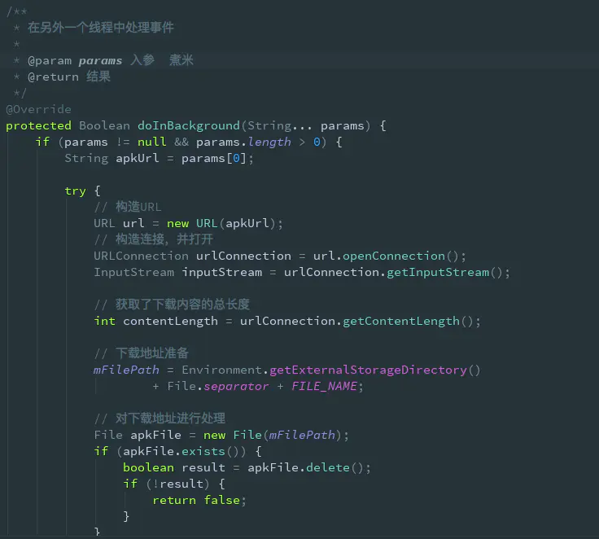
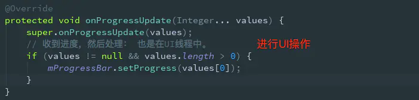
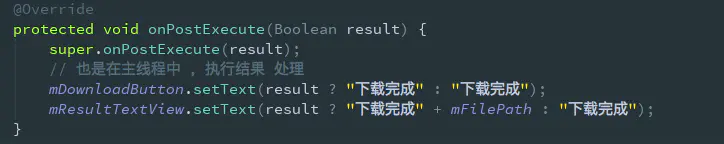

## Android AsyncTask详解

### 1: 什么是AsyncTask？

1. AsyncTask是一个抽象类，本质上就是封装了一个线程池和handler的异步框架，它是由Android封装的一个轻量级异步类（轻量体现在使用方便、代码简洁），
它可以在线程池中执行后台任务，然后把执行的进度和最终结果传递给主线程并在主线程中更新UI。
2. AsyncTask的内部封装了两个线程池(SerialExecutor和THREAD_POOL_EXECUTOR)和一个Handler(InternalHandler)。
3. 其中SerialExecutor线程池用于任务的排队，让需要执行的多个耗时任务，按顺序排列，
4. THREAD_POOL_EXECUTOR线程池才真正地执行任务，InternalHandler用于从工作线程切换到主线程。

### 2.  AsyncTask的使用方法

AsyncTask是一个抽象泛型类。

其中，三个泛型类型参数的含义如下：

Params：开始异步任务执行时传入的参数类型；

Progress：异步任务执行过程中，返回下载进度值的类型；

Result：异步任务执行完成后，返回的结果类型；

如果AsyncTask确定不需要传递具体参数，那么这三个泛型参数可以用Void来代替。

有了这三个参数类型之后，也就控制了这个AsyncTask子类各个阶段的返回类型，如果有不同业务，我们就需要再另写一个AsyncTask的子类进行处理。

### 3. AsyncTask常用方法总结

onPreExecute

这个方法会在后台任务开始执行之间调用，在主线程执行。用于进行一些界面上的初始化操作，比如显示一个进度条对话框等。

doInBackground(Params...)
这个方法中的所有代码都会在子线程中运行，我们应该在这里去处理所有的耗时任务。

任务一旦完成就可以通过return语句来将任务的执行结果进行返回，如果AsyncTask的第三个泛型参数指定的是Void，就可以不返回任务执行结果。注意，在这个方法中是不可以进行UI操作的，如果需要更新UI元素，比如说反馈当前任务的执行进度，可以调用publishProgress(Progress...)方法来完成。

onProgressUpdate(Progress...)

当在后台任务中调用了publishProgress(Progress...)方法后，这个方法就很快会被调用，
方法中携带的参数就是在后台任务中传递过来的。在这个方法中可以对UI进行操作，在主线程中进行，
利用参数中的数值就可以对界面元素进行相应的更新。

onPostExecute(Result)

当doInBackground(Params...)执行完毕并通过return语句进行返回时，这个方法就很快会被调用。
返回的数据会作为参数传递到此方法中，可以利用返回的数据来进行一些UI操作，在主线程中进行，比如说提醒任务执行的结果，以及关闭掉进度条对话框等。

上面几个方法的调用顺序：

onPreExecute() --> doInBackground() --> publishProgress() --> onProgressUpdate() --> onPostExecute()

如果不需要执行更新进度则为

onPreExecute() --> doInBackground() --> onPostExecute(),

除了上面四个方法，AsyncTask还提供了onCancelled()方法，它同样在主线程中执行，当异步任务取消时，
onCancelled()会被调用，这个时候onPostExecute()则不会被调用，但是要注意的是，
AsyncTask中的cancel()方法并不是真正去取消任务，只是设置这个任务为取消状态，
我们需要在doInBackground()判断终止任务。就好比想要终止一个线程，调用interrupt()方法，
只是进行标记为中断，需要在线程内部进行标记判断然后中断线程。

### 4. AsyncTask的内部原理
1、AsyncTask的本质是一个静态的线程池，AsyncTask派生出的子类可以实现不同的异步任务，这些任务都是提交到静态的线程池中之行。

2、线程池中的工作线程之行doInBackground(mParams)方法执行异步任务。

3、当任务状态改变之后，工作线程会向UI线程发送消息，AsyncTask内部的InternalHandler响应这些消息，并调用相关的回调函数。

