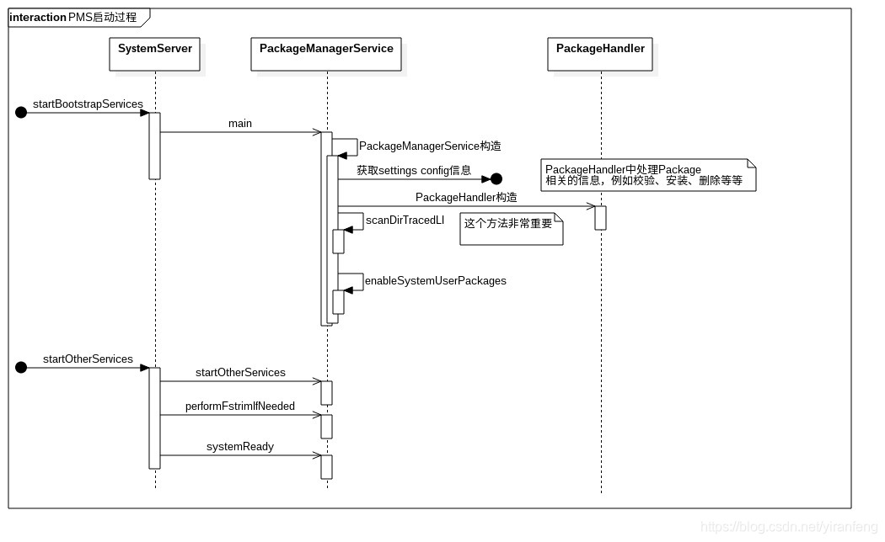
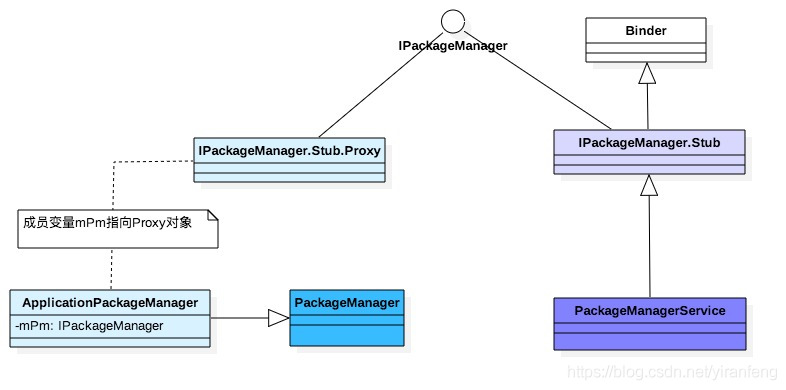
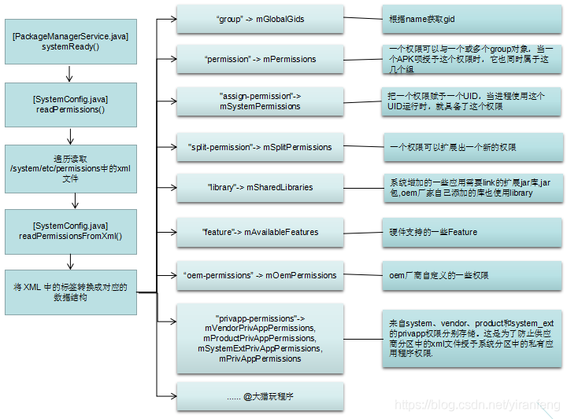
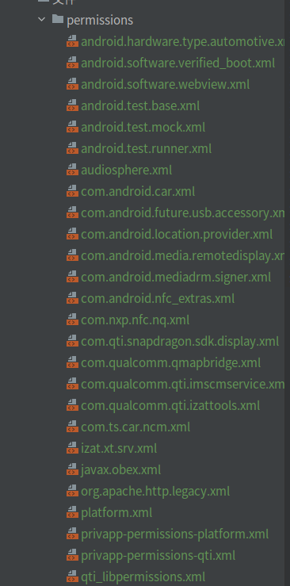
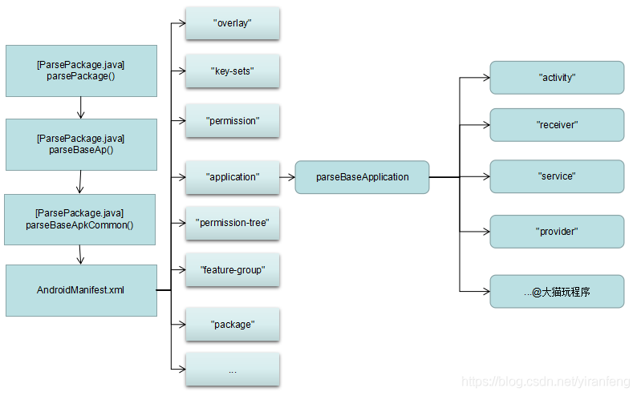

# PKMS工作流程及启动流程 Android 10.0

PackageManagerService是Android系统核心服务之一，在Android中的非常重要，主要负责的功能如下：

解析 AndroidManifest.xml，主要包括AndroidManifest中节点信息的解析和target-name的分析和提炼

扫描本地文件，主要针对apk，主要是系统应用、本地安装应用等等。这部分会在下面仔细讲解。

管理本地apk，主要包括安装、删除等等。

下面称PackageManagerService为PKMS。

## PKMS启动流程



## PKMS 继承关系



## 权限管理



> 这里提到了解析/system/etc/permissions中得xml文件，来看看有那些文件
[permissions](文件/permissions)

platform.xml中出现的标签种类则较为多样，它们的含义分别是：

<group>:根据name获取gid

<permission >标签：把属性name所描述的权限赋予给<group>标签中属性gid所表示的用户组，一个权限可以有一个或多个group对象，当一个APK授权于这个这个权限时，它同时属于这几个组

<assign-permission>标签：把属性name所描述的权限赋予给uid属性所表示的用户

<split-permission>标签：一个权限可以扩展出一个新的权限

<library>标签：除framework中动态库以外的，所有系统会自动加载的动态库

<feature>标签：硬件支持的一些feature

<oem-permission>标签：oem厂商自己定义的一些权限

<privapp-permission>标签：来自system、vendor、product、system_ext的privapp权限分别存储，这是防止供应商分区中的xml授权于系统分区中的私有应用权限

PKMS systemReady()时，通过SystemConfig的readPermissionsFromXml()来扫描读取/system/etc/permissions中的xml文件,
包括platform.xml和系统支持的各种硬件模块的feature主要工作:

readPermissions() 扫描/system/etc/permissions中文件，调用 readPermissionsFromXml()进行解析，存入System Config相应的成员数组变量中
解析xml的标签节点，存入mGlobalGids、mPermissions、mSystemPermissions等成员变量中，供其他进行调用

```java
class readPermission {

    void readPermissions(File libraryDir, int permissionFlag) {
  ...
        // Iterate over the files in the directory and scan .xml files
        File platformFile = null;
        for (File f : libraryDir.listFiles()) {
            if (!f.isFile()) {
                continue;
            }

            // 最后读取platform.xml
            if (f.getPath().endsWith("etc/permissions/platform.xml")) {
                platformFile = f;
                continue;
            }
        ...
            readPermissionsFromXml(f, permissionFlag);
        }

        // Read platform permissions last so it will take precedence
        if (platformFile != null) {
            readPermissionsFromXml(platformFile, permissionFlag);
        }
    }


    private void readPermissionsFromXml(File permFile, int permissionFlag) {
        FileReader permReader = null;
        permReader = new FileReader(permFile);
    ...
        XmlPullParser parser = Xml.newPullParser();
        parser.setInput(permReader);

        while (true) {
        ...
            String name = parser.getName();
            switch (name) {
                //解析 group 标签，前面介绍的 XML 文件中没有单独使用该标签的地方
                case "group": {
                    String gidStr = parser.getAttributeValue(null, "gid");
                    if (gidStr != null) {
                        int gid = android.os.Process.getGidForName(gidStr);
                        //转换 XML 中的 gid字符串为整型，并保存到 mGlobalGids 中
                        mGlobalGids = appendInt(mGlobalGids, gid);
                    } else {
                        Slog.w(TAG, "<" + name + "> without gid in " + permFile + " at "
                                + parser.getPositionDescription());
                    }
                ...
                } break;
                case "permission": { //解析 permission 标签
                    if (allowPermissions) {
                        String perm = parser.getAttributeValue(null, "name");
                        if (perm == null) {
                            Slog.w(TAG, "<" + name + "> without name in " + permFile + " at "
                                    + parser.getPositionDescription());
                            XmlUtils.skipCurrentTag(parser);
                            break;
                        }
                        perm = perm.intern();
                        readPermission(parser, perm); //调用 readPermission 处理,存入mPermissions
                    } else {
                        logNotAllowedInPartition(name, permFile, parser);
                        XmlUtils.skipCurrentTag(parser);
                    }
                }
                break;
            }
        }
    }
}
```



> AOSP 使用的解析XML是怎样解析的呢， 工具有那些呢？

安卓中有三种对XML解析的方式，这个众所周知，
DOM
SAX
PULL

Android内部是用的pull解析
PULL是顺序扫描XML的每一行，并且根据扫描到的事件来做出不同的行为，事件驱动
PULL一共有5种事件类型：

* START_DOCUMENT：文档的开始，解析器尚未读取任何输入。
* START_TAG：开始标签的解析。
* TEXT：标签内元素的内容解析。
* END_TAG：结束标签的解析。
* END_DOCUMENT：文档的结束。

JAVA 解析 XML 通常有两种方式：DOM 和SAX（PULL）

DOM
DOM是结构化解析，会在内存中维护一个完整的XML的树状结构，开销大，对某些复杂需求可能比较方便
XML DOM 是 XML Document Object Model 的缩写，即 XML 文档对象模型。
DOM（文档对象模型）是W3C标准，提供了标准的解析方式，但其解析效率一直不尽如人意，
这是因为DOM解析XML文档时，把所有内容一次性的装载入内存，并构建一个驻留在内存中的树状结构（节点数）。
如果需要解析的XML文档过大，或者我们只对该文档中的一部分感兴趣，这样就会引起性能问题。
它有一个非常庞大的事件库
SAX（PULL）
SAX和PULL的原理是一样的，都不维护什么完整的结构，而是逐行扫描，不保存结构关系，开销小，适合简单的需求
（两者区别是，SAX使用回调的方式实现，PULL使用switch case的方式实现）
SAX是事件驱动型XML解析的一个标准接口，SAX的工作原理简单地说就是对文档进行顺序扫描，
当扫描到文档（document）开始与结束、元素（element）开始与结束、文档（document）结束等地方时通知事件处理函数，
由事件处理函数做相应动作，然后继续同样的扫描，直至文档结束。

## APK扫描

扫描APK的AndroidManifest.xml中的各个标签信息，

例如"application"、"overlay"、"permission"、"uses-permission"等信息。

再针对各个标签的子标签进程扫描，

例如application会扫描"activity"、"receiver"、"service"、"provider"等信息



PackageManagerService的构造函数中调用了scanDirTracedLI方法来扫描某个目录的apk文件。Android 10.0中，PKMS主要扫描以下路径的APK信息：

/vendor/overlay
/product/overlay
/product_services/overlay
/odm/overlay
/oem/overlay
/system/framework
/system/priv-app
/system/app
/vendor/priv-app
/vendor/app
/odm/priv-app
/odm/app
/oem/app
/oem/priv-app
/product/priv-app
/product/app
/product_services/priv-app
/product_services/app
/product_services/priv-app

scanDirTracedLI的入口很简单，首先加入了一些systtrace的日志追踪，然后调用scanDirLI()进行分析canDirLI()

scanDirLI()中使用了ParallelPackageParser的对象，ParallelPackageParser是一个队列，我们这里手机所有系统的apk，
然后从这些队列里面取出apk，再调用PackageParser 解析进行解析

把扫描路径中的APK等内容，放入队列mQueue，并把parsePackage()赋给ParseResult，用于后面的调用

通过parsePackage 进行apk解析，如果传入的packageFile是目录，调用parseClusterPackage()解析，
如果传入的是APK文件，就调用parseMonolithicPackage()解析

在 PackageParser 扫描完一个 APK 后，此时系统已经根据该 APK 中 AndroidManifest.xml，创建了一个完整的 Package 对象，
下一步就是将该 Package 加入到系统中
```java
class PMS {
    private void scanDirLI(File scanDir, int parseFlags, int scanFlags, long currentTime) {
        final File[] files = scanDir.listFiles();
        if (ArrayUtils.isEmpty(files)) {
            Log.d(TAG, "No files in app dir " + scanDir);
            return;
        }

        if (DEBUG_PACKAGE_SCANNING) {
            Log.d(TAG, "Scanning app dir " + scanDir + " scanFlags=" + scanFlags
                    + " flags=0x" + Integer.toHexString(parseFlags));
        }
        //parallelPackageParser是一个队列，收集系统 apk 文件，
        //然后从这个队列里面一个个取出 apk ，调用 PackageParser 解析
        try (ParallelPackageParser parallelPackageParser = new ParallelPackageParser(
                mSeparateProcesses, mOnlyCore, mMetrics, mCacheDir,
                mParallelPackageParserCallback)) {
            // Submit files for parsing in parallel
            int fileCount = 0;
            for (File file : files) {
                //是Apk文件，或者是目录
                final boolean isPackage = (isApkFile(file) || file.isDirectory())
                        && !PackageInstallerService.isStageName(file.getName());
                // 过滤掉非　apk　文件 如果不是则跳过继续扫描
                if (!isPackage) {
                    // Ignore entries which are not packages
                    continue;
                }
                //把APK信息存入parallelPackageParser中的对象mQueue，PackageParser()函数赋给了队列中的pkg成员
                //参考[6.3]
                parallelPackageParser.submit(file, parseFlags);
                fileCount++;
            }

            // Process results one by one
            for (; fileCount > 0; fileCount--) {
                //从parallelPackageParser中取出队列apk的信息
                ParallelPackageParser.ParseResult parseResult = parallelPackageParser.take();
                Throwable throwable = parseResult.throwable;
                int errorCode = PackageManager.INSTALL_SUCCEEDED;

                if (throwable == null) {
                    // TODO(toddke): move lower in the scan chain
                    // Static shared libraries have synthetic package names
                    if (parseResult.pkg.applicationInfo.isStaticSharedLibrary()) {
                        renameStaticSharedLibraryPackage(parseResult.pkg);
                    }
                    try {
                        //调用 scanPackageChildLI 方法扫描一个特定的 apk 文件
                        // 该类的实例代表一个 APK 文件，所以它就是和 apk 文件对应的数据结构。
                        //参考[6.4]
                        scanPackageChildLI(parseResult.pkg, parseFlags, scanFlags,
                                currentTime, null);
                    } catch (PackageManagerException e) {
                        errorCode = e.error;
                        Slog.w(TAG, "Failed to scan " + parseResult.scanFile + ": " + e.getMessage());
                    }
                } else if (throwable instanceof PackageParser.PackageParserException) {
                    PackageParser.PackageParserException e = (PackageParser.PackageParserException)
                            throwable;
                    errorCode = e.error;
                    Slog.w(TAG, "Failed to parse " + parseResult.scanFile + ": " + e.getMessage());
                } else {
                    throw new IllegalStateException("Unexpected exception occurred while parsing "
                            + parseResult.scanFile, throwable);
                }

                // Delete invalid userdata apps
                //如果是非系统 apk 并且解析失败
                if ((scanFlags & SCAN_AS_SYSTEM) == 0 &&
                        errorCode != PackageManager.INSTALL_SUCCEEDED) {
                    logCriticalInfo(Log.WARN,
                            "Deleting invalid package at " + parseResult.scanFile);
                    // 非系统 Package 扫描失败，删除文件
                    removeCodePathLI(parseResult.scanFile);
                }
            }
        }
    }


    // 把扫描路径中的APK等内容，放入队列mQueue，并把parsePackage()赋给ParseResult，用于后面的调用
    public void submit(File scanFile, int parseFlags) {
        mService.submit(() -> {
            ParseResult pr = new ParseResult();
            Trace.traceBegin(TRACE_TAG_PACKAGE_MANAGER, "parallel parsePackage [" + scanFile + "]");
            try {
                PackageParser pp = new PackageParser();
                pp.setSeparateProcesses(mSeparateProcesses);
                pp.setOnlyCoreApps(mOnlyCore);
                pp.setDisplayMetrics(mMetrics);
                pp.setCacheDir(mCacheDir);
                pp.setCallback(mPackageParserCallback);
                pr.scanFile = scanFile;
                pr.pkg = parsePackage(pp, scanFile, parseFlags);
            } catch (Throwable e) {
                pr.throwable = e;
            } finally {
                Trace.traceEnd(TRACE_TAG_PACKAGE_MANAGER);
            }
            try {
                mQueue.put(pr);
            } catch (InterruptedException e) {
                Thread.currentThread().interrupt();
                // Propagate result to callers of take().
                // This is helpful to prevent main thread from getting stuck waiting on
                // ParallelPackageParser to finish in case of interruption
                mInterruptedInThread = Thread.currentThread().getName();
            }
        });
    }

    // arsePackage 进行apk解析，如果传入的packageFile是目录，调用parseClusterPackage()解析，
    // 如果传入的是APK文件，就调用parseMonolithicPackage()解析
    public Package parsePackage(File packageFile, int flags, boolean useCaches)
            throws PackageParserException {
=
        if (packageFile.isDirectory()) {
            //如果传入的packageFile是目录，调用parseClusterPackage()解析
            parsed = parseClusterPackage(packageFile, flags);
        } else {
            //如果是APK文件，就调用parseMonolithicPackage()解析
            parsed = parseMonolithicPackage(packageFile, flags);
        }
        return parsed;
    }
}
```

我们先来看看parseClusterPackage()
作用：解析给定目录中包含的所有apk，将它们视为单个包。这还可以执行完整性检查，比如需要相同的包名和版本代码、单个基本APK和惟一的拆分名称
首先通过parseClusterPackageLite()对目录下的apk文件进行初步分析，主要区别是核心应用还是非核心应用。核心应用只有一个，非核心应用可以没有，或者多个，
非核心应用的作用主要用来保存资源和代码。然后对核心应用调用parseBaseApk分析并生成Package。对非核心应用调用parseSplitApk，分析结果放在前面的Package对象中

再看parseMonolithicPackage()，它的作用是解析给定的APK文件，将其作为单个单块包处理。
最终也是调用parseBaseApk()进行解析，我们接下来看下parseBaseApk()

parseBaseApk()主要是对AndroidManifest.xml进行解析，解析后所有的信息放在Package对象中。

针对"application"进行展开分析一下，进入parseBaseApplication()函数

```java
class PMS {

    private Package parseClusterPackage(File packageDir, int flags) throws PackageParserException {
        //获取应用目录的PackageLite对象，这个对象分开保存了目录下的核心应用以及非核心应用的名称
        final PackageLite lite = parseClusterPackageLite(packageDir, 0);
        //如果lite中没有核心应用，退出
        if (mOnlyCoreApps && !lite.coreApp) {
            throw new PackageParserException(INSTALL_PARSE_FAILED_MANIFEST_MALFORMED,
                    "Not a coreApp: " + packageDir);
        }

        // Build the split dependency tree.
        //构建分割的依赖项树
        SparseArray<int[]> splitDependencies = null;
        final SplitAssetLoader assetLoader;
        if (lite.isolatedSplits && !ArrayUtils.isEmpty(lite.splitNames)) {
            try {
                splitDependencies = SplitAssetDependencyLoader.createDependenciesFromPackage(lite);
                assetLoader = new SplitAssetDependencyLoader(lite, splitDependencies, flags);
            } catch (SplitAssetDependencyLoader.IllegalDependencyException e) {
                throw new PackageParserException(INSTALL_PARSE_FAILED_BAD_MANIFEST, e.getMessage());
            }
        } else {
            assetLoader = new DefaultSplitAssetLoader(lite, flags);
        }

        try {
            final AssetManager assets = assetLoader.getBaseAssetManager();
            final File baseApk = new File(lite.baseCodePath);
            //对核心应用解析 parseBaseApk
            final Package pkg = parseBaseApk(baseApk, assets, flags);
            if (pkg == null) {
                throw new PackageParserException(INSTALL_PARSE_FAILED_NOT_APK,
                        "Failed to parse base APK: " + baseApk);
            }

            if (!ArrayUtils.isEmpty(lite.splitNames)) {
                final int num = lite.splitNames.length;
                pkg.splitNames = lite.splitNames;
                pkg.splitCodePaths = lite.splitCodePaths;
                pkg.splitRevisionCodes = lite.splitRevisionCodes;
                pkg.splitFlags = new int[num];
                pkg.splitPrivateFlags = new int[num];
                pkg.applicationInfo.splitNames = pkg.splitNames;
                pkg.applicationInfo.splitDependencies = splitDependencies;
                pkg.applicationInfo.splitClassLoaderNames = new String[num];

                for (int i = 0; i < num; i++) {
                    final AssetManager splitAssets = assetLoader.getSplitAssetManager(i);
                    //对非核心应用的处理
                    parseSplitApk(pkg, i, splitAssets, flags);
                }
            }

            pkg.setCodePath(packageDir.getCanonicalPath());
            pkg.setUse32bitAbi(lite.use32bitAbi);
            return pkg;
        } catch (IOException e) {
            throw new PackageParserException(INSTALL_PARSE_FAILED_UNEXPECTED_EXCEPTION,
                    "Failed to get path: " + lite.baseCodePath, e);
        } finally {
            IoUtils.closeQuietly(assetLoader);
        }
    }


    public Package parseMonolithicPackage(File apkFile, int flags) throws PackageParserException {
        final PackageLite lite = parseMonolithicPackageLite(apkFile, flags);
        if (mOnlyCoreApps) {
            if (!lite.coreApp) {
                throw new PackageParserException(INSTALL_PARSE_FAILED_MANIFEST_MALFORMED,
                        "Not a coreApp: " + apkFile);
            }
        }

        final SplitAssetLoader assetLoader = new DefaultSplitAssetLoader(lite, flags);
        try {
            //对核心应用解析
            final Package pkg = parseBaseApk(apkFile, assetLoader.getBaseAssetManager(), flags);
            pkg.setCodePath(apkFile.getCanonicalPath());
            pkg.setUse32bitAbi(lite.use32bitAbi);
            return pkg;
        } catch (IOException e) {
            throw new PackageParserException(INSTALL_PARSE_FAILED_UNEXPECTED_EXCEPTION,
                    "Failed to get path: " + apkFile, e);
        } finally {
            IoUtils.closeQuietly(assetLoader);
        }
    }


    private Package parseBaseApk(File apkFile, AssetManager assets, int flags)
            throws PackageParserException {
        final String apkPath = apkFile.getAbsolutePath();

        XmlResourceParser parser = null;

        final int cookie = assets.findCookieForPath(apkPath);
        if (cookie == 0) {
            throw new PackageParserException(INSTALL_PARSE_FAILED_BAD_MANIFEST,
                    "Failed adding asset path: " + apkPath);
        }
        //获得一个 XML 资源解析对象，该对象解析的是 APK 中的 AndroidManifest.xml 文件。
        parser = assets.openXmlResourceParser(cookie, ANDROID_MANIFEST_FILENAME);
        final Resources res = new Resources(assets, mMetrics, null);

        final String[] outError = new String[1];
        //再调用重载函数parseBaseApk()最终到parseBaseApkCommon()，解析AndroidManifest.xml 后得到一个Package对象
        final Package pkg = parseBaseApk(apkPath, res, parser, flags, outError);

        pkg.setVolumeUuid(volumeUuid);
        pkg.setApplicationVolumeUuid(volumeUuid);
        pkg.setBaseCodePath(apkPath);
        pkg.setSigningDetails(SigningDetails.UNKNOWN);

        return pkg;

    }


    private Package parseBaseApkCommon(Package pkg, Set<String> acceptedTags, Resources res,
                                       XmlResourceParser parser, int flags, String[] outError) throws XmlPullParserException,
            IOException {
        TypedArray sa = res.obtainAttributes(parser,
                com.android.internal.R.styleable.AndroidManifest);
        //拿到AndroidManifest.xml 中的sharedUserId, 一般情况下有“android.uid.system”等信息
        String str = sa.getNonConfigurationString(
                com.android.internal.R.styleable.AndroidManifest_sharedUserId, 0);

        while ((type = parser.next()) != XmlPullParser.END_DOCUMENT
                && (type != XmlPullParser.END_TAG || parser.getDepth() > outerDepth)) {
            //从AndroidManifest.xml中获取标签名
            String tagName = parser.getName();
            //如果读到AndroidManifest.xml中的tag是"application",执行parseBaseApplication()进行解析
            if (tagName.equals(TAG_APPLICATION)) {
                if (foundApp) {
        ...
                }
                foundApp = true;
                //解析"application"的信息，赋值给pkg
                if (!parseBaseApplication(pkg, res, parser, flags, outError)) {
                    return null;
                }
      ...
                //如果标签是"permission"
      else if (tagName.equals(TAG_PERMISSION)) {
                    //进行"permission"的解析
                    if (!parsePermission(pkg, res, parser, outError)) {
                        return null;
                    }
      ....
                }
            }
        }
    }

    // 针对"application"进行展开分析一下
    private boolean parseBaseApplication(Package owner, Resources res,
                                         XmlResourceParser parser, int flags, String[] outError) {
        while ((type = parser.next()) != XmlPullParser.END_DOCUMENT
                && (type != XmlPullParser.END_TAG || parser.getDepth() > innerDepth)) {
            //获取"application"子标签的标签内容
            String tagName = parser.getName();
            //如果标签是"activity"
            if (tagName.equals("activity")) {
                //解析Activity的信息，把activity加入Package对象
                Activity a = parseActivity(owner, res, parser, flags, outError, cachedArgs, false,
                        owner.baseHardwareAccelerated);
                if (a == null) {
                    mParseError = PackageManager.INSTALL_PARSE_FAILED_MANIFEST_MALFORMED;
                    return false;
                }

                hasActivityOrder |= (a.order != 0);
                owner.activities.add(a);

            } else if (tagName.equals("receiver")) {
                //如果标签是"receiver"，获取receiver信息，加入Package对象
                Activity a = parseActivity(owner, res, parser, flags, outError, cachedArgs,
                        true, false);
                if (a == null) {
                    mParseError = PackageManager.INSTALL_PARSE_FAILED_MANIFEST_MALFORMED;
                    return false;
                }

                hasReceiverOrder |= (a.order != 0);
                owner.receivers.add(a);

            } else if (tagName.equals("service")) {
                //如果标签是"service"，获取service信息，加入Package对象
                Service s = parseService(owner, res, parser, flags, outError, cachedArgs);
                if (s == null) {
                    mParseError = PackageManager.INSTALL_PARSE_FAILED_MANIFEST_MALFORMED;
                    return false;
                }

                hasServiceOrder |= (s.order != 0);
                owner.services.add(s);

            } else if (tagName.equals("provider")) {
                //如果标签是"provider"，获取provider信息，加入Package对象
                Provider p = parseProvider(owner, res, parser, flags, outError, cachedArgs);
                if (p == null) {
                    mParseError = PackageManager.INSTALL_PARSE_FAILED_MANIFEST_MALFORMED;
                    return false;
                }

                owner.providers.add(p);
            }
    ...
        }
    }
    // 在 PackageParser 扫描完一个 APK 后，此时系统已经根据该 APK 中 AndroidManifest.xml，创建了一个完整的 Package 对象，
    // 下一步就是将该 Package 加入到系统中 此时调用的函数就是另外一个 scanPackageChildLI scanPackageChildLI()
    // 调用addForInitLI()在platform初始化时，把Package内容加入到内部数据结构
    private PackageParser.Package scanPackageChildLI(PackageParser.Package pkg,
                                                     final @ParseFlags int parseFlags, @ScanFlags int scanFlags, long currentTime,
                                                     @Nullable UserHandle user)
            throws PackageManagerException {
  ...
        // Scan the parent
        PackageParser.Package scannedPkg = addForInitLI(pkg, parseFlags,
                scanFlags, currentTime, user);

        // Scan the children
        final int childCount = (pkg.childPackages != null) ? pkg.childPackages.size() : 0;
        for (int i = 0; i < childCount; i++) {
            PackageParser.Package childPackage = pkg.childPackages.get(i);
            //在平台初始化期间向内部数据结构添加新包。
            //在platform初始化时，把Package内容加入到内部数据结构，
            addForInitLI(childPackage, parseFlags, scanFlags,
                    currentTime, user);
        }

        if ((scanFlags & SCAN_CHECK_ONLY) != 0) {
            return scanPackageChildLI(pkg, parseFlags, scanFlags, currentTime, user);
        }
    }
    
    // 在addForInitLI()中，进行安装包校验、签名检查、apk更新等操作，把Package加入系统
    private PackageParser.Package addForInitLI(PackageParser.Package pkg,
                                               @ParseFlags int parseFlags, @ScanFlags int scanFlags, long currentTime,
                                               @Nullable UserHandle user)
            throws PackageManagerException {
        // 判断系统应用是否需要更新
        synchronized (mPackages) {
            // 更新子应用
            if (isSystemPkgUpdated) {
        ...
            }
            if (isSystemPkgBetter) {
                // 更新安装包到 system 分区中
                synchronized (mPackages) {
                    // just remove the loaded entries from package lists
                    mPackages.remove(pkgSetting.name);
                }
      ...
                // 创建安装参数 InstallArgs
                final InstallArgs args = createInstallArgsForExisting(
                        pkgSetting.codePathString,
                        pkgSetting.resourcePathString, getAppDexInstructionSets(pkgSetting));
                args.cleanUpResourcesLI();
                synchronized (mPackages) {
                    mSettings.enableSystemPackageLPw(pkgSetting.name);
                }
            }
            // 安装包校验
            collectCertificatesLI(pkgSetting, pkg, forceCollect, skipVerify);
    ...
            try (PackageFreezer freezer = freezePackage(pkg.packageName,
                    "scanPackageInternalLI")) {
                // 如果两个 apk 签名不匹配，则调用 deletePackageLIF 方法清除 apk 文件及其数据
                deletePackageLIF(pkg.packageName, null, true, null, 0, null, false, null);
            }
    ...
            // 更新系统 apk 程序
            InstallArgs args = createInstallArgsForExisting(
                    pkgSetting.codePathString,
                    pkgSetting.resourcePathString, getAppDexInstructionSets(pkgSetting));
            synchronized (mInstallLock) {
                args.cleanUpResourcesLI();
            }
        }
        // 如果新安装的系统APP 会被旧的APP 数据覆盖，所以需要隐藏隐藏系统应用程序，并重新扫描 /data/app 目录
        if (shouldHideSystemApp) {
            synchronized (mPackages) {
                mSettings.disableSystemPackageLPw(pkg.packageName, true);
            }
        }
    }
}

```
按照core app >system app > other app 优先级扫描APK，解析AndroidManifest.xml文件，得到各个标签内容

解析XML文件得到的信息由 Package 保存。从该类的成员变量可看出，和 Android 四大组件相关的信息分别由 activites、receivers、providers、services 保存。由于一个 APK 可声明多个组件，因此 activites 和 receivers等均声明为 ArrayList。

在 PackageParser 扫描完一个 APK 后，此时系统已经根据该 APK 中 AndroidManifest.xml，创建了一个完整的 Package 对象，下一步就是将该 Package 加入到系统中

非系统 Package 扫描失败，删除文件

上文提到的 在 PackageParser 扫描完一个 APK 后，此时系统已经根据该 APK 中 AndroidManifest.xml，创建了一个完整的 Package 对象，

其中再下次启动的时候会先检查缓存文件 避免重复扫描 但是 PMS服务，启动以后制作缓存的时候，android系统时间还没同步，导致制作缓存文件的时候，缓存文件时间戳写入不正确。
缓存文件时间戳是1900年. 会导致在下次加载的时候 缓存失效 需要重新加载。

[应用缓存](文件/55a4de06748e0484ef1f42b789cb5079d67ba1d3)

Android开机性能的优化是每个手机项目的必须点.针对开机性能,Apk的扫描安装耗时是大头
解决方案 通过更新时间戳来尽量减小重新生成cache的问题。 cacheFile.setLastModified(lastPackageFileTime + SystemClock.uptimeMillis());

PKMS APK缓存机制
PMS服务，启动以后制作缓存的时候，android系统时间还没同步，导致制作缓存文件的时候，缓存文件时间戳写入不正确。缓存文件时间戳是1900年.
通过更新时间戳来尽量减小重新生成cache的问题。

```java
class PackageParser {
    /**
     * Caches the parse result for {@code packageFile} with flags {@code flags}.
     */
    private void cacheResult(File packageFile, int flags, Package parsed) {
        if (mCacheDir == null) {
            return;
        }
        try {
            final String cacheKey = getCacheKey(packageFile, flags);
            final File cacheFile = new File(mCacheDir, cacheKey);
            if (cacheFile.exists()) {
                if (!cacheFile.delete()) {
                    Slog.e(TAG, "Unable to delete cache file: " + cacheFile);
                }
            }
            final byte[] cacheEntry = toCacheEntry(parsed);
            if (cacheEntry == null) {
                return;
            }
            try (FileOutputStream fos = new FileOutputStream(cacheFile)) {
                fos.write(cacheEntry);
            } catch (IOException ioe) {
                Slog.w(TAG, "Error writing cache entry.", ioe);
                cacheFile.delete();
            }
            // update cachefile timestamp. 
            // The slow calibration of the system time will cause the cache mechanism to fail.
            long lastPackageFileTime = packageFile.lastModified();
            if (cacheFile.lastModified() <=  lastPackageFileTime) {
                Slog.i(TAG, "updateFileTimestamp cache file:" + cacheFile);
                cacheFile.setLastModified(lastPackageFileTime + SystemClock.uptimeMillis());
            }
        } catch (Throwable e) {
            Slog.w(TAG, "Error saving package cache.", e);
        }
    }
}

```

在PKMS这里会进行判断

```java
public class PackageManagerService extends IPackageManager.Stub {

    // 解析package缓存
    private static File preparePackageParserCache(boolean isUpgrade) {
        if (!DEFAULT_PACKAGE_PARSER_CACHE_ENABLED) {
            return null;
        }
        // Disable package parsing on eng builds to allow for faster incremental development.
        if (Build.IS_ENG) {
            return null;
        }
        // 1. 这里默认是False
        if (SystemProperties.getBoolean("pm.boot.disable_package_cache", false)) {
            Slog.i(TAG, "Disabling package parser cache due to system property.");
            return null;
        }
        // The base directory for the package parser cache lives under /data/system/.
        // 2. 我随便找了两个已经将此文件放到文件夹里面了
        final File cacheBaseDir = FileUtils.createDir(Environment.getDataSystemDirectory(),
                "package_cache");
        if (cacheBaseDir == null) {
            return null;
        }
        // 4 系统升级 删除这个Cache
        // If this is a system upgrade scenario, delete the contents of the package cache dir.
        // This also serves to "GC" unused entries when the package cache version changes (which
        // can only happen during upgrades).
        if (isUpgrade) {
            FileUtils.deleteContents(cacheBaseDir);
        }
        // Return the versioned package cache directory. This is something like
        // "/data/system/package_cache/1"
        File cacheDir = FileUtils.createDir(cacheBaseDir, PACKAGE_PARSER_CACHE_VERSION);
        // The following is a workaround to aid development on non-numbered userdebug
        // builds or cases where "adb sync" is used on userdebug builds. If we detect that
        // the system partition is newer.
        //
        // NOTE: When no BUILD_NUMBER is set by the build system, it defaults to a build
        // that starts with "eng." to signify that this is an engineering build and not
        // destined for release.
        if (Build.IS_USERDEBUG && Build.VERSION.INCREMENTAL.startsWith("eng.")) {
            Slog.w(TAG, "Wiping cache directory because the system partition changed.");
            // Heuristic: If the /system directory has been modified recently due to an "adb sync"
            // or a regular make, then blow away the cache. Note that mtimes are NOT reliable
            // in general and should not be used for production changes. In this specific case,
            // we know that they will work.
            // 5. 事件戳比较
            File frameworkDir = new File(Environment.getRootDirectory(), "framework");
            if (cacheDir.lastModified() < frameworkDir.lastModified()) {
                FileUtils.deleteContents(cacheBaseDir);
                cacheDir = FileUtils.createDir(cacheBaseDir, PACKAGE_PARSER_CACHE_VERSION);
                // 6. 解决方案 因为android系统时间还没同步，导致制作缓存文件的时候，缓存文件时间戳写入不正确 缓存文件时间戳是1900年
                // 在创建文件的时候更新事件戳 下次启动的时候就不会重新创建Cache， 缓存文件是用apk制作的，apk的时间戳是rom编译时间
                // Update cache file timestamp
                // The system time is late and the new file is generated later than the previous comparison file
                if (cacheDir.lastModified() < frameworkDir.lastModified()) {
                    Slog.i(TAG, "preparePackageParserCache update cache dir timestamp:" + cacheDir);
                    // SystemClock.uptimeMillis()表示系统开机到当前的时间总数
                    cacheDir.setLastModified(frameworkDir.lastModified() + SystemClock.uptimeMillis());
                }
                // end
            }
        }
        return cacheDir;
    }
}

```

## 启动过程

PKMS服务由SystemServer进行启动，在SystemServer中startBootstrapServices()启动PKMS服务,
再调用startOtherServices()进行dex优化，磁盘管理等功能，并让PKMS进入system ready状态。
startBootstrapServices()首先启动Installer服务，也就是安装器，随后判断当前的设备是否处于加密状态，
如果是则只是解析核心应用，接着调用PackageManagerService的静态方法main来创建pms对象
如果设备没有加密，操作它。管理A/B OTA dex opting。

```java
public class SystemService {

    private void startBootstrapServices() {
    ...
        //(1)启动Installer
        //阻塞等待installd完成启动，以便有机会创建具有适当权限的关键目录，如/data/user。
        //我们需要在初始化其他服务之前完成此任务。
        Installer installer = mSystemServiceManager.startService(Installer.class);
        mActivityManagerService.setInstaller(installer);
    ...
        //(2)获取设别是否加密(手机设置密码)，如果设备加密了，则只解析"core"应用，mOnlyCore = true，后面会频繁使用该变量进行条件判断
        String cryptState = VoldProperties.decrypt().orElse("");
        if (ENCRYPTING_STATE.equals(cryptState)) {
            Slog.w(TAG, "Detected encryption in progress - only parsing core apps");
            mOnlyCore = true;
        } else if (ENCRYPTED_STATE.equals(cryptState)) {
            Slog.w(TAG, "Device encrypted - only parsing core apps");
            mOnlyCore = true;
        }

        //(3)调用main方法初始化PackageManagerService，参考[4.1.3]
        mPackageManagerService = PackageManagerService.main(mSystemContext, installer,
                mFactoryTestMode != FactoryTest.FACTORY_TEST_OFF, mOnlyCore);

        //PKMS是否是第一次启动
        mFirstBoot = mPackageManagerService.isFirstBoot();

        //(4)如果设备没有加密，操作它。管理A/B OTA dexopting。
        if (!mOnlyCore) {
            boolean disableOtaDexopt = SystemProperties.getBoolean("config.disable_otadexopt",
                    false);
            OtaDexoptService.main(mSystemContext, mPackageManagerService);
        }
    ...
    }
}

```

startOtherServices()

说明：

执行 updatePackagesIfNeeded ，完成dex优化；

执行 performFstrimIfNeeded ，完成磁盘维护；

调用systemReady，准备就绪。

```java
public class SystemService {

    private void startOtherServices() {
    ...
        if (!mOnlyCore) {
        ...
            //如果设备没有加密，执行performDexOptUpgrade，完成dex优化；[参考4.3]
            mPackageManagerService.updatePackagesIfNeeded();
        }
    ...
        //最终执行performFstrim，完成磁盘维护,[参考4.4]
        mPackageManagerService.performFstrimIfNeeded();
    ...
        //PKMS准备就绪,[参考4.5]
        mPackageManagerService.systemReady();
    ...
    }
}
```

PackageManagerService.java] main()
main函数主要工作：

(1)检查Package编译相关系统属性

(2)调用PackageManagerService构造方法

(3)启用部分应用服务于多用户场景

(4)往ServiceManager中注册”package”和”package_native”。

```java
public class packageManagerService extends IPackageManager.Stub implements PackageSender {
    public static PackageManagerService main(Context context, Installer installer,
                                             boolean factoryTest, boolean onlyCore) {
        // (1)检查Package编译相关系统属性
        PackageManagerServiceCompilerMapping.checkProperties();

        //(2)调用PackageManagerService构造方法,参考[4.2]
        PackageManagerService m = new PackageManagerService(context, installer,
                factoryTest, onlyCore);
        //(3)启用部分应用服务于多用户场景
        m.enableSystemUserPackages();

        //(4)往ServiceManager中注册”package”和”package_native”。
        ServiceManager.addService("package", m);
        final PackageManagerNative pmn = m.new PackageManagerNative();
        ServiceManager.addService("package_native", pmn);
        return m;
    }
}
```

PKMS初始化时的核心部分为PackageManagerService()构造函数的内容，我们下面就来分析该流程

PKMS的构造函数中由两个重要的锁(mInstallLock、mPackages) 和5个阶段构成，下面会详细的来分析这些内容。

mInstallLock ：用来保护所有安装apk的访问权限，此操作通常涉及繁重的磁盘数据读写等操作，并且是单线程操作，故有时候会处理很慢。

此锁不会在已经持有mPackages锁的情况下锁的，反之，在已经持有mInstallLock锁的情况下，立即获取mPackages是安全的

mPackages：用来解析内存中所有apk的package信息及相关状态。

5个阶段：

阶段1：BOOT_PROGRESS_PMS_START
构造 DisplayMetrics ，保存分辨率等相关信息；
创建Installer对象，与installed交互；
创建mPermissionManager对象，进行权限管理；
构造Settings类，保存安装包信息，清除路径不存在的孤立应用，主要涉及/data/system/目录的packages.xml，
packages-backup.xml，packages.list，packages-stopped.xml，packages-stopped-backup.xml等文件。[安装包信息](文件/安装包信息/packages.xml)
packages.xml：PKMS 扫描完目标文件夹后会创建该文件。当系统进行程序安装、卸载和更新等操作时，均会更新该文件。该文件保存了系统中与
package 相关的一些信息。
packages.list：描述系统中存在的所有非系统自带的 APK 的信息。当这些程序有变动时，PKMS 就会更新该文件。
packages-stopped.xml：从系统自带的设置程序中进入应用程序页面，然后在选择强制停止（ForceStop）某个应用时，系统会将该应用的相关信息记录到此文件中。也就是该文件保存系统中被用户强制停止的
Package 的信息。
这些目录的指向，都在Settings中的构造函数完成， 如下所示，得到目录后调用readLPw()进行扫描
构造PackageDexOptimizer及DexManager类，处理dex优化；
创建SystemConfig实例，获取系统配置信息，配置共享lib库；
创建PackageManager的handler线程，循环处理外部安装相关消息。

阶段2：BOOT_PROGRESS_PMS_SYSTEM_SCAN_START
(1)从init.rc中获取环境变量BOOTCLASSPATH和SYSTEMSERVERCLASSPATH；

(2)对于旧版本升级的情况，将安装时获取权限变更为运行时申请权限；

(3)扫描system/vendor/product/odm/oem等目录的priv-app、app、overlay包；

(4)清除安装时临时文件以及其他不必要的信息。

阶段3：BOOT_PROGRESS_PMS_DATA_SCAN_START
对于不仅仅解析核心应用的情况下，还处理data目录的应用信息，及时更新，祛除不必要的数据。

阶段4：BOOT_PROGRESS_PMS_SCAN_END
(1)sdk版本变更，更新权限；

(2)OTA升级后首次启动，清除不必要的缓存数据；

(3)权限等默认项更新完后，清理相关数据；

(4)更新package.xml

阶段5：BOOT_PROGRESS_PMS_READY

(1)创建PackageInstallerService对象

(2)GC回收内存

```java

public class packageManagerService extends IPackageManager.Stub implements PackageSender {
    public PackageManagerService(Context context, Installer installer,
                                 boolean factoryTest, boolean onlyCore) {
        ...
        //阶段1：BOOT_PROGRESS_PMS_START
        EventLog.writeEvent(EventLogTags.BOOT_PROGRESS_PMS_START,
                SystemClock.uptimeMillis());

        mFactoryTest = factoryTest; // 一般为false，即非工厂生产模式
        mOnlyCore = onlyCore; //标记是否只加载核心服务
        mMetrics = new DisplayMetrics(); // 分辨率配置
        mInstaller = installer; //保存installer对象

        //创建提供服务/数据的子组件。这里的顺序很重要,使用到了两个重要的同步锁：mInstallLock、mPackages
        synchronized (mInstallLock) {
            synchronized (mPackages) {
                // 公开系统组件使用的私有服务
                // 本地服务
                LocalServices.addService(
                        PackageManagerInternal.class, new PackageManagerInternalImpl());
                // 多用户管理服务
                sUserManager = new UserManagerService(context, this,
                        new UserDataPreparer(mInstaller, mInstallLock, mContext, mOnlyCore), mPackages);
                mComponentResolver = new ComponentResolver(sUserManager,
                        LocalServices.getService(PackageManagerInternal.class),
                        mPackages);
                // 权限管理服务
                mPermissionManager = PermissionManagerService.create(context,
                        mPackages /*externalLock*/);
                mDefaultPermissionPolicy = mPermissionManager.getDefaultPermissionGrantPolicy();

                //创建Settings对象
                mSettings = new Settings(Environment.getDataDirectory(),
                        mPermissionManager.getPermissionSettings(), mPackages);
            }
        }

        // 添加system, phone, log, nfc, bluetooth, shell，se，networkstack 这8种shareUserId到mSettings；
        mSettings.addSharedUserLPw("android.uid.system", Process.SYSTEM_UID,
                ApplicationInfo.FLAG_SYSTEM, ApplicationInfo.PRIVATE_FLAG_PRIVILEGED);
        mSettings.addSharedUserLPw("android.uid.phone", RADIO_UID,
                ApplicationInfo.FLAG_SYSTEM, ApplicationInfo.PRIVATE_FLAG_PRIVILEGED);
        mSettings.addSharedUserLPw("android.uid.log", LOG_UID,
                ApplicationInfo.FLAG_SYSTEM, ApplicationInfo.PRIVATE_FLAG_PRIVILEGED);
        mSettings.addSharedUserLPw("android.uid.nfc", NFC_UID,
                ApplicationInfo.FLAG_SYSTEM, ApplicationInfo.PRIVATE_FLAG_PRIVILEGED);
        mSettings.addSharedUserLPw("android.uid.bluetooth", BLUETOOTH_UID,
                ApplicationInfo.FLAG_SYSTEM, ApplicationInfo.PRIVATE_FLAG_PRIVILEGED);
        mSettings.addSharedUserLPw("android.uid.shell", SHELL_UID,
                ApplicationInfo.FLAG_SYSTEM, ApplicationInfo.PRIVATE_FLAG_PRIVILEGED);
        mSettings.addSharedUserLPw("android.uid.se", SE_UID,
                ApplicationInfo.FLAG_SYSTEM, ApplicationInfo.PRIVATE_FLAG_PRIVILEGED);
        mSettings.addSharedUserLPw("android.uid.networkstack", NETWORKSTACK_UID,
                ApplicationInfo.FLAG_SYSTEM, ApplicationInfo.PRIVATE_FLAG_PRIVILEGED);
    ...
        // DexOpt优化
        mPackageDexOptimizer = new PackageDexOptimizer(installer, mInstallLock, context,
                "*dexopt*");
        mDexManager = new DexManager(mContext, this, mPackageDexOptimizer, installer, mInstallLock);
        // ART虚拟机管理服务
        mArtManagerService = new ArtManagerService(mContext, this, installer, mInstallLock);
        mMoveCallbacks = new MoveCallbacks(FgThread.get().getLooper());

        mViewCompiler = new ViewCompiler(mInstallLock, mInstaller);
        // 权限变化监听器
        mOnPermissionChangeListeners = new OnPermissionChangeListeners(
                FgThread.get().getLooper());
        mProtectedPackages = new ProtectedPackages(mContext);
        mApexManager = new ApexManager(context);

        // 获取默认分辨率
        getDefaultDisplayMetrics(context, mMetrics);
        //拿到SystemConfig()的对象，其中会调用SystemConfig的readPermissions()完成权限的读取，参考[5 权限管理]
        SystemConfig systemConfig = SystemConfig.getInstance();
        synchronized (mInstallLock) {
            // writer
            synchronized (mPackages) {
                // 启动"PackageManager"线程，负责apk的安装、卸载
                mHandlerThread = new ServiceThread(TAG,
                        Process.THREAD_PRIORITY_BACKGROUND, true /*allowIo*/);
                mHandlerThread.start();
                // 应用handler
                mHandler = new PackageHandler(mHandlerThread.getLooper());
                // 进程记录handler
                mProcessLoggingHandler = new ProcessLoggingHandler();
                // Watchdog监听ServiceThread是否超时：10分钟
                Watchdog.getInstance().addThread(mHandler, WATCHDOG_TIMEOUT);
                // Instant应用注册
                mInstantAppRegistry = new InstantAppRegistry(this);
                // 共享lib库配置
                ArrayMap<String, SystemConfig.SharedLibraryEntry> libConfig
                        = systemConfig.getSharedLibraries();
                final int builtInLibCount = libConfig.size();
                for (int i = 0; i < builtInLibCount; i++) {
                    String name = libConfig.keyAt(i);
                    SystemConfig.SharedLibraryEntry entry = libConfig.valueAt(i);
                    addBuiltInSharedLibraryLocked(entry.filename, name);
                }
                ...
                // 读取安装相关SELinux策略
                SELinuxMMAC.readInstallPolicy();

                // 返回栈加载
                FallbackCategoryProvider.loadFallbacks();
                //读取并解析/data/system下的XML文件
                mFirstBoot = !mSettings.readLPw(sUserManager.getUsers(false));

                // 清理代码路径不存在的孤立软件包
                final int packageSettingCount = mSettings.mPackages.size();
                for (int i = packageSettingCount - 1; i >= 0; i--) {
                    PackageSetting ps = mSettings.mPackages.valueAt(i);
                    if (!isExternal(ps) && (ps.codePath == null || !ps.codePath.exists())
                            && mSettings.getDisabledSystemPkgLPr(ps.name) != null) {
                        mSettings.mPackages.removeAt(i);
                        mSettings.enableSystemPackageLPw(ps.name);
                    }
                }

                // 如果不是首次启动，也不是CORE应用，则拷贝预编译的DEX文件
                if (!mOnlyCore && mFirstBoot) {
                    requestCopyPreoptedFiles();
                }

                //阶段2：BOOT_PROGRESS_PMS_SYSTEM_SCAN_START 
                EventLog.writeEvent(EventLogTags.BOOT_PROGRESS_PMS_SYSTEM_SCAN_START,
                        startTime);
        ...

                //阶段3：BOOT_PROGRESS_PMS_DATA_SCAN_START 
                if (!mOnlyCore) {
                    EventLog.writeEvent(EventLogTags.BOOT_PROGRESS_PMS_DATA_SCAN_START,
                            SystemClock.uptimeMillis());
                }
        ...
                //阶段4：BOOT_PROGRESS_PMS_SCAN_END
                EventLog.writeEvent(EventLogTags.BOOT_PROGRESS_PMS_SCAN_END,
                        SystemClock.uptimeMillis());
        ...
                //阶段5：BOOT_PROGRESS_PMS_READY
                EventLog.writeEvent(EventLogTags.BOOT_PROGRESS_PMS_READY,
                        SystemClock.uptimeMillis());
            }
        }
```

## 细节

dex 优化 检查是否需要去更新Packages并进行dex优化，如果没有OTA升级、没有大版本升级、没有清楚过dalvik虚拟机的缓存，可以去更新packages，
最终调用的是Installer的dexopt()进行优化
磁盘维护 磁盘维护最终调用的是vold进程的 fstrim()进行清理操作 主要是执行磁盘清理工作，释放磁盘空间
PKMS 准备就绪 systemReady主要完成的是默认授权和更新package的信息，通知在等待pms的一些组件
