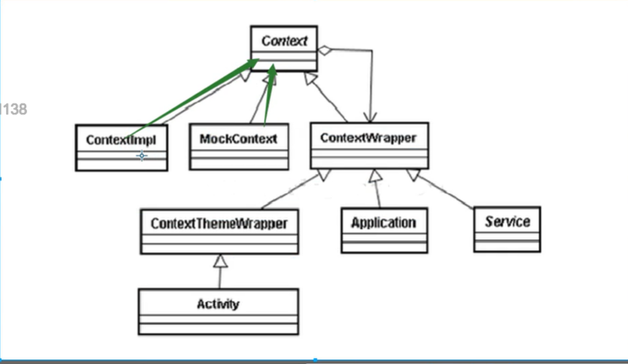

# Java IO

对象序列化 json解析 xml解析
zip 压缩均需要IO作为基础
处理底层业务逻辑

IO 常见的使用方式
       ```DataOutputStream out = new DataOutputStream(
        new BufferedOutputStream(
                new FileOutputStream(
                        new File(file))))```


## 装饰模式
例如 Context
Component  抽象构建接口

ConcreteComponent 具体的构建对象 实现组件对象接口 通常就是装饰器的原始对象. 就对这个对象添加功能

Decorator  所有装饰器的抽象父类, 需要定义一个与组件接口一致的接口 内部持有一个Component对象 就是持有一个装饰器的对象

ConnreteDecoratorA/ConreteDecorateB:
实例的装饰对象 实现具体添加功能




