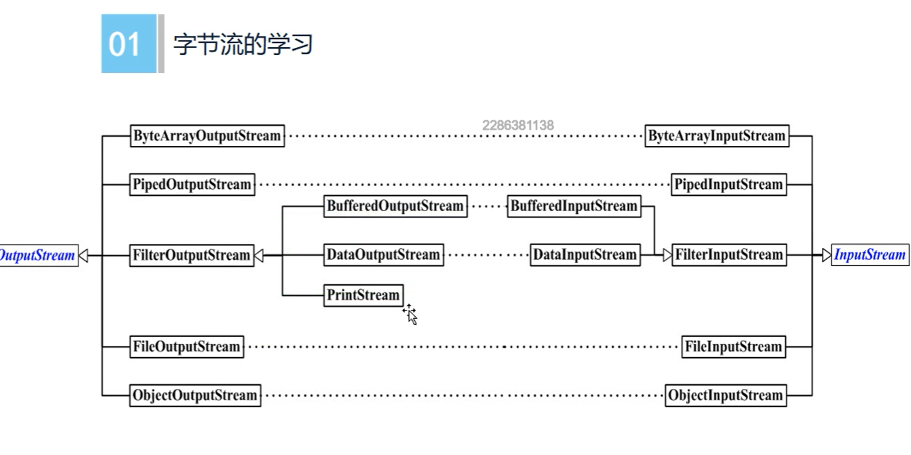

# Java IO

Java中流分为字节流Stream和字符流Reader/writer 
文本文件 xml都是字符流来读取和写入 RAR EXE文件 图片等非文本 都是字节流来读取和写入
字符是Unicode编码 一个字符占用两个字节
IO 类一共包含五个类和一个接口
File OutputStream InputStream Writer Reader 接口 Serializable
对象序列化 json解析 xml解析
zip 压缩均需要IO作为基础
处理底层业务逻辑

那开发中究竟用字节流好还是用字符流好呢？
在所有的硬盘上保存文件或进行传输的时候都是以字节的方法进行的，包括图片也是按字节完成，而字符是只有
在内存中才会形成的，所以使用字节的操作是最多的。
如果要java程序实现一个拷贝功能，应该选用字节流进行操作（可能拷贝的是图片），并且采用边读边写的方式
（节省内存）。
IO 常见的使用方式
```java
class Solution {
    private void stream() {
            // 装饰器模式
            // 实现与机器类型无关的Java基本类型数据的输出
            DataOutputStream out = new DataOutputStream(
                    // 提高效率
                    new BufferedOutputStream(
                            // 向文件中写数据
                            new FileOutputStream(
                                    new File(file))));
            // 读取一定要按照顺序进行读写
            DataInputStream in = new DataInputStream(
                    new BufferInputStream(
                            new FileInputStream()));
    }
}
```


## 装饰模式


Component  抽象构建接口

ConcreteComponent 具体的构建对象 实现组件对象接口 通常就是装饰器的原始对象. 就对这个对象添加功能

Decorator  所有装饰器的抽象父类, 需要定义一个与组件接口一致的接口 内部持有一个Component对象 就是持有一个装饰器的对象

ConnreteDecoratorA/ConreteDecorateB:
实例的装饰对象 实现具体添加功能

例如 Context


### IO中的装饰器模式



```java
import java.io.BufferedWriter;
import java.io.File;
import java.io.FileOutputStream;
import java.io.OutputStreamWriter;

public class Stream {
    
        // FileOutputStream 是字节流 一个字节一个字节读取数据
        // OutputStreamWriter是字符流 一个字符一个字符读
        // 英文占一个字节  中文占一个字符 读中文得用字符流
        // Buffer 一次多读一点 减少硬盘读取次数
        BufferedWriter bufferedWriter = new BufferedWriter(
                new OutputStreamWriter(
                        new FileOutputStream(new File("xxxxx"))
                )
        );
}
```


## Dex文件加密

> 基于热修复的原理实现dex文件加密的操作

反编译
利用编程程序从源语言的源程序产生目标程序的过程
Zip文件解压成apk  -dex2Jar -> Class.dex -> jar包 -> jar包从查看Class文件

最早应用要进行加固
应用 加固 proguard 混淆
加固的手段有很多 

壳dex文件 公开
源dex文件 加密

dex文件操作 大量使用文件IO

dex文件加密 读dex文件 + (AES加密 + 壳dex文件) + 写回dex文件(新dex) 打包文件 签名
对其 对dex的文件进行优化

问题
Dex文件可以随便拼凑吗
壳dex文件怎末来的
如何签名
如何运行新apk


Dex文件分为
文件头 header(签名)
索引区 字符串索引  类型索引  方法原型索引  域的索引  方法索引
数据区 类的定义区  数据区  连接数据区 

APK打包流程
资源文件 -appt->  R.java 
AIDL  -aidl-> JavaInterface
ApplicationSourceCode -javaFile
    汇总上述所有Java文件 -JavaCompiler-> .classFile -dex-> dexFile
        拿到Dex文件 + 资源文件包 -APKBuild-> 初始APK - JarSigner(debug Release KeyStore) -Signed.apk
文件加密的过程

壳子工程不能加密 但可以解密
hookApplication

解密 是再 安装APK时候？ 是在运行APK的时候 安装的时候APK不会运行
运行时候解密 attachBase


加固密码学
AES加密
A: 
