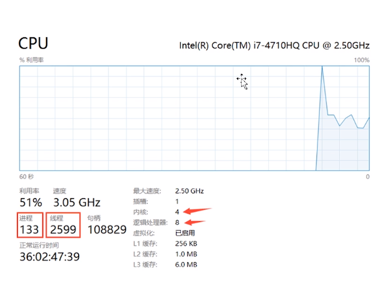
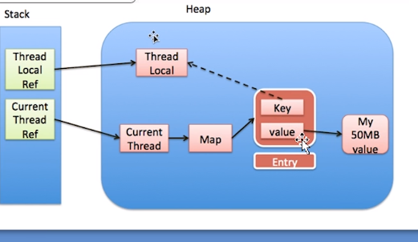

# 1 基础概念

## 什么是进程和线程


线程不能独立进程存在  一个进程拥有多个线程 共享进程的资源 内存 IO

## CPU核心数和线程数的关系

内核和线程是1 对 1 的关系  超核心数 可以 1 : 2

CPU时间轮转机制, 可以看到运行的线程 远远超过 8 也叫 RR机制

CPU时间切片 

1.6G  CPU 执行指令 0.6 ns
1 s = 10亿ns

上下文切换  一次上下文切换 需要2w 个 CPU时间周期

并发编程的好处 充分利用CPU资源
Linux 一个进程所能开的最大线程数 1000个
Windows 2000 个
因为每个线程需要分配栈空间 虚拟机栈 1M 句柄 文件描述符 打开内存地址 肯定需要一个指针指向我打开的其实位置 一个进程 1024 
向CPU申请线程也是以进程未单位进行申请的
Java天生就是多线程 
```java
/**
 *类说明：只有一个main方法的程序
 */
public class OnlyMain {
    public static void main(String[] args) {
        //Java 虚拟机线程系统的管理接口
        ThreadMXBean threadMXBean = ManagementFactory.getThreadMXBean();
        // 不需要获取同步的monitor和synchronizer信息，仅仅获取线程和线程堆栈信息
        ThreadInfo[] threadInfos =
                threadMXBean.dumpAllThreads(false, false);
        // 遍历线程信息，仅打印线程ID和线程名称信息
        for (ThreadInfo threadInfo : threadInfos) {
            System.out.println("[" + threadInfo.getThreadId() + "] "
                    + threadInfo.getThreadName());
        }
    }
}

```
启动了 6个线程
如下
monitor Ctrl-Break
Attach Listener  Dump类信息 线程信息 都是由这个线程负责的
Singal Dispatcher
Surrogate Locker Thread(Concurent GC)
Finalize 这个线程指向Finalize方法 主线程退出 这个线程可能也退出了   
Reference Handler
Main

启动Java线程的集中方法
1. 类 Thread  对操作系统线程的抽象
2. 接口Runnable 他只是个任务 对业务逻辑的抽象 callable 是有返回值的任务
```java
public class ThreadStart() {
    private static class UseThread extends Thread {
        @Override
        public void run() {
            // do my work
            super.run();
        }
    }

    private static class UseRunnable implements Runnable {
        @Override
        public void run() {
            // do my work
        }
    }

    public static void main(String[] args) {
        UseThread useThread = new UseThread();
        useThread.start();
        UseRunnable useRunnable = new UseRunnable();
        new Thread(useRunnable).start();
    }
}

```
api stop 执行终止 任务没有结束 会强制停止  线程占用的资源不能正常释放

JDK 里面的线程是协做式的
正确API
void Interrupt()  发起中断 其实是给线程的中断标志位 给改写了一下 a.interrupt() 可以不理会中断请求
static boolean Interrupted() 判断当前线程是否被中断 不会清除中断标志位
public boolean isInterrupted() 判断当前线程是否被中断 会清除中断标志位
Runnable (Thread.currentThread.inInterrupted());
死锁状态不会理会中断

使用标志位来做终止线程 可能会当线程阻塞的时候永远中断不了
但是使用调用interrupt 方法当阻塞的时候会抛出中断异常  阻塞类 会把中断标志位把 true 改为false 需要手动调用一次interrupted
异常如果直接退出 会导致资源未释放 所以手动interrpted

创建一个线程两种方式 只有两种JDK官方在Thread源码上标记了两种

Run 和 Start
Thread 是对线程类的抽象

Start 才真正将线程和操作系统联系起来 native void start
调用两次start 方法会报错 发生异常 抛出异常出来
业务逻辑实现的地方 run 方法 

Join方法 线程 A调用Join方法 挂起线程 
怎末包装两个线程能顺序执行 哎呀！！！ 字节问的就是这个 A B C 顺序执行

setDaemon(true)// 守护线程
主线程结束以后 没有更多的用户线程了 守护线程就跟着用户线程结束了
守护线程中 finally 不一定起作用 特别注意 完全看操作系统的调度

synchronized
线程间的共享 
对象都有一个锁标志位
1. 对象锁 锁不同的对象 两个对象 可以并行进行 一个对象不可以
    加锁可以对方法加锁 也可以对同步代码块加锁 
    同步方法            同步块this 
2. 类锁 class对象 每个类再类加载的时候 都有唯一一个class对象
    静态方法上面加锁 和其他对象锁互相不干扰
   
Volatile 关键字 
最轻量的同步机制 保证的式可见性 value - new Value  不能保证原子性 
一写多读的场景 适合 Volatile变量

ThreadLocal的使用
每个线程提供一个变量副本 线程隔离！

```java
public class UseThreadLocal {
    private static ThreadLocal<Integer> threadLocal = new ThreadLocal<Integer>() {
        @Override
        protected Integer initialValue() {
            return 1;
        }
    };

    public static void main(String[] args) {
        threadLocal.set(2);
        threadLocal.get();
        // get源码
        // ThreadMap  map = getMap(Thread.currentThread());
        // 每个线程有一个ThreadLocalMap(); 
        // LocalMap -> entry(WeakReference)  key = ThreadLocal Value = object
        // entry[] // 多个ThreadLocal变量 初始大小16
        // - > getEntry(threadLocal)
        // ThreadLocal 用不好 会引发内存泄露 线程不安全
        
        
    }
}


```
ThreadLocal 使用不当会内存泄露
    如图 ThreadLocal 释放, 不再使用value 但是因为线程还没释放 倒是Value不能释放


ThreadLocal get/set 内部 也会有一个专门清除TreadLocal = null的Value
但是清除不及时
解决办法 用完了之后一定要及时清除
local.set(new object());
local.remove();

TreadLocal 线程不安全 在对静态对象操作的时候 可能线程不安全  存储的是对象的引用副本的时候 注意共享
在TreadLocalMap
Static引用是线程共享的 但是实例是线程共享的

线程的等待和通知
wait()  会释放锁  被唤醒了重新竞争锁
notify()/notifyAll() 不会释放锁  尽量用notifyALl()

yield() 放出CPU时间片 不会释放锁
Sleep() 不会释放锁
wait() 释放当前线程持有的锁 唤醒后竞争锁 拿到锁后执行后面的方法
notify() notifyAll() 不会释放锁 需要等同步代码块执行完 一帮帮助最后一行
