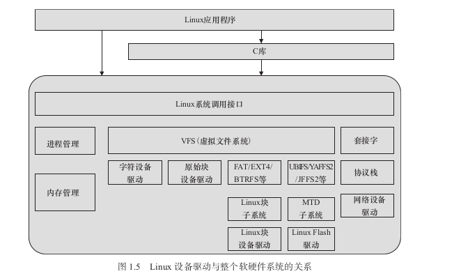
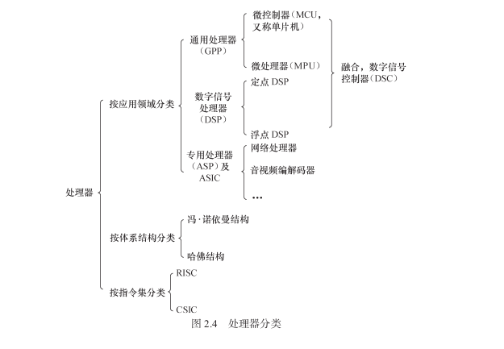
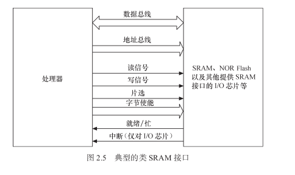
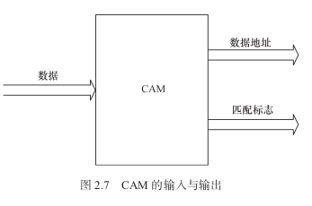
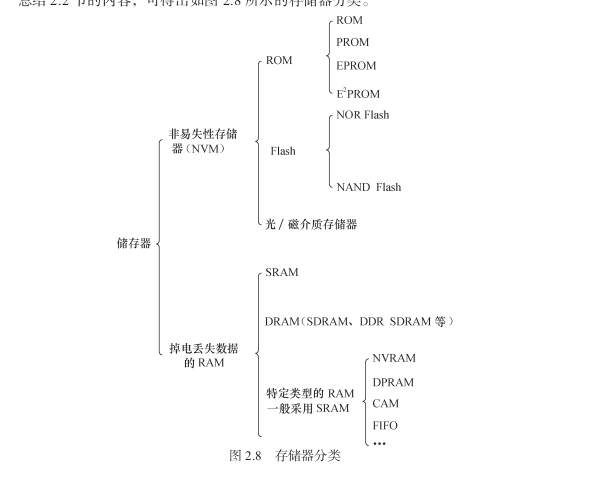
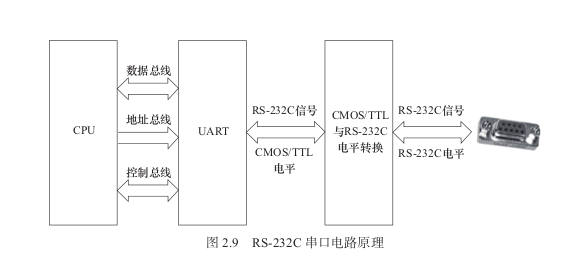
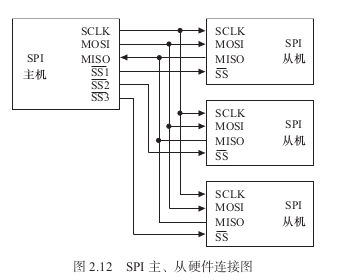
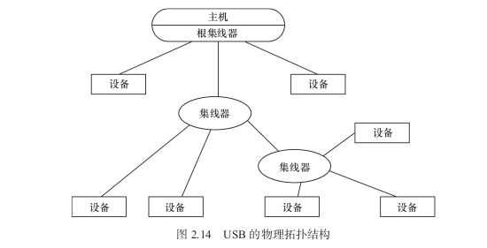
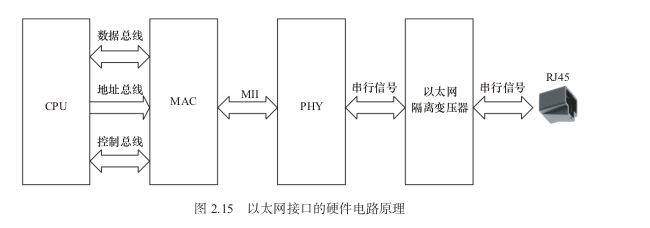

应用软件工程师需要看到一个没有硬件的纯粹的软件世界，硬件必须透明地呈现给他。谁来实现硬件对应用软件工程师的隐形？这个光荣而艰巨的任务就落在了驱动工
程师的头上。

设备驱动充当了硬件和应用软件之间的纽带，应用软件时只需要调用系统软 件的应用编程接口（API）就可让硬件去完成要求的工作。在系统没有操作系统的情况下，工
程师可以根据硬件设备的特点自行定义接口，如对串口定义 SerialSend()、SerialRecv()，对LED 定义 LightOn()、LightOff()，对 Flash 定义 
FlashWr()、FlashRd() 等。而在有操作系统的 情况下，驱动的架构则由相应的操作系统定义，
驱动工程师必须按照相应的架构设计驱动， 这样，驱动才能良好地整合入操作系统的内核中。

一般情 况下，每一种设备驱动都会定义为一个软件模块，包含 .h 文件和 .c 文件，前者定义该设备
驱动的数据结构并声明外部函数，后者进行驱动的具体实现。

其他模块想要使用这个设备的时候，只需要包含设备驱动的头文件 serial.h，然后调用其
中的外部接口函数。

操作系统通过给驱动制造麻烦来达到给上层应用提供便利的目的

计算机系统的硬件主要由 CPU、存储器和外设组成。随着 IC 制作工艺的发展，目前， 芯片的集成度越来越高，往往在 CPU 内部就集成了存储器和外设适配器

相当多的
ARM、PowerPC、MIPS 等处理器都集成了 UART、I 2 C 控制器、SPI 控制器、USB 控制器、
SDRAM 控制器等，有的处理器还集成了 GPU（图形处理器）、视频编解码器等。

Linux 将存储器和外设分为 3 个基础大类。
● 字符设备。字符设备指那些必须以串行顺序依次进行访问的设备，如触摸屏、磁带驱动器、鼠标 等。
● 块设备。块设备可以按任意顺序进行访问，以块为单位进行操作，如硬盘、eMMC 等。对于用户而言，它们都要使用文件系统的操作接 口 open()、close()、read()、write() 等进行访问。

字符设备与块设备都被映射到 Linux 文件系统的文件和目录，通过文件系统的系统调用接口 open()、write()、read()、close() 等即可访问字符设备和块设备。
Linux 的块设备有两种访问方法：一 种是类似 dd 命令对应的原始块设备，如“ /dev/sdb1”等；另外一种方法是在块设备上建立 FAT、EXT4、BTRFS 等文件系统，
然后以文件路径如“ /home/barry/hello.txt ”的形式进行访问。

● 网络设备  网络设备面向数据包的接收和发送而设计，内核与网络设备的通信与内核和字符设备、网络设备的通信方式完全不同，前 者主要还是使用套接字接口。

Linux 设备驱动的学习是一项浩繁的工程，包含如下重点、难点。
● 编写 Linux 设备驱动要求工程师有非常好的硬件基础，懂得 SRAM、Flash、SDRAM、
磁盘的读写方式，UART、I 2 C、USB 等设备的接口以及轮询、中断、DMA 的原理，
PCI 总线的工作方式以及 CPU 的内存管理单元（MMU）等。
● 编写 Linux 设备驱动要求工程师有非常好的 C 语言基础，能灵活地运用 C 语言的结
构体、指针、函数指针及内存动态申请和释放等。
● 编写 Linux 设备驱动要求工程师有一定的 Linux 内核基础，虽然并不要求工程师对
内核各个部分有深入的研究，但至少要明白驱动与内核的接口。尤其是对于块设
备、网络设备、Flash 设备、串口设备等复杂设备，内核定义的驱动体系结构本身就
非常复杂。
● 编写 Linux 设备驱动要求工程师有非常好的多任务并发控制和同步的基础，因为在驱
动中会大量使用自旋锁、互斥、信号量、等待队列等并发与同步机制。

## Linux 驱动的硬件基础

### 处理器

主流的通用处理器（GPP）多采用 SoC（片上系统）的芯片设计方法，集成了各种功 能模块，每一种功能都是由硬件描述语言设计程序，然后在 SoC 内由电路实现的。
每一个模块不是一个已经设计成熟的 ASIC 器件，而是利用芯片的一部分资源去实现某种传统的功能，将各种组件采用类似搭积木的方法组合在一起。

很多 ARM 主控芯片的集成度非常高，除了集成多核 ARM 以外，还可能集成图形处理器、视频编解码器、浮点协处理器、GPS、WiFi、蓝牙、基带、Camera 等一系列功能。

中央处理器的体系结构可以分为两类，一类为冯·诺依曼结构，另一类为哈佛结构

冯·诺依曼结构也称普林斯顿结构，是一种将程序指令存储器和数据存储器合并在一起的存储器结构。程序指令存储地址和数据存储地址指向同一个存储器的不 同物理位置，因此程序指令和数据的宽度相同。

而哈佛结构将程序指令和数据分开存储，指令和数据可以有不同的数据宽度。哈佛结构还采用了独立的程序总线和数据总线，分别作为 CPU 与每个存储器之间的专用通信路径，具有较高的执行效率。
[CPU结构](Image/img_1.png)

从指令集的角度来讲，中央处理器 也可以分为两类，即 RISC（精简指令集计算机）和 CISC（复杂指令集计算机）。

数字信号处理器（DSP）针对通信、图像、语音和视频处理等领域的算法而设计。它包含 独立的硬件乘法器。 

DSP 的乘法指令一般在单周期内完成，且优化了卷积、数字滤波、 FFT （快速傅里叶变换）、相关矩阵运算等算法中的大量重复乘法,DSP 分为两类，一类是定点 DSP，另一类是浮点 DSP

网络处理器是一种可编程器件, 它应用于电信领域的各种任务，如包处理、协议分析、 路由查找、声音 / 数据的汇聚、防火墙、QoS 等,网络处理器器件内部通常由若干个微码处
理器和若干硬件协处理器组成，多个微码处理器在网络处理器内部并行处理，通过预先编制 微码来控制处理流程。而对于一些复杂的标准操作（如内存操作、路由表查找算法、QoS
的拥塞控制算法、流量调度算法等），则采用硬件协处理器来进一步提高处理性能，从而实现 了业务灵活性和高性能的有机结合。

对于某些应用场合，使用 ASIC（专用集成电路）往往是低成本且高性能的方案。使用 ASIC 完成同样的功能往 往比直接使用 CPU 资源或 
CPLD（复杂可编程逻辑器件）/FPGA（现场可编程门阵列）来得 更廉价且高效。

复杂的系统中，这些芯片可能会 同时存在，协同合作，各自发挥自己的长处。如在一款智能手机中，可使用 MCU 处理图形
用户界面和用户的按键输入并运行多任务操作系统，使用 DSP 进行音视频编解码，而在射频 方面则采用 ASIC。

### 存储器

存储器主要可分类为只读储存器（ROM）、闪存（Flash）、随机存取存储器（RAM）、光 / 磁介质储存器。

ROM 还 可 再 细 分 为 
1. 不 可 编 程 ROM、 
2. 可 编 程 ROM（PROM）、
3. 可 擦 除 可 编 程 ROM （EPROM）
4. 电可擦除可编程 ROM（E 2 PROM），完全可以用软件来擦写，已经非常方便了。

NOR（或非）和 NAND（与非）是市场上两种主要的 Flash 闪存技术，NOR Flash 和 CPU 的接口属于典型的类 SRAM 接口（如图 2.5 所示）

Flash 的编程原理都是只能将 1 写为 0，而不能将 0 写为 1。因此在 Flash 编程之前，必 须将对应的块擦除，而擦除的过程就是把所有位都写为 1 的过程，块内的所有字节变为

0xFF。另外，Flash 还存在一个负载均衡的问题，不能老是在同一块位置进行擦除和写的动作，这样容易导致坏块。 

ROM、Flash 和磁介质存储器都属于非易失性存储器（NVM）的范畴，掉电时信息不会丢失，而 RAM 则与此相反，RAM 也可再分为静态 RAM（SRAM）和动态 RAM（DRAM）。
DRAM 以电荷形式进 行存储，数据存储在电容器中。由于电容器会因漏电而出现电荷丢失，所以 DRAM 器件需 要定期刷新。
SRAM 是静态的，只要供电它就会保持一个值，SRAM 没有刷新周期。每个 SRAM 存储单元由 6 个晶体管组成，而 DRAM 存储单元由 1 个晶体管和 1 个电容器组成。

CAM 是以内容进行寻址的存储器，是一种特殊的存储阵列 RAM，它的主要工作机制就.

是同时将一个输入数据项与存储在 CAM 中的所有数据项自动进行比较，判别该输入数据 与 CAM 中存储的数据项是否相匹配，并输出该数据项对应的匹配信息。

在 CAM 中，输入 的是所要查询的数据，输出的是数据 地址和匹配标志。若匹配（即搜寻到数 据），则输出数据地址。CAM 用于数据 检索的优势是软件无法比拟的，它可
以极大地提高系统性能。

存储器分类

### 接口

RS-232、RS-422 与 RS-485 都是串行数据接口标准
RS-232 在 1962 年发布，命名为 EIA-232-E。之后发布的 RS-422 定义了一种平衡通信接口，它是一种单机发送、多机接收的单向、平衡传输规范，被命名为 TIA/EIA-422-A 标准。
RS-422 改进了 RS-232 通信距离短、速率低的缺点。为进一步扩展应用范围，EIA 又于 1983 年在 RS-422 的基础上制定了 RS-485 标准，增加了多点、双向通信能力，即允许多个发送器
连接到同一条总线上，同时增加了发送器的驱动能力和冲突保护特性，并扩展了总线共模范围，被命名为 TIA/EIA-485-A 标准。

1969 年发布的 RS-232 修改版 RS-232C 是嵌入式系统中应用最广泛的串行接口，它为连接 DTE（数据终端设备）与 DCE（数据通信设备）而制定

RS-232C 标准接口有 25 条线（4 条数据线、11 条控制线、3 条定时线、7 条备用和未定义线），

DTE（数据终端设备）
DCE（数据通信设备）

UART （通用异步接收器发送器，作用是完成并 / 串转换）

#### I2C

I2C（内置集成电路）总线是由 Philips 公司开发的两线式串行总线。

用于连接微控制器及其外围设备。I 2 C 总线简单而有效，占用的 PCB（印制电路板）空间很小，芯片引脚数量少，设计成本低。

I 2 C 总线支持多主控（Multi-Mastering）模式，任何能够进行发送和接收的设备都可以成为主设备。 主控能够控制数据的传输和时钟频率，在任意 时刻只能有一个主控。

组成 I 2 C 总线的两个信号为数据线 SDA 和时钟 SCL。为了避免总线信号的混乱，要求各
设备连接到总线的输出端必须是开漏输出或集电极开路输出的结构。总线空闲时，上拉电阻
使 SDA 和 SCL 线都保持高电平。根据开漏输出或集电极开路输出信号的“线与”逻辑，I 2 C
总线上任意器件输出低电平都会使相应总线上的信号线变低。

#### SPI 
SPI（Serial Peripheral Interface，串行外设接口）总线系统是一种同步串行外设接口，总线系统是一种同步串行外设接口，它
可以使 CPU 与各种外围设备以串行方式进 行 通 信 以 交 换 信 息。 一 般 主 控 SoC 作 为

SPI 的“主”，而外设作为 SPI 的“从”。

#### USB

USB（通用串行总线）是 Intel、Microsoft 等厂商为解决计算机外设种类的日益增加与有
限的主板插槽和端口之间的矛盾而于 1995 年提出的，它具有数据传输率高、易扩展、支持
即插即用和热插拔的优点，目前已得到广泛应用

USB 1.1 包含全速和低速两种模式，低速方式的速率为 1.5Mbit/s，支持一些不需要很大
数据吞吐量和很高实时性的设备，如鼠标等。全速模式为 12Mbit/s，可以外接速率更高的外
设。在 USB 2.0 中，增加了一种高速方式，数据传输率达到 480Mbit/s，半双工，可以满足更
高速外设的需要。而 USB 3.0（也被认为是 Super Speed USB）的最大传输带宽高达 5.0Gbit/s
（即 640MB/s），全双工。

#### 以太网
以太网接口由 MAC（以太网媒体接入控制器）和 PHY（物理接口收发器）组成。以太
网 MAC 由 IEEE 802.3 以太网标准定义，实现了数据链路层。常用的 MAC 支持 10Mbit/s 或
100Mbit/s 两种速率。吉比特以太网（也称为千兆位以太网）是快速以太网的下一代技术，将
网速提高到了 1000 Mbit/s。千兆位以太网以 IEEE 802.3z 和 802.3ab 发布，作为 IEEE 802.3
标准的补充。

#### PCI 和 PCI-E

PCI（外围部件互连）是由 Intel 于 1991 年推出的一种局部总线，作为一种通用的总线接 口标准，它在目前的计算机系统中得到了非常广泛应用。

#### SD 和 SDIO

SD（Secure Digital）是一种关于 Flash 存储卡的标准，也就是一般常见的 SD 记忆卡，在
设计上与 MMC（Multi-Media Card）保持了兼容。SDHC（SD High Capacity）是大容量 SD 卡，
支持的最大容量为 32GB。

#### CPLD 和 FPGA

CPLD（复杂可编程逻辑器件）由完全可编程的与或门阵列以及宏单元构成。

CPLD 中的基本逻辑单元是宏单元，宏单元由一些“与或”阵列加上触发器构成，其中 “与或”阵列完成组合逻辑功能，触发器完成时序逻辑功能。

。宏单元中与阵列的输出称为乘
积项，其数量标示着 CPLD 的容量。乘积项阵列实际上就是一个“与或”阵列，每一个交叉
点都是一个可编程熔丝，如果导通就是实现“与”逻辑。