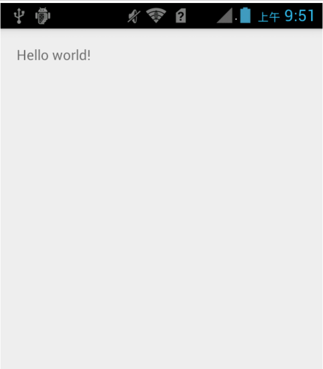

AppCompatActivity Compat  : 兼容性 AppCompatDelegate Delegate : 委托

我们先看一个有趣的事情，在我们使用theme为AppCompat或MaterialComponents的时候使用xml进行布局，
就会发现我们使用的安卓原生自带控件会被以AppCompat或MaterialComponents的样式进行替换。而使用代码进行添加的就不会。 
AppCompatActivity 从Android 21之后引入Material
Design的设计方式， 为了支持Material Color 、调色板、toolbar等各种新特性，AppCompatActivity就应用而生。

AS 继承AppCompatActivity 可以看到在界面最上面会出现一个ActionBar, AppCompatActivity是用来替代ActionBarActivity的


AS 继承Activity


代替了原有的ActionBarActivity。在AppCompatActivity中，更是引入了AppCompatDelegate类的设计， 可以在普通的Activity中使用AppCompate的相关特性。
AppCompatDelegate 是什么？ 通过查看AppCompatActivity的源码我们可以发现Activity的大部分生命周期都交给AppCompatDelegate进行委托处理，
那么我们就开始从AppCompatDelegate开始入手

```java
public class AppCompatActivity extends FragmentActivity implements AppCompatCallback,
        TaskStackBuilder.SupportParentable, ActionBarDrawerToggle.DelegateProvider {
    @Override
    protected void attachBaseContext(Context newBase) {
        super.attachBaseContext(newBase);
        getDelegate().attachBaseContext(newBase);
    }

    @Override
    protected void onCreate(@Nullable Bundle savedInstanceState) {
        final AppCompatDelegate delegate = getDelegate();
        delegate.installViewFactory();
        delegate.onCreate(savedInstanceState);
        super.onCreate(savedInstanceState);
    }

    @Override
    protected void onPostResume() {
        super.onPostResume();
        getDelegate().onPostResume();
    }

    @Override
    protected void onStart() {
        super.onStart();
        getDelegate().onStart();
    }

    @Override
    protected void onStop() {
        super.onStop();
        getDelegate().onStop();
    }

    @Override
    protected void onPostCreate(@Nullable Bundle savedInstanceState) {
        super.onPostCreate(savedInstanceState);
        getDelegate().onPostCreate(savedInstanceState);
    }

    public void setSupportActionBar(@Nullable Toolbar toolbar) {
        getDelegate().setSupportActionBar(toolbar);
    }

    @Override
    public void setContentView(@LayoutRes int layoutResID) {
        getDelegate().setContentView(layoutResID);
    }

    @Override
    public void setContentView(View view, ViewGroup.LayoutParams params) {
        getDelegate().setContentView(view, params);
    }

    @Override
    public void addContentView(View view, ViewGroup.LayoutParams params) {
        getDelegate().addContentView(view, params);
    }

    @NonNull
    public AppCompatDelegate getDelegate() {
        if (mDelegate == null) {
            mDelegate = AppCompatDelegate.create(this, this);
        }
        return mDelegate;
    }
  ...
}


```

通过查看AppCompatActivity的源码我们可以发现Activity的大部分生命周期都交给AppCompatDelegate进行委托处理， 那么我们就开始从AppCompatDelegate开始入手
AppCompatDelegate是个抽象类，通过AppCompatDelegate#create方法可以知道该抽象类的实现类为AppCompatDelegateImpl
AppCompatDelegateImpl继承自AppCompatDelegate并实现了LayoutInflater.Factory2接口

```java
public abstract class AppCompatDelegateImpl {
	....

    @NonNull
    public static AppCompatDelegate create(@NonNull Activity activity,
                                           @Nullable AppCompatCallback callback) {
        return new AppCompatDelegateImpl(activity, callback);
    }
  ....
}

class AppCompatDelegateImpl extends AppCompatDelegate
        implements MenuBuilder.Callback, LayoutInflater.Factory2 {
}


```

看过LayoutInflater类的源码的话应该知道在tryCreateView方法会调用工厂类的onCreateView方法进行对View的创建，
我们给Activity设置布局会使用到setContentView方法，我们先看setContentView方法。

```java
public class AppCompatActivity {
    @Override
    public void setContentView(int resId) {
        ensureSubDecor();
        ViewGroup contentParent = mSubDecor.findViewById(android.R.id.content);
        contentParent.removeAllViews();
        LayoutInflater.from(mContext).inflate(resId, contentParent);
        mAppCompatWindowCallback.getWrapped().onContentChanged();
    }

    @Override
    protected void onCreate(@Nullable Bundle savedInstanceState) {
        final AppCompatDelegate delegate = getDelegate();
        delegate.installViewFactory();
        delegate.onCreate(savedInstanceState);
        super.onCreate(savedInstanceState);
    }

    @Override
    public void installViewFactory() {
        LayoutInflater layoutInflater = LayoutInflater.from(mContext);
        if (layoutInflater.getFactory() == null) {
            LayoutInflaterCompat.setFactory2(layoutInflater, this);
        } else {
            if (!(layoutInflater.getFactory2() instanceof AppCompatDelegateImpl)) {
                Log.i(TAG, "The Activity's LayoutInflater already has a Factory installed"
                        + " so we can not install AppCompat's");
            }
        }
    }

}
```

从setContentView方法看不出来有什么特殊的操作就是正常的解析xml文件并添加到contentParent，
我们接着看调用此方法的onCreate方法。此方法的调用发生在我们自己的Activity那么看看AppCompatActivity#onCreate AppCompatActivity#onCreate
在AppCompatActivity#onCreate方法对AppCompatDelegate调用了installViewFactory方法，
通过方法名我们大致可以知道这是用于设定View工厂的方法。在这个方法对LayoutInflater设定了Factory2， 并且此Factory2为当前这个类的对象。

```java

public interface Factory2 extends Factory {
    View onCreatView(View parentm, String name, Context context, AttributeSet atts);
}

```

Factory2是一个接口，AppCompatDelegateImpl实现了这个接口那么我们看对这个方法的实现。
onCreateView方法首先会获取R.styleable.AppCompatTheme并从中获取R.styleable.AppCompatTheme_viewInflaterClass，
并通过获取到的viewInflaterClass来进行对mAppCompatViewInflater的赋值操作，
如果viewInflaterClass不为空或者等于AppCompatViewInflater的类名那么直接进行对AppCompatViewInflater的创建否则通过反射进行创建，
发生异常的情况下也会直接进行对AppCompatViewInflater的创建。

```java
public class AppCompatDelegateImpl implements Factory2 {
    @Override
    public final View onCreateView(View parent, String name, Context context, AttributeSet attrs) {
        return createView(parent, name, context, attrs);
    }

    @Override
    public View createView(View parent, final String name, @NonNull Context context,
                           @NonNull AttributeSet attrs) {
        if (mAppCompatViewInflater == null) {
            TypedArray a = mContext.obtainStyledAttributes(R.styleable.AppCompatTheme);//获取名为AppCompatTheme的styeable
            String viewInflaterClassName =
                    a.getString(R.styleable.AppCompatTheme_viewInflaterClass);//从styleable获取viewInflaterClass
            if ((viewInflaterClassName == null)
                    || AppCompatViewInflater.class.getName().equals(viewInflaterClassName)) {//如果viewInflaterClass不为空或者等于AppCompatViewInflater的类名
                // Either default class name or set explicitly to null. In both cases
                // create the base inflater (no reflection)
                mAppCompatViewInflater = new AppCompatViewInflater();
            } else {
                try {//通过反射获取这个类的对象
                    Class<?> viewInflaterClass = Class.forName(viewInflaterClassName);
                    mAppCompatViewInflater =
                            (AppCompatViewInflater) viewInflaterClass.getDeclaredConstructor()
                                    .newInstance();
                } catch (Throwable t) {//异常情况下使用AppCompatViewInflater对象
                    Log.i(TAG, "Failed to instantiate custom view inflater "
                            + viewInflaterClassName + ". Falling back to default.", t);
                    mAppCompatViewInflater = new AppCompatViewInflater();
                }
            }
        }

        boolean inheritContext = false;
        if (IS_PRE_LOLLIPOP) {
            inheritContext = (attrs instanceof XmlPullParser)
                    // If we have a XmlPullParser, we can detect where we are in the layout
                    ? ((XmlPullParser) attrs).getDepth() > 1
                    // Otherwise we have to use the old heuristic
                    : shouldInheritContext((ViewParent) parent);
        }
        //调用AppCompatViewInflater的createView方法
        return mAppCompatViewInflater.createView(parent, name, context, attrs, inheritContext,
                IS_PRE_LOLLIPOP, /* Only read android:theme pre-L (L+ handles this anyway) */
                true, /* Read read app:theme as a fallback at all times for legacy reasons */
                VectorEnabledTintResources.shouldBeUsed() /* Only tint wrap the context if enabled */
        );
    }

}

```

AppCompatViewInflater类与createView方法

```java
public class AppCompatViewInflater {
    final View createView(View parent, final String name, @NonNull Context context,
                          @NonNull AttributeSet attrs, boolean inheritContext,
                          boolean readAndroidTheme, boolean readAppTheme, boolean wrapContext) {
        final Context originalContext = context;

        // We can emulate Lollipop's android:theme attribute propagating down the view hierarchy
        // by using the parent's context
        if (inheritContext && parent != null) {
            context = parent.getContext();
        }
        if (readAndroidTheme || readAppTheme) {
            // We then apply the theme on the context, if specified
            context = themifyContext(context, attrs, readAndroidTheme, readAppTheme);
        }
        if (wrapContext) {
            context = TintContextWrapper.wrap(context);
        }

        View view = null;

        // We need to 'inject' our tint aware Views in place of the standard framework versions
        switch (name) {
            case "TextView"://如果name为TextView
                view = createTextView(context, attrs);
                verifyNotNull(view, name);
                break;
            case "ImageView"://如果name为ImageView
                view = createImageView(context, attrs);
                verifyNotNull(view, name);
                break;
            case "Button"://如果name为Botton
                view = createButton(context, attrs);
                verifyNotNull(view, name);
                break;
            case "EditText"://如果name为EditText
                view = createEditText(context, attrs);
                verifyNotNull(view, name);
                break;
            case "Spinner"://如果name为Spinner
                view = createSpinner(context, attrs);
                verifyNotNull(view, name);
                break;
            case "ImageButton"://如果name为ImageButton
                view = createImageButton(context, attrs);
                verifyNotNull(view, name);
                break;
            case "CheckBox"://如果name为CheckBox
                view = createCheckBox(context, attrs);
                verifyNotNull(view, name);
                break;
            case "RadioButton"://如果name为RadioButton
                view = createRadioButton(context, attrs);
                verifyNotNull(view, name);
                break;
            case "CheckedTextView"://如果name为CheckedTextView
                view = createCheckedTextView(context, attrs);
                verifyNotNull(view, name);
                break;
            case "AutoCompleteTextView"://如果name为AutoCompleteTextView
                view = createAutoCompleteTextView(context, attrs);
                verifyNotNull(view, name);
                break;
            case "MultiAutoCompleteTextView"://如果name为MultiAutoCompleteTextView
                view = createMultiAutoCompleteTextView(context, attrs);
                verifyNotNull(view, name);
                break;
            case "RatingBar"://如果name为RatingBar
                view = createRatingBar(context, attrs);
                verifyNotNull(view, name);
                break;
            case "SeekBar"://如果name为SeekBar
                view = createSeekBar(context, attrs);
                verifyNotNull(view, name);
                break;
            case "ToggleButton"://如果name为ToggleButton
                view = createToggleButton(context, attrs);
                verifyNotNull(view, name);
                break;
            default:
                // The fallback that allows extending class to take over view inflation
                // for other tags. Note that we don't check that the result is not-null.
                // That allows the custom inflater path to fall back on the default one
                // later in this method.
                view = createView(context, name, attrs);
        }

        if (view == null && originalContext != context) {
            // If the original context does not equal our themed context, then we need to manually
            // inflate it using the name so that android:theme takes effect.
            view = createViewFromTag(context, name, attrs);
        }

        if (view != null) {
            // If we have created a view, check its android:onClick
            checkOnClickListener(view, attrs);
        }

        return view;
    }

    @NonNull
    protected AppCompatTextView createTextView(Context context, AttributeSet attrs) {
        return new AppCompatTextView(context, attrs);
    }

    @NonNull
    protected AppCompatImageView createImageView(Context context, AttributeSet attrs) {
        return new AppCompatImageView(context, attrs);
    }

    @NonNull
    protected AppCompatButton createButton(Context context, AttributeSet attrs) {
        return new AppCompatButton(context, attrs);
    }

    @NonNull
    protected AppCompatEditText createEditText(Context context, AttributeSet attrs) {
        return new AppCompatEditText(context, attrs);
    }

    @NonNull
    protected AppCompatSpinner createSpinner(Context context, AttributeSet attrs) {
        return new AppCompatSpinner(context, attrs);
    }

    @NonNull
    protected AppCompatImageButton createImageButton(Context context, AttributeSet attrs) {
        return new AppCompatImageButton(context, attrs);
    }

    @NonNull
    protected AppCompatCheckBox createCheckBox(Context context, AttributeSet attrs) {
        return new AppCompatCheckBox(context, attrs);
    }

    @NonNull
    protected AppCompatRadioButton createRadioButton(Context context, AttributeSet attrs) {
        return new AppCompatRadioButton(context, attrs);
    }

    @NonNull
    protected AppCompatCheckedTextView createCheckedTextView(Context context, AttributeSet attrs) {
        return new AppCompatCheckedTextView(context, attrs);
    }

    @NonNull
    protected AppCompatAutoCompleteTextView createAutoCompleteTextView(Context context,
                                                                       AttributeSet attrs) {
        return new AppCompatAutoCompleteTextView(context, attrs);
    }

    @NonNull
    protected AppCompatMultiAutoCompleteTextView createMultiAutoCompleteTextView(Context context,
                                                                                 AttributeSet attrs) {
        return new AppCompatMultiAutoCompleteTextView(context, attrs);
    }

    @NonNull
    protected AppCompatRatingBar createRatingBar(Context context, AttributeSet attrs) {
        return new AppCompatRatingBar(context, attrs);
    }

    @NonNull
    protected AppCompatSeekBar createSeekBar(Context context, AttributeSet attrs) {
        return new AppCompatSeekBar(context, attrs);
    }

    @NonNull
    protected AppCompatToggleButton createToggleButton(Context context, AttributeSet attrs) {
        return new AppCompatToggleButton(context, attrs);
    }

    @Nullable
    protected View createView(Context context, String name, AttributeSet attrs) {
        return null;
    }
}


```

在AppCompatViewInflater#createView方法中对atgName为：

TextView
ImageView
Button
EditText
Spinner
ImageButton
CheckBox
RadioButton
CheckedTextView
AutoCompleteTextView
MultiAutoCompleteTextView
RatingBar
SeekBar
ToggleButton
这14种控件进行创建替换，并且还提供了一个createView(Context context, String name, AttributeSet attrs)方法支持开发者自定义扩展。

总结
首先AppCompatActivity将自己的生命周期委托给AppCompatDelegate

AppCompatDelegate的实现类AppCompatDelegateImpl实现LayoutInfaler.Factory2接口

给当前context的LayoutInfalter设定Factory2工厂

LayoutInfalter.infalte方法调用Factory2#onCreateView

Factory2#onCreateView间接调用AppCompatViewInflater#createView

AppCompatViewInflater对象来自AppCompatTheme的viewInflaterClass属性

AppCompatViewInflater#createView方法会通过name对控件进行创建
