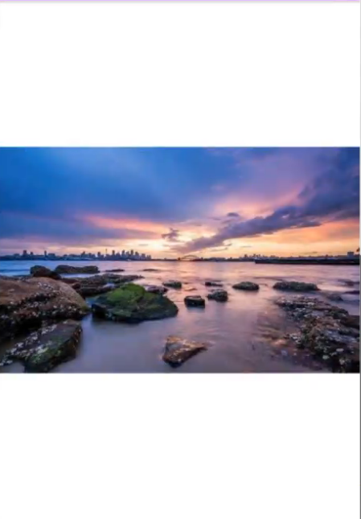

# 自定义PhotoView手势处理和双指操作

```java
import javax.naming.Context;
import javax.swing.text.AttributeSet;
import java.awt.*;

public class PhotoView extends View {
    private Bitmap bitmap;
    private Paint paint;
    private FlintRunner flintRunner;

    // 偏移量 
    private float originalOffsetX;
    private float originalOffsetY;

    private float offsetX;
    private float offsetY;

    private OverScorller overScorller; // 回弹

    // 一边全屏 一边留白
    private float smallScale;
    // 一边全屏 一边超出
    private float bigScale;

    private boolean isEnlarge;

    private GestureDetector gestureDetector;

    private ObjectAnimator objectAnimator;

    private float OVER_SCALE_FACTOR = 1.5f;

    // 当前缩放值
    private float currentScale;

    public PhotoView(Context context) {
        this(context, null);
    }

    public PhotoView(Context context, AttributeSet attrs) {
        this(context, attrs, 0);
    }

    public PhotoView(Context context, AttributeSet attrs, int defStyleAttr) {
        this(context, attrs, defStyleAttr);
        init(context);
    }

    private void init(Context context) {
        // 获取bitmap对象
        bitmap = BitmapFactory.decodeResource(getResources(), R.drawable.photo);
        paint = new Paint();
        gestureDetector = new GestureDetector(context, new PhotoGestureListener());
        overScorller = new OverScorller();
    }

    public boolean onTouchEvent(MotionEvent event) {
        return gestureDetector.onTouchEvent();
    }

    private ObjectAnimator getObjectAnimator() {
        if (objectAnimator == null) {
            objectAnimator = ObjectAnimator.ofFloat(this, "currentScale", 0);// 属性 就是改变这个属性的值 需要重写set get 方法 反射调用 setget

        }
        objectAnimator.setFloatValues(smaleScale, bigScale);
        return objectAnimator;
    }

    // 属性动画 值变化的时候进行刷新 
    private void setObjectAnimator(float currentScale) {
        this.currentScale = currentScale;
        invalidate();
    }

    private void fixOffsets() {
        offsetX = Math.min(offsetX, (bitmap.getWidth() * bigScale - getWidth()) / 2);
        offsetX = Math.max(offsetX, -(bitmap.getWidth() * bigScale - getWidth()) / 2);
        offsetY = Math.min(offsetX, (bitmap.getWidth() * bigScale - getWidth()) / 2);
        offsetY = Math.max(offsetX, -(bitmap.getWidth() * bigScale - getWidth()) / 2);
    }

    @Override
    protected void onDraw(Canvas canvas) {
        super.onDraw(canvas);

        // 偏移
        canvas.translate(offsetX, offsetY);

        canvas.scale(currentScale, currentScale, getWidth() / 2f, getHeight() / 2f);

        // 绘制bitmap
        canvas.drawBitmap(bitmap, originalOffsetX, originalOffsetY, paint);
    }

    // onMeasure 之后调用 onSizeChanged
    // 每次改变尺寸也会调用
    @Override
    protected void onSizeChanged(int w, int h, int oldW, int oldH) {
        super.onSizeChanged(w, h, oldW, oldH);

        // 得到浮点数 否则会留一条小缝隙
        originalOffsetX = (getWidth() - bitmap.getWidth()) / 2f;
        originalOffsetY = (getHeight() - bitmap.getHeight()) / 2f;

        // 图片是横向的 图片的宽高比 大于屏幕的 说明是横向的 
        if ((float) bitmap.getWidth() / bitmap.getHeight() > (float) getWidth() / getHeight()) {
            smallScale = (float) getWidth() / bitmap.getWidth();
            bigScale = (float) getHeight() / bitmap.getHeight() * OVER_SCALE_FACTOR;
        } else {
            smallScale = (float) getHeight() / bitmap.getHeight();
            bigScale = (float) getWidth() / bitmap.getWidth() * OVER_SCALE_FACTOR;
        }
        currentScale = smallScale;
    }


    class PhotoGestureListener extends GestureDetector.SimpleOnGestureListener {
        // up 时触发 双击的时候 在第二次抬起时触发
        public boolean onSingleTapUp(MotionEvent e) {
            return super.onSingleTapUp(e);
        }

        // 长按 300ms
        public void onLongPress(MotionEvent e) {
            super.onLongPress(e);
        }

        // move
        // distanceX 在 X 轴 滑过的距离 单位时间 旧位置 - 新位置
        // distanceY 在 Y 轴 滑过的距离 单位时间
        public boolean onScroll(MotionEvent e1, MotionEvent e2, float distanceX, float distanceY) {
            // 只有在大放大的情况下才能移动
            if (isEnlarge) {
                offsetX -= distanceX;
                offsetY -= distanceY;
                fixOffsets();
                invalidate();
            }
            return super.onScroll(e1, e2, distanceX, distanceY);
        }

        // 抛掷 
        public boolean onFling(MotionEvent e1, MotionEvent e2, float VX, float VY) {
            if (isEnlarge) {
                // 只会处理一次
                overScorller.fling(offsetX, offsetY, vX, VY, minX, maxX, minY, maxY, 300, 300);
                postOnAnimation(flintRunner);// 每帧动画执行一次 性能更好  
            }

            return super.onScroll(e1, e2, distanceX, distanceY);
        }

        // 延迟触发 100ms 点击效果 水波纹 
        public void onShowPress(MotionEvent e) {
            super.onShowPress(e);
        }

        // 按下 
        public boolean onDown(MotionEvent e) {
            return super.onDown(e);// 直接返回true 消费事件 
        }

        // 双击 第二次点击按下的时候 会触发 间隔40ms(小于 表示抖动)-- 300ms
        public boolean onDoubleTap(MotionEvent e) {
            isEnlarge = !isEnlarge;
            if (isEnlarge) {
                // 启动属性动画 从小到大
                getObjectAnimator().start();
            } else {
                // 启动属性动画 从大到小 
                getObjectAnimator().reverse();
            }
            invalidate();
            return super.onDoubleTap(e);
        }

        // 双击 第二次 down move up 都会触发
        public boolean onDoubleEvent(MotionEvent e) {
            return super.onDoubleEvent(e);
        }

        // 单击按下时触发 双击时不触发  
        public boolean onSingleTapConfirmed(MotionEvent e) {
            return super.onSingleTapConfirmed(e);
        }
    }

    class FlingRunner implements Runnable {
        protected void run() {
            //动画还在执行 return true
            if (overScorller.compauteScrollOffset) {
                offsetX = overScroller.getCurrX();
                offsetY = overScroller.getCurrY();
                invalidate();
                postOnAnimation(this);
            }
        }
    }

}
```
