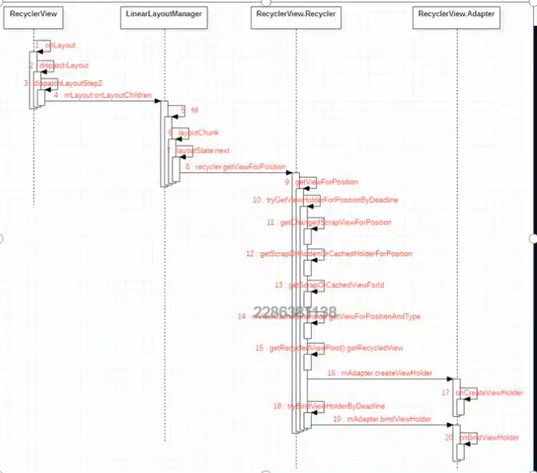

# RecycleView 缓存复用原理解析

缓存复用针对的是什么？ 保存的是什么？
ViewHolder 相当于一个Item

RecyclerView extends ViewGroup
1. 构造方法
   onMeasure、onLayout 放一起的 --》 dispatchLayoutStep2
   --》
   // 只会执行一次 -- State.STEP_START
   dispatchLayoutStep1(); // PreLayout  动画前布局
   dispatchLayoutStep2();
  
    // onLayout
    dispatchLayoutStep3(); // postLayout 动画后布局
   
2. View的绘制流程 --》onMeasure 、onLayout、onDraw
3. 事件处理

// 分线画在哪个方法里面 --》 itemView 覆盖分割线，分割线覆盖itemView --》 onDrawOver 绘制的分割线 覆盖 ItemView
mItemDecorations.get(i).onDraw() --> dispatchDraw(canvas);（绘制ItemView）
--》 mItemDecorations.get(i).onDrawOver


## 复用原理分析
复用的入口
嵌套滑动 --》 RecyclerView   

--》 dispatchNestedPreScroll --> scrollByInternal --> dispatchNestedScroll --> 边缘效果

--》 scrollByInternal

--》scrollStep(x, y, mReusableIntPair); // 绘制 

--> (layoutManager)mLayout.scrollHorizontallyBy 水平方向滑动

--> mLayout.scrollVerticallyBy 垂直方向滑动   自定义layoutManager 可以实现自定义滑动效果  这个是根据
rv.setLayoutManager(new GridLayoutManager(this, 1));

--> LinearLayoutManager.scrollBy() // 处理滚动 把消费了的滑动距离返回 

--> LinearLayoutManager.fill() // 

--> layoutChunk() // 

-->  View view = layoutState.next(recycler); // 拿到View 

--》 recycler.getViewForPosition//  

--》 tryGetViewHolderForPositionByDeadline // 主要的复用代码

--> measureChildWithMargins(view, 0, 0); // 测量，padding margin inset(分割线的空间)


tryGetViewHolderForPositionByDeadline // 主要的复用代码

复用就必须有缓存 

1， mChangeScrap 与 mAttachedScrap  缓存还在屏幕内的ViewHolder 动画刷新期间的复用

2. mCachedViews 缓存移除屏幕之外的ViewHolder

3. mViewCacheExtension 创建和缓存完全由开发者自己控制 系统未往这里添加数据

4. RecycledViewPoll View缓存池

缓存代码流程 



1. getChangedScrapViewForPosition --》 mChangedScrap （position、StableId）
2. getScrapOrHiddenOrCachedHolderForPosition --》 mAttachedScrap、mCachedViews（ForPosition）
3. getScrapOrCachedViewForId --》 mAttachedScrap、mCachedViews（StableId）
4. mViewCacheExtension.  --》 自定义复用，缓存需要自己实现
5. getRecycledViewPool().getRecycledView  缓存池
   所有的缓存中没有拿到ViewHolder
6. mAdapter.createViewHolder --> onCreateViewHolder --> 创建 ViewHolder 对象
7. tryBindViewHolderByDeadline --> onBindViewHolder --> 处理数据  


## 缓存原理分析

缓存 --> onLayoutChildren --> detachAndScrapAttachedViews(recycler); --> recycler.scrapView(view);

fill

--》 recycleViewsFromStart

--》 recycleChildren

--》 removeAndRecycleViewAt

--》 recycler.recycleView

--》 recycleViewHolderInternal // 关键代码，（cacheView、pool）

--》 mCachedViews

--》 如果满了 --》 recycleCachedViewAt(0);

--》 新的Item肯定是放在 CacheView 中的

--》 CacheView 把老的移除集合，放入 pool 中

--》 Pool

--》 addViewHolderToRecycledViewPool(viewHolder, true); // 添加到Pool中

--》 getRecycledViewPool().putRecycledView(holder);

--》 viewType = scrap.getItemViewType();

--》 scrap.resetInternal();

--》 scrapHeap.add(scrap);

getScrapDataForType(viewType)

ArrayList<ViewHolder> mCachedViews --》 DEFAULT_CACHE_SIZE = 2  --> setViewCacheSize
ArrayList<ViewHolder> scrapHeap --》 DEFAULT_MAX_SCRAP = 5 --> setMaxRecycledViews


从缓存池中 复用  ViewHolder ：需要调用 onBindViewHolder 
从 CacheView  复用: 不用调用 onBindViewHolder
从缓存中没有拿到 ViewHolder： onCreate onBind

## 使用
```java
import android.os.Bundle;
import android.widget.LinearLayout;

import androidx.appcompat.app.AppCompatActivity;
import androidx.recyclerview.widget.DividerItemDecoration;
import androidx.recyclerview.widget.GridLayoutManager;
import androidx.recyclerview.widget.RecyclerView;

import java.util.ArrayList;
import java.util.List;

/**
 * RecyclerView缓存机制
 */
public class MainActivity extends AppCompatActivity {

    private RecyclerView rv;

    @Override
    protected void onCreate(Bundle savedInstanceState) {
        super.onCreate(savedInstanceState);
        setContentView(R.layout.activity_main);

        rv = findViewById(R.id.rv);

        rv.setLayoutManager(new GridLayoutManager(this, 1));
        rv.addItemDecoration(new DividerItemDecoration(this, LinearLayout.VERTICAL));

        final List<String> list = new ArrayList<>();
        for (int i = 0; i < 1000; i++) {
            list.add("" + i);
        }

        final CustomAdapter adapter = new CustomAdapter(this, list);
        rv.setAdapter(adapter);
    }
}


public class CustomAdapter extends RecyclerView.Adapter<CustomAdapter.CustomViewHolder> {

    private final Context context;
    private List<String> list;

    private static final String TAG = "leo";

    public CustomAdapter(Context context, List<String> list) {
        this.context = context;
        this.list = list;
    }

    // 只调用一次 
    @Override
    public CustomViewHolder onCreateViewHolder(ViewGroup parent, int viewType) {
        View view = LayoutInflater.from(context).inflate(R.layout.item_rv, parent, false);
        Log.e(TAG, "onCreateViewHolder: " + getItemCount());
        return new CustomViewHolder(view);
    }

    // 一直调用
    @Override
    public void onBindViewHolder(CustomViewHolder holder, int position) {
        holder.tv.setText(list.get(position));
        Log.e(TAG, "onBindViewHolder: " + position);
    }

    @Override
    public int getItemCount() {
        return list == null ? 0 : list.size();
    }

    public static class CustomViewHolder extends RecyclerView.ViewHolder {
        private TextView tv;

        public CustomViewHolder(View itemView) {
            super(itemView);
            tv = itemView.findViewById(R.id.tv);
        }
    }
}

```

