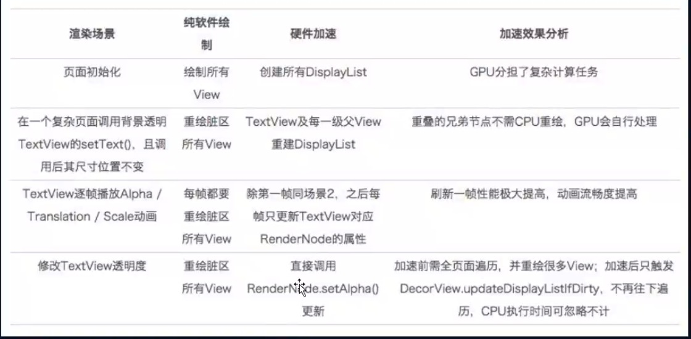
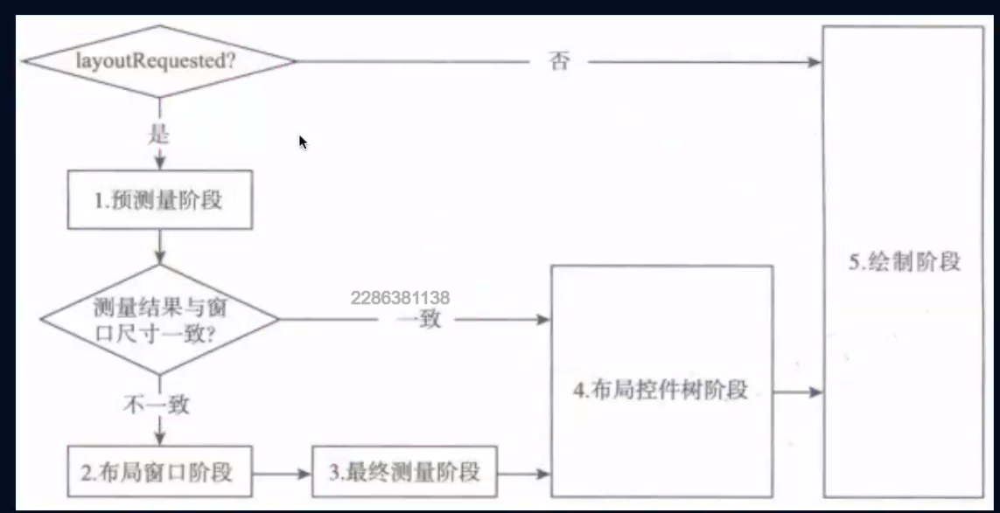

# View的绘制流程

view是什么时候添加到屏幕上的？
setContentView = 创建DecorView xml添加到DecorView上面, 但是还没有绘制到屏幕上去

来看个实例, 请问那些能拿到 高度值
```java
public class MainActivity extends AppCompatActvity {
    private static final String TAG = "leo";
    parvate TextView mTextView;
    @Override
    protected void onCreate(Bundle saveInstanceState) {
        super.onCtreate();
        setContectView(R.layout.activity_main);
        mTextView = findViewById(R.id.tv);

        android.util.Log.e(TAG, "height1 = ", + mTextView.getMeasureHeight());
        
        // handler 取消息 取到的时候测量已经完成了
        mTextView.post(new Runnable() {
            @Override
            public void run() {
                android.util.Log.e(TAG, "height2 = ", + mTextView.getMeasureHeight());
            }
        });
        
    }
    
    @Override
    protected void onResume() {
        super.onResume();
        android.util.Log.e(TAG, "height3 = ", + mTextView.getMeasureHeight());
    }
    
}

```

实际只有 Height2 可以拿到 值

在ActivityThread中

1. ActivityResumeActivity -  preformResumeActivity -- r.activity.performResume -- mInstrumentation.callActivityOnResume

2. r.window = r.activity.getWindow() // 拿到phone window

3. view decor = r.widow.getDecorView() // 创建decor 拿到 parentContent setContentView流程差不多 decor != null return decor

4. wm.addView(decor, l) wm = a.getWindowManager() (windowManagerImpl.addView - 
   windowManagerGoble.addView - new viewRootImpl(context,display))

    mView.add(view); // decor View
    mRoot.add(root); // viewRootImpl
    mParams.add(params); // window params
    root.setView(view, params, )
   
    windowManagerImap 确定 View 属于那个屏幕 那个父窗口
    
    windowManagerGlobal 管理者 管理整个进程所有的窗口信息  每个进程对应一个Global

    viewRootImpl 和 WMS 进行交互 操作自己的窗口 实际的操作者


ActivityThread在使用handleResumeActivity方法调用了activity的onResume方法之后，就调用了

wm.addView(decor, LayoutParams)

所以，在onResume方法之前，一个view的最顶层都是decor view，之后就是view root impl了。


5. viewRootImpl.setView()  - requestLayout()请求遍历 - scheduleTraversals() - Choreograpgher.CALLBACK_TRAVERSAL
        doTraversal() -  preformTraversal() // 绘制view
   
    res = mWindowSession.addToDisplayAsUser() // 将窗口添加到WMS上面
    InputEventReceiver = new WindowInputEventReceiver(inputChannel, looper.myLooper());// 事件的接受处理
    view.assignParent(this) //  把viewROotImpl 设置为 decorView 的parent this = viewRootImpl
   
    viewRootImpl 构造方法 
    
    mThread = Thread.currentThread(); 拿到当前线程 mainThread
    
    mDirty = new Rect(); //脏区域 改变文字的时候 会标记文字区域为脏 绘制的时候只绘制文字区域

    mAttachInfo = new View.AttachInfo(windowSession, window, display, this , handler, this context) // 保存当前窗口的一些信息 
        windowSession = windowManager.openSession - new session(this, callback)  // session 就是wms的代理 

6 重点就是 requestLayout()请求遍历
    1. windowSizeMayChange |= measureHierarchy 预测量 预测量是干嘛的 子view 和 父控件协商测量大小 宽高要为 warp_content 才要进行协商
        1. 设置一个值 进行第一次测量 performMeasure 获取一个状态值 state == 0 给的这个值认可 预测量结束 不等于0 
        2. 改变大小 baseSize = baseSize + desireWindowWidth / 2 给最大宽高 一半
        3. performMeasure 进行第二次测量, 满意退出
        4. 给最大宽高 进行测量  performMeasure
        5. 第三次测量 后面就不管了 
        6. 如果windowSizeMayChange = true 表示还需要测量
预测量 - getMeasureWithAndState
     2. relayoutResule = relayoutWindow() -- wms.relayout // 窗口布局
    3. performMeasure(childWidthMeasureSpec, childHeightMeasureSpec) // 控件树 测量
            view.measure(childWidthMeasureSpec, childHeightMeasureSpec) -> 
            onMeasure() -> setMeasureDimension() 所以自定义view必须重写setMeasureDimension() // 尺寸
            onMeasure() 
                1 params = child.getLayoutParams()
                2 xml中 root_view 没有设置 LayoutInflate 的root参数 = null xml 参数无效 原因就是在这里
                3 MeasureSpec 32 位 0-30 是size值 高两位是 模式 
    4. performLayout(lp, mWidth, mHight) // 布局
        view.layout()  onlayout(left, top, right, bootom) 相对于父容器的左上
                            viewGroup.onLayout() -> childLayout()
                         onLayoutChange()
                        如果是view + 自己的padding
                        如果是容器 + 孩子的Margin
    5. performDraw() // 绘制
            draw() 方法 -> scrollToRectOrFocus 计算滚动 输入 弹出输入框 View上移动
        两种情况  1 硬件加速绘制  mAttachInfo.mThreadedRenderer.draw() 效果更高 主要是软件绘制会绘制所有 软件会有区分
                2 软件绘制      drawSoftware() canvas view.draw()  drawBackGround(canvas) onDraw 绘制自己 dispatchDraw 绘制子view
                流程差不多 
    

总结

调用requestLayout 走的是下面的流程
调用invalidate走的上面的流程


问题
view UI刷新只能在主线程进行嘛 不是的 因为requesLayout设置一个checkThread() 
那个线程创建ViewrootImpl.requeseLayout 在那个线程更新UI
view.invalidate - parent.invalidateChild - viewGroup - viewRotImpl - checkThread()'

1. 在viewrootImpl创建之前进行出阿信 
2. 在子线程中创建ViewRootImpl  

    1 创建一个windowManager  
    2 view.inflte(id)
    3 这只 WindowManager.LayoutParams
    4 wm.addView()

    


    
   
   
   