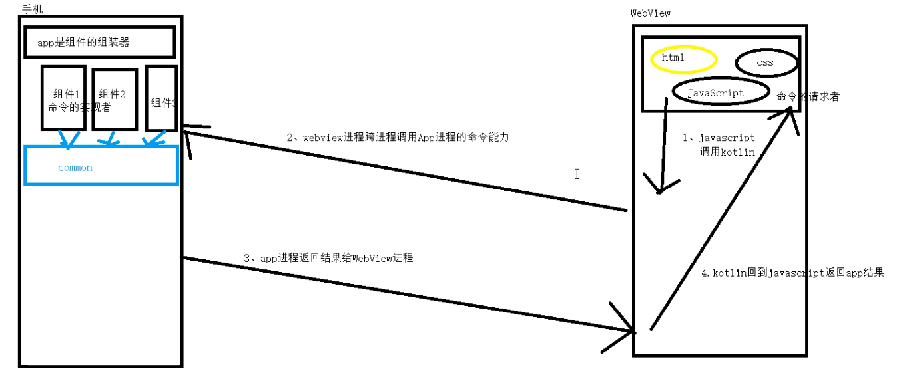
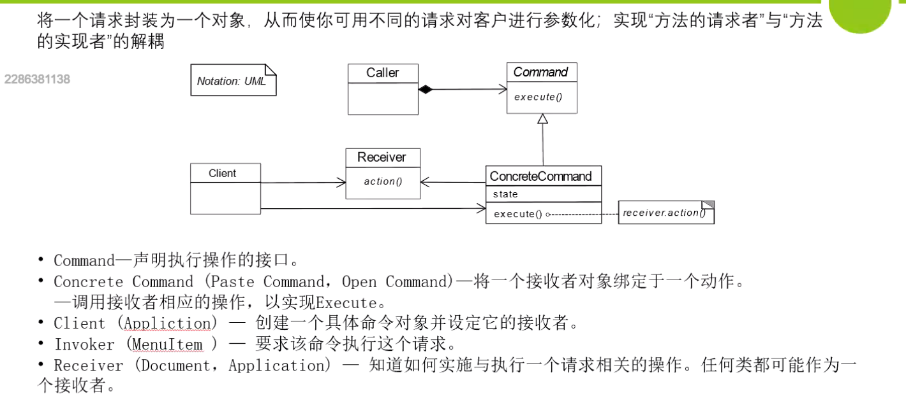

## 高可靠可扩展的原生和WebView通信框架

WebView框架


> WebView 和 Java通信架构

1. WebView 独立组件
2. 使用方便
3. 可扩展性
   命令模式 + autoService

4. 可配置性 actionBar  title smart refreshLayout loadsir
5. 可靠性  独立进程
6. 全面详细的文档
7. 升级部署

使用WebView的方式有那些 1 fragment 2 activity

组件化 -》 接口下称 组件和组件之间没有横向的依赖, 一个组件只有一个实现者

AutoService

```java
public class loadService {
    public <T> load(Class<T> service) {
        return ServiceLoader.load(service). ().next();
    }
}

```

Java SPI机制 - ServiceLoader

ServiceLoader来加载并实例化类 SPI全称Service Provider Interface，是Java提供的一套用来被第三方实现或者扩展的API，它可以用来启用框架扩展和替换组件。

Java SPI 实际上是“基于接口的编程＋策略模式＋配置文件”组合实现的动态加载机制，提供了通过interface寻找implement的方法。类似于IOC的思想，将装配的控制权移到程序之外，从而实现解耦。

Java SPI使用示例

1 定义接口

```java
package com.example.demo.service;

public interface PayService {
    void pay();
}

```

2 提供实现类

```java
package com.example.demo.service.impl;

import com.example.demo.service.PayService;

public class AlipayService implements PayService {
    @Override
    public void pay() {
        System.out.println("Alipay");
    }
}

public class WeixinpayService implements PayService {
    @Override
    public void pay() {
        System.out.println("Weixin Pay");
    }
}

```

3 配置文件 配置文件存放在目录META-INF/services中，文件名称为接口的全限定名， 文件内容为所有实现类的全限定名。


4 工具类

```java
package com.example.demo.util;

import com.example.demo.service.PayService;

import java.util.ServiceLoader;

public class ServiceObtain {

    public void showAllServices() {
        ServiceLoader<PayService> serviceLoader = ServiceLoader.load(PayService.class);

        for (PayService ele : serviceLoader) {
            ele.pay();
        }
    }
}
```

5 使用

在主程序中调用工具类来展示ServiceLoader的结果。

```java

@SpringBootApplication
public class DemoApplication {

    public static void main(String[] args) {

        SpringApplication.run(DemoApplication.class, args);

        ServiceObtain serviceObtain = new ServiceObtain();
        serviceObtain.showAllServices();
    }

}
```

6 结果 ServiceLoader获取配置文件中列出的实现类并使用classloader加载到JVM中。

Started DemoApplication in 1.952 seconds (JVM running for 2.441)
Alipay Weixin Pay

源码分析

根据ServiceLoader的入口load()函数，我们知道ServiceLoader创建LazyIterator， 而且ServiceLoader类也实现了Interator。

```java
public class loader {
    public static <S> ServiceLoader<S> load(Class<S> service) {
        ClassLoader cl = Thread.currentThread().getContextClassLoader();
        return ServiceLoader.load(service, cl);
    }

    public static <S> ServiceLoader<S> load(Class<S> service, ClassLoader loader) {
        return new ServiceLoader<>(service, loader);
    }

    private ServiceLoader(Class<S> svc, ClassLoader cl) {
        service = Objects.requireNonNull(svc, "Service interface cannot be null");
        loader = (cl == null) ? ClassLoader.getSystemClassLoader() : cl;
        acc = (System.getSecurityManager() != null) ? AccessController.getContext() : null;
        reload();
    }

    public void reload() {
        providers.clear();
        lookupIterator = new LazyIterator(service, loader);
    }
}
```

当我们在程序中遍历返回的ServiceLoader实例时，会使用创建的迭代器。 下面的hasNextService函数的fullName便为配置文件的全限定名，
使用classloader的getSystemResource来获取配置文件中的实现类的全限定名。

```java
public class hashnext {
    private boolean hasNextService() {
        if (nextName != null) {
            return true;
        }
        if (configs == null) {
            try {
                String fullName = PREFIX + service.getName();
                if (loader == null)
                    configs = ClassLoader.getSystemResources(fullName);
                else
                    configs = loader.getResources(fullName);
            } catch (IOException x) {
                fail(service, "Error locating configuration files", x);
            }
        }
        while ((pending == null) || !pending.hasNext()) {
            if (!configs.hasMoreElements()) {
                return false;
            }
            pending = parse(service, configs.nextElement());
        }
        nextName = pending.next();
        return true;
    }
}
```

下面的nextService函数对每个实现类的全限定名使用Class.forName来获得相应的class， 调用Class.newInstance来生成类的实例，最后将创建的实例和类名放入providers中。

```java
public class nextService {
    private S nextService() {
        if (!hasNextService())
            throw new NoSuchElementException();
        String cn = nextName;
        nextName = null;
        Class<?> c = null;
        try {
            c = Class.forName(cn, false, loader);
        } catch (ClassNotFoundException x) {
            fail(service,
                    "Provider " + cn + " not found");
        }
        if (!service.isAssignableFrom(c)) {
            fail(service,
                    "Provider " + cn + " not a subtype");
        }
        try {
            S p = service.cast(c.newInstance());
            providers.put(cn, p);
            return p;
        } catch (Throwable x) {
            fail(service,
                    "Provider " + cn + " could not be instantiated",
                    x);
        }
        throw new Error();          // This cannot happen
    }
}
```

使用Java SPI机制能够在service provider与service user之间进行解耦，同时， 只有在使用的时候才主动加载实现类并缓存加载的实现类，但是会加载配置文件中所有的实现类，
尽管有些实现类不使用。获取指定实现类也只能通过Iterator来获取，不能通过类似Map方式直接获取。 而且，ServiceLoader实例在多线程环境中不安全。

