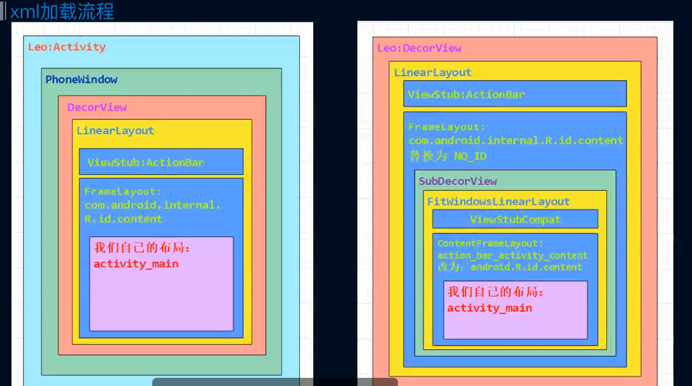

# SetContentView流程解析

SetContentView

1 MainActivity extends AppCompatActivity
2 MainActivity extend Activity

整体流程
phoneWindow.setContentView  注意目的 创建 DecorView 拿到Content

phoneWindow
1 Activity
2 Dialog
3 popupWindow
4 Toast

// phoneWindow 创建流程
ActivityThread.performLaunchActivity(创建Activity )
activity = mInstrumentation.newActivity()
activity.attach(); // new PhoneWindow
mInstrumentation.callActivityOnCreate() // onCreate

注意看第二个
```java
setContentView(int layoutID)
    getWindow.setContentView(layoutID); // 
        getWindow = phoneWindow 
            installDecor(); // 创建 DecorView 拿到 mContentParent
                mDecor = generateDecor(-1) // 创建 DecorView
                        new DecorView() // 就是一个FrameLayout extented FrameLayout
                mContentParent = generateLayout(mDecor) // 拿到 mContentParent
                        getWindowStyle // 拿到自定义主题
                        进行一些属性的设置 再xml设置的各种各样的属性 通过不同属性 拿到不同的xml content
                        mDecor.onResourcesLoaded(mLayoutInflater, layoutResource)
                            mLayoutInflater.inflate(layoutResource)
                            addView(root)
                        contentPrent = ViewGroup findViewByID(ID_ANDROID_CONTENT)
            mLayoutInflater.inflate(layoutID, mContentParent) // 渲染XML 到 mContentParent
                如果是Merge 必须又父容器 否则报错 创建根view
                view temp = creatViewFromTag() //创建View对象
                    view = onCreatView()
                        phoneLayoputInflater.onCreateView() 
                    view = CreatView
                        // 反射创建 View对象 class = class.forname() 拿到构造方法 两参数的构造方法自定义view
                        view = view = constructor.newInstan(); 
                        // 创建子view
                        InflateChilden()
     initWindowDecorActionBar();
```




merge 优化布局 必须作为 rootview

include
id 要注意
不能作为 rootview

viewStub
又隐藏作用 懒加载

为什么Xml 的 layout不带包名 SDK的必须带包名 
因为在 setContentView 的 inflatte 流程 xml的onCreateView 的时候会主动加上包名