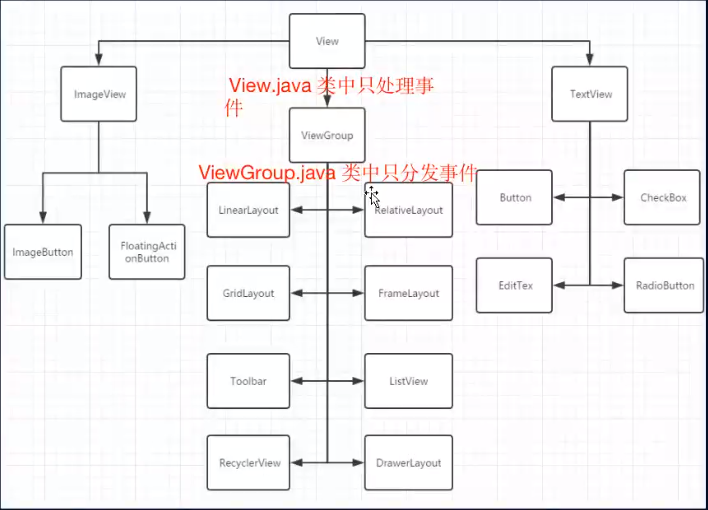
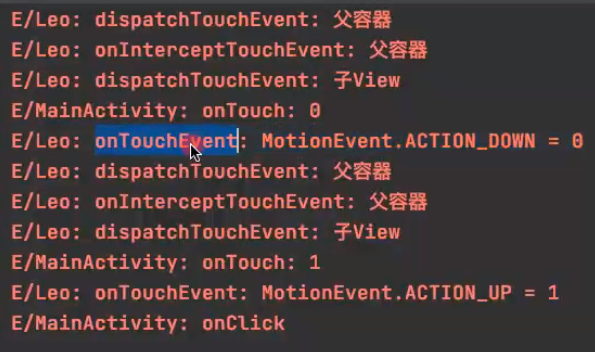
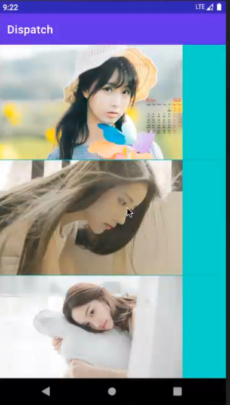
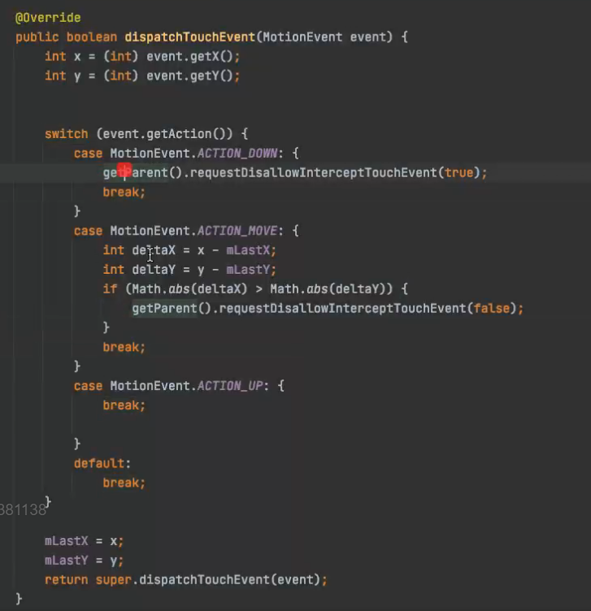

# 事件分发的处理机制

ActionDown 手指初次触碰到屏幕

ActionMove 手指向上滑动 会多次触发

ActionUp 手指离开屏幕时触发

ActionCancel 事件被上层拦截

## View继承关系



父容器 子View 是包裹关系

继承自View如果没有重写DispatchTouchEvent 默认都是调用父类的方法 View.DispatchEvent()

容器才会右分发

View 只有事件的处理逻辑
ViewGroup才有事件的分发逻辑


ViewRootImpl.setView()方法 会创建

InputChannel = new InputChannel();

### 事件接收流程
// 接收事件的流程 最后到了ViewGroup的DispatchEvent 

InputEventReceiver = new WindowInputReceiver(inputChannel, looper.myLooper);

事件来了会执行 InputEventReceiver.onInputEvent() (ViewRootImpl的内部类)

        接着调用 enqueueInputEvent doPrecessInputEvents();

            接着调用 deliverInputEvents(q)

                 state.deliver(q)(inputState stage)  inputState 有很多种 我们View的input处理实际上是在
                        
                        ViewPostImeInputStage 

                        // view 就是DecorView

                        mView.dispatchPointerEvent(event);

                                decorView.dispatchTouchEvent(event)

                                    activity.dispatchTouchEvent(event)

                                        getWindow().superDispatchTouchEvent(ev)

                                            phoneWindow.DispatchTouchEvent()

                                                Decor.DispatchTouchEvent()

                                                    super.DispatchTouchEvent()// 交给了Decor的Super Decor的super是FrameLayout
                                                       
                                                        ViewGroup.DispatchEvent();
                
### 事件处理流程

```java
public class Activity {
    
    public boolean dispatchTouchEvent(MotionEvent ev) {
        if (ev.getAction() == MotionEvent.ACTION_DOWN) {
            onUserInteraction();
        }
        if (getWindow().superDispatchTouchEvent(ev)) { // phoneWindow - decor - viewGroup - View.dispatchEvent();
            return true;
        }
        return onTouchEvent(ev); // 触摸事件 
    }
}
```

## 实例
模拟一个点击事件 查看一下事件处理的流程


流程图如下


事件处理
1， onTouchEvent 在哪执行的
2. onTouch 和 onClick 执行位置, 关系
    冲突关系 onTouch 执行后 return true onTouchEvent不会执行  onClick 就不会执行了  
            return false onTouchEvent执行 onClick 执行 
3. 按下移除View 为什么onClick 不执行
   onTouchEvent
   Down
   Move // 滑动的时候执行
        x = getEventX();
        y = getEventY();
        setPressed(false);// 设置一个标志位 会影响performClick执行 也就是Click执行
        
   UP
4. onTouchEvent干了什么 ？
    Down
    Move
    UP // onClick 在手指抬起后执行
      performClick - PerformClickInternal - listener.onClick() return true; // 表示事件消费了
5. 长按在哪处理
    按下的时候处理 通过延迟回调
    Down  checkForLongClick() - postDelayed() // 等待500ms


事件处理的几个重要方法:
1. dispatchTouchEvent  只有事件来到 View 这个事件就一定执行
2. onInterceptTouchEvent
3. onTouchEvent

ViewGroup.DispatchEvent();

父容器分发流程, 递归 责任链模式

Action_Down 后重置状态, 检测是否拦截(onInterceptTouchEvent) 检查一个标志位(disallowIntercept)
```java
public class ViewGroup{
    
    void onDispatchEvent() {
        if (actionMasked == MotionEvent.ACTION_DOWN || mFirstTouchTarget != null) {
            final boolean disallowIntercept = (mGroupFlags & FLAG_DISALLOW_INTECEPT) != 0;
            if (!disallowIntercept) {
                // 重写了这个方法 可拦截事件
                intercepted = onInteceptTouchEvent(ev);
                ev.setAction(action);
            } else {
                intercepted = false;
            }
        } else {
            intercepted = true;
        }
        
        // 检测事件是否取消
        final boolean canceled = resetCancelNextUpFlag(this) 
                || actionMasked == MotionEvent.ACTION_DOWN;
        
        if(!canceled && !intercepted) {
            // 在这里分发事件 intercepted的状态影响事件的分发 intercepted = false 才能分发事件
            
            int childrenCount = getChindrenCount();
            if (newTouchTarget != null && childrenCount != 0) {
                // 将子View进行排序 内部通过for循环遍历 遍历Z值 nextChild.getZ() 默认不设置都是0 xml中布局在上面的在后面 
                final ArrayList<View> preorderedList = buildTouchDispatchChildList();
                // 倒序遍历 先处理最后面的 ViewGroup - FrameLayout
                for (int i = childrenCount-1; i >=0 ; i--) {
                    // 判断是否能处理点击事件 判断View 可见 和 判断 点击区域是否在区域内
                    if (!child.canReceivePointerEvents()
                            || !isTransformedTouchPointInView(x, y, child, null)) {
                        continue;
                    }
                    
                    // 询问Child是否处理事件 这里是递归 执行child的DispatchEvent child.dispatchEven  t()
                    if (dispatchTransformedTouchEvent(ev, false, child, idBitsToAssign)) {
                        // 命中后说明有孩子可以处理此事件
                        // 创建了newTouchTarget  TouchTarget是一个链表 多指操作 
                        newTouchTarget = addTouchTarget(child, idBitsToAssign);
                        // 后面会用到
                        alreadyDispatchedToNewTouchTarget = true;
                        // 退出循环 不再询问其他child
                        break;
                    }
                    
                }
                // 说明上面没有孩子处理事件 没有child处理事件的时候 mFirstTouchTarget = null
                if(mFirstTouchTarget == null) {
                    // 询问自己是否处理
                    handled = dispatchformedTouchTarget();// super.dispatchTouchEvent  
                } else {
                    // 有子view处理事件
                    while(target != null) {
                        TouchTarget next =  target.next;
                        target = next;
                        // 前面赋值的 有child处理事件 标志位位true
                        if (alreadyDispatchedToNewTouchTarget && target == newTouchTarget) {
                            handled = true;
                        } else {
                            // 询问target.child() 
                            final boolean cancelChild = resetCancelNextUpFlag(target.child) || intercepted;
                        }
                    }
                }
            }
        }
    }

    
}
```
总结代码
1. ActionDown事件到来，是否拦截子View处理事件， onInterceptTouchEvent return false 不拦截 true 拦截
2. 遍历子View 询问子View是否拦截事件
3， 子View不处理, 询问自己是否拦截事件
## 事件拦截实战 解决滑动冲突

解决左右和上下滑动的事件冲突



```java
import javax.naming.Context;
import javax.swing.text.AttributeSet;
import javax.swing.text.html.ListView;

public class BadViewPager extends ViewPager {
    private int mLastX, mLastY;

    public BadViewPager(Context context) {
        super(context);
    }

    public BadViewPager(Context context, AttributeSet atts) {
        super(context, atts);
    }

    // 拦截自己的孩子 自己的孩子收不到事件 上下滑动不可以
    public boolean onInterceptTouchEvent(MotionEvent event) {
        // 上下滑动不可以 不询问子view ListView接收不到事件 上下没办法滑动
        return true;
        // return false 左右滑动不可以 View不拦截子孩子 ListView处理事件 ViewPager 就得不到执行 事件都被消费了
        // 解决办法 View根据X Y 判断 上下左右  判断拦截不拦截 实现滑动效果 
    }
}

public class MyListView extends ListView {
    private int mLastX, mLastY;

    public MyListView(Context context) {
        super(context);
    }

    public MyListView(Context context, AttributeSet atts) {
        super(context, atts);
    }

    // 拦截自己的孩子 自己的孩子收不到事件 上下滑动不可以
    public boolean onInterceptTouchEvent(MotionEvent event) {
        // 左右滑动不可以
        return true;
        // return false 上下滑动不可以 不拦截 询问孩子处理事件吗？ 所有孩子都不处理事件 ViewPager自己处理事件
    }
}

```

根据上面的结论 当事件冲突的时候如果实现上下滑动左右滑动也可以？

处理冲突两种方案 
1. 内部拦截法 子view根据条件 让事件由谁处理 是自己本身处理 还是让 父容器处理 一定让子view拿到事件
            getParent().requestDisallowInterceptTouchEvent(true);
2. 外部拦截法 

API
请求父容器不要拦截我
getParent().requestDisallowInterceptTouchEvent(true); 
    // 内部给 mGroupFlags赋值 - 影响final boolean disallowIntercept = (mGroupFlags & FLAG_DISALLOW_INTECEPT) != 0;
    // 这个会影响 父容器重写的方法执不执行



代码流程如下
1. Down事件直接分发给ListView处理 requestDisallowInterceptTouchEvent(true);
2. Move事件 判断事件左右滑动  requestDisallowInterceptTouchEvent(false); 但因为是move事件 事件还是在ListView中
    直接影响这里  final boolean cancelChild = resetCancelNextUpFlag(target.child) || intercepted; cancelChild 取消事件
        询问ListView是否处理事件 事件设置为CANCLE 执行取消事件  将FastTouchTarget 置为null 那第二个move事件到来后 ViewPager的DispatchEvent
            // 说明上面没有孩子处理事件 没有child处理事件的时候 mFirstTouchTarget = null
            if(mFirstTouchTarget == null) {
            // 询问自己是否处理 ViewPager处理move事
            handled = dispatchformedTouchTarget();// super.dispatchTouchEvent  
            