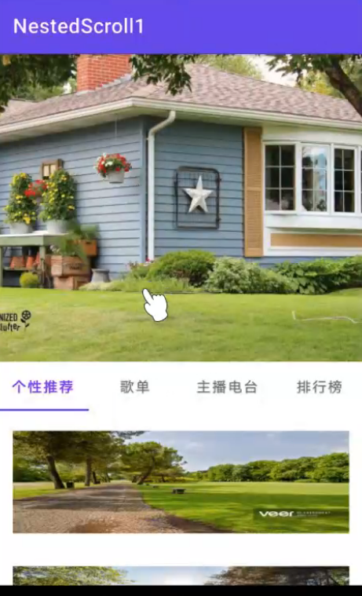
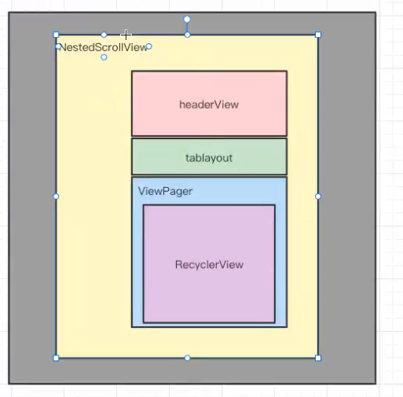
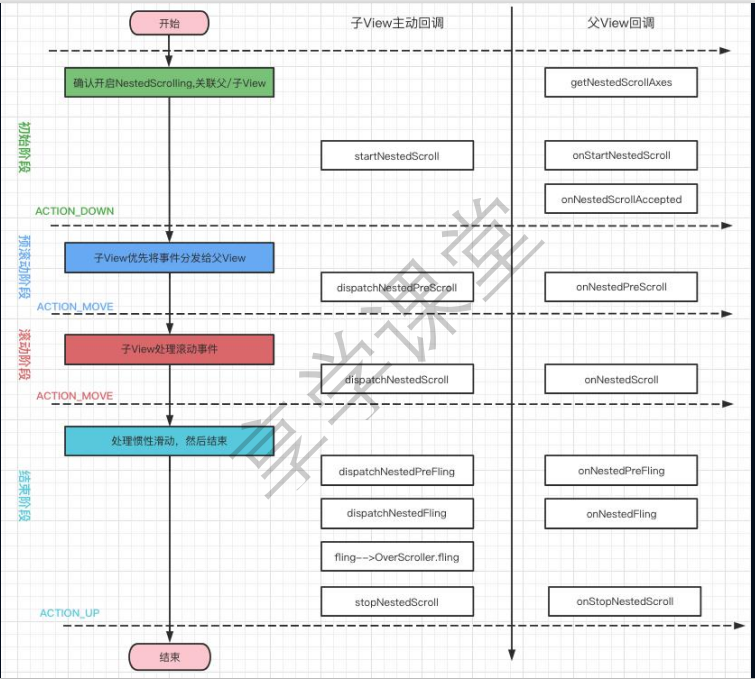

# 嵌套滑动 - 吸顶效果

效果



1. headView 支持滑动 NestedScrollView
2. 在recycle 向上滑动 Scroll 和 Fling headView 一起滑动 事件分发 
   
            子 View 处理后 让父容器处理 很容易 getParent().requestDisallowInterceptTouchEvent(false);
   
            父容器处理后再次给到子 view 内部拦截发 外部拦截发 是实现不了的 
3. 在headView 向上滑动 Scroll 和 Fling recycle 一起滑动
4. tableLayout吸顶  高度计算 tableLayout + viewPage = 一个屏幕高 便不能再滑动了

嵌套滑动
NestedScrollView  实现了 NestedScrollingParent NestedScrollingChild
NestedScrollingParent
NestedScrollingParentHelper
NestedScrollingChild
NestedScrollingChildHelper 


NestedScrollView  实现了 NestedScrollingParent NestedScrollingChild 既能作为父亲也能作为孩子
Recycle 实现了 NestedScrollingChild 只能作为孩子

实现嵌套滑动的思路

通过回调进行处理  没有走传统的事件分发 

子View 拿到事件后 通过回调让父容器也可以处理滚动 



RecycleView.dispatchNestedPreScroll()
    
    - > NestScrollVIew.onNestedPreScroll();
        
        -> dispatchHelper.dispatchNestedScroll();

## 布局 效果


```xml
<?xml version="1.0" encoding="utf-8"?>
<layout>
    <androidx.core.widget.NestedScrollView 
       xmlns:android="http://schemas.android.com/apk/res/android"
       xmlns:tools="http://schemas.android.com/tools"
       android:layout_width="match_parent"
       android:layout_height="match_parent"
       android:orientation="vertical"
       tools:context=".MainActivity">

        <androidx.appcompat.widget.LinearLayoutCompat
                android:layout_width="match_parent"
                android:layout_height="match_parent"
                android:orientation="vertical">
            <androidx.appcompat.widget.AppCompatImageView
                    android:layout_width="match_parent"
                    android:src="@drawable/demo"
                    android:scaleType="centerCrop"
                    android:layout_height="300dp" />

            <com.google.android.material.tabs.TabLayout
                    android:id="@+id/tablayout"
                    android:layout_width="match_parent"
                    android:layout_height="wrap_content"/>

            <androidx.viewpager2.widget.ViewPager2
                    android:id="@+id/viewpager_view"
                    android:layout_width="match_parent"
                    android:layout_height="match_parent" />
        </androidx.appcompat.widget.LinearLayoutCompat>
    </androidx.core.widget.NestedScrollView>
</layout>

<?xml version="1.0" encoding="utf-8"?>
<androidx.recyclerview.widget.RecyclerView 
xmlns:android="http://schemas.android.com/apk/res/android"
   android:id="@+id/recycler_view"
   android:layout_width="match_parent"
   android:layout_height="match_parent">
</androidx.recyclerview.widget.RecyclerView>

<layout xmlns:android="http://schemas.android.com/apk/res/android"
        xmlns:app="http://schemas.android.com/apk/res-auto">

<data>
    <variable
            name="viewModel"
            type="com.leo.nestedscroll1.viewpager.fragment.recyclerview.titleview.TitleViewViewModel" />

    <import type="android.view.View" />
    <import type="android.text.TextUtils" />
    <import type="androidx.databinding.ObservableField" />
</data>AppCompatImageView
<androidx.appcompat.widget.
        android:layout_margin="16dp"
        android:id="@+id/item_file_name"
        android:layout_width="match_parent"
        android:layout_height="0dp"
        android:scaleType="centerCrop"/>
</layout>

```

## MainActivity
```java
import androidx.annotation.NonNull;
import androidx.appcompat.app.AppCompatActivity;
import androidx.databinding.DataBindingUtil;
import androidx.fragment.app.Fragment;

import android.os.Bundle;

import com.google.android.material.tabs.TabLayout;
import com.google.android.material.tabs.TabLayoutMediator;
import com.leo.nestedscroll3.databinding.ActivityMainBinding;
import com.leo.nestedscroll3.viewpager.fragment.RecyclerViewFragment;
import com.leo.nestedscroll3.viewpager.fragment.ViewPagerAdapter;

import java.util.ArrayList;
import java.util.List;

public class MainActivity extends AppCompatActivity {
    private ActivityMainBinding mBinding;
    final String[] labels = new String[]{"个性推荐", "歌单", "主播电台", "排行榜"};

    @Override
    protected void onCreate(Bundle savedInstanceState) {
        super.onCreate(savedInstanceState);
        mBinding = DataBindingUtil.setContentView(this, R.layout.activity_main);
        ViewPagerAdapter pagerAdapter = new ViewPagerAdapter(this, getPageFragments());
        mBinding.viewpagerView.setAdapter(pagerAdapter);
        new TabLayoutMediator(mBinding.tablayout, mBinding.viewpagerView, new TabLayoutMediator.TabConfigurationStrategy() {
            @Override
            public void onConfigureTab(@NonNull TabLayout.Tab tab, int position) {
                tab.setText(labels[position]);
            }
        }).attach();
        // 吸顶效果
        mBinding.tablayoutViewpager.post(new Runnable() {
            @Override
            public void run() {
                mBinding.tablayoutViewpager.getLayoutParams().height = mBinding.nestedscrollview.getMeasuredHeight();
                mBinding.tablayoutViewpager.requestLayout();
            }
        });
    }

    private List<Fragment> getPageFragments() {
        List<Fragment> data = new ArrayList<>();
        data.add(new RecyclerViewFragment());
        data.add(new RecyclerViewFragment());
        data.add(new RecyclerViewFragment());
        data.add(new RecyclerViewFragment());
        return data;
    }
}

```