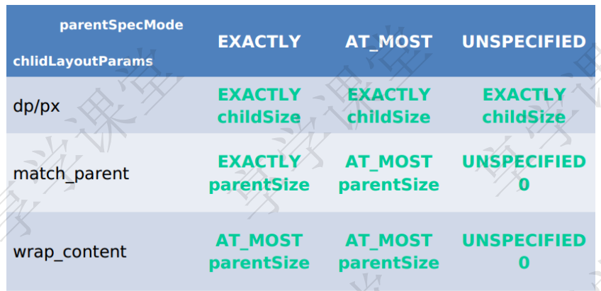

# 自定义View
自定义View的三个方法
1 onMeasure()  View的大小
2 onLayout()   View在ViewGroup中的位置
3 onDraw()     决定绘制这个View

自定义View 重写 onMeasure() 和 onDraw()
自定义ViewGroup 只需要重写onMeasure() 和 onLayout()

Android 中的组件都是View 和 ViewGroup构成
View的构造函数一共有四个

```java
import java.util.jar.Attributes;

public class View {
    // View 在Java里面new的调用第一个构造函数
    public CarsonView(Context context) {

    }

    // view 在xml里面生命调用第二个 自定义属性是从AttributeSet传进来的
    public CarsonView(Context context, Attributeset attributeset){
        super(context, attributeset);
    }
    
    // 不会自动调用 一般是第二个构造函数主动调用
    public CarsonView(Context context, Attributeset attributeset, int defstyleAttr){
        super(context, attributeset, defstyleAttr);
    }

    // 不会自动调用 一般是第二个构造函数主动调用 如果有style属性
    public CarsonView(Context context, Attributeset attributeset, int defstyleAttr, int defstyleRes){
        super(context, attributeset, defstyleAttr, defstyleRes);
    }

}
```

AttributeSet自定义属性
可以在xml里面配置属性 对于写好的自定义View 同样也可以在xml中配置属性 View 可以在xml中配置
1 通过 <decle-styleable> 自定义View添加属性
2 在xml中声明属性值
3 在运行一般为构造函数获取属性值
4 将获取到的属性值应用到View


View的视图结构

PhoneWindow是Android系统中最基本的窗口系统
    继承window类 负责管理界面显示以及事件响应
DecorView是PhoneWindow的起始View 继承View 本质是一个Framelayout
ViewRoot在Activity启动时创建 负责管理 布局 渲染窗口UI


View的四个顶点
Top 子View上边界到父View上边界的距离
Left子View左边界到父View左边界的距离
Bottom子View下边到父View上边界的距离
Right子View右边界到父View左边界的距离

View树的绘制流程
ViewRoot负责绘制  ViewRoot其实不是View的根节点 View的节点都不算 负责将DecorView 和 PhoneWindow联系起来  
每个DecorView都有一个ViewRoot 这种管理关系由WindowManager管理

View的添加
WM.addView WMImpl.addView VMGoble.addView ViewRootImpl.setView
    ViewRootImpl.requestLayout  viewRootImpl.scheduleTraversals 
        TraversalRunnable.run ViewRootImpl.doTraversal ViewRootImpl.performTraversals

绘制流程
viewRotImpl.performTraversals() - viewRootImpl.performsMeasure - View.measure
    DecorView.onMeasure() - FrameLayout.onMeasure - FrameLayout.measureChildWithMargins 
        viewGroup.getChildMeasureSpec - view.Measure - LinerLayout.onMeasure - 子View.measure


Layout
viewRootImpl.performLayout - DecorView.layout - view.setGrame - decorView.onLayout 
        FrameLayout.onLayout - FrameLayout.layoutChildren - LinearLayout.onLayout - View.layout


Draw
ViewRootImpl.perforTraversals - ViewrootImpl.performDraw ViewRootImpl.drawSoftWare
    View.draw - view.drawBackGround - View.onDraw View.dispatchDraw - view.onDrawForeGround - 
        ViewGroup.dispatchDraw - viewGroup.drawChild() view.draw()


widthMeasureSpec:  SpecMode(高2位) + SpecSize(低30)
heightMeasureSpec: SpecMode + SpecSize

UNSPECIFIED 父控件不对子View有任何限制 想要多大就给多大
Exactly  精确的的小 最终大小就是这么大
Atmost 大小不能大于父控件给你指定的size

MeasureSpecs的意义
将SpecMode 和 SoecSize 打包成一个int值 可以避免过多的对象内存分配

子View的MeasureSpec值时根据子View的布局参数和父容器的MeasureSpec值计算得来的
具体逻辑封装在getChildMeasureSpec()


ParentSize 为父容器中目前可使用的大小 对于应用层View 其MeasureSpec有父容器的
    MeasureSpec和自身的LayoutParams共同决定

对于不同的父容器和View本身不同的LayoutParams,view就可以有多种MeasureSpec
1 当View采用固定宽高的时候 不管父容器的MeasureSpec是神，view 的MeasureSpec
都是精确模式并且其大小遵循Layoutparams中的大小
2 当View的宽高是match_parent时 这个时候如果父容器的模式是精确模式 那么View也是精确模式
    并且其大小是父容器的剩余空间 如果父容器是最大模式 那么view也是最大模式并且其大小不会超过父容器的剩余大小
3 当View的宽高为Warp_content时 不管父容器的模式时精准还是最大化 view的模式总是最大化并且大小不会超过父容器的宽高
4 当view为unspecified模式 这个模式主要用于系统多出measure的清空 一般不需要关注 

