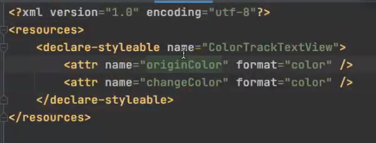
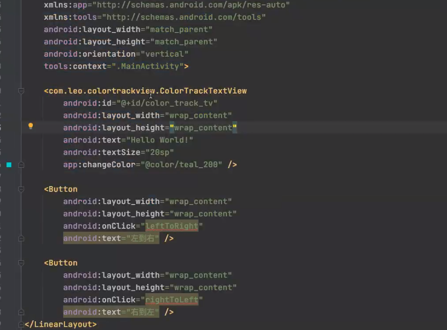
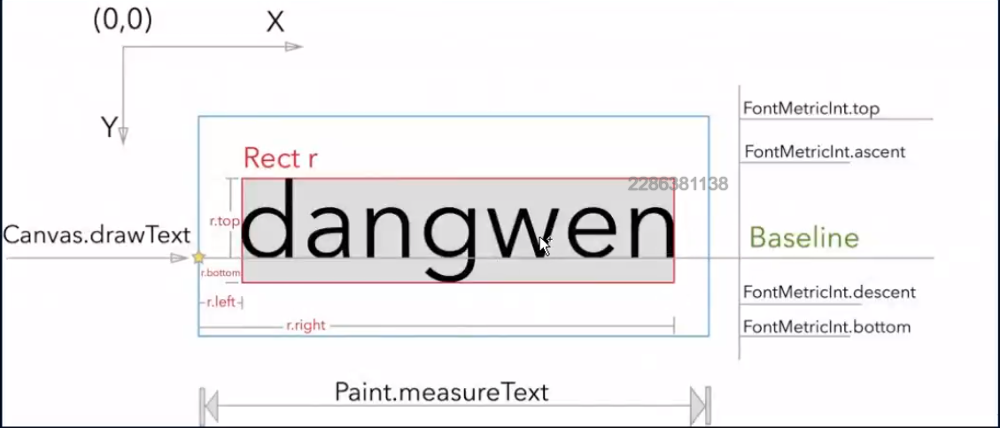
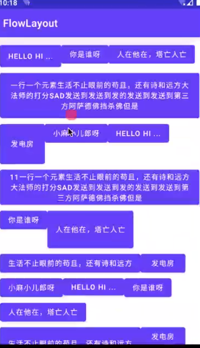

# 自定义UI实战

## 自定义View的流程

有些时候会觉得Android中提供的控件不能满足项目的要求，所以就会常常去自定义控件。自定义控件就不免会自定义属性。自定义属性大致需要三个步骤：

1. 在XML文件中定义自定义属性的名称和数据类型
2. 在布局中调用自定义属性
3. 在代码中获取自定义属性。 下面来详细的解析一下这三个步骤。

自定义属性实现的步骤 1.在res/values/attrs.xml中配置View的自定义属性 注意:
name:是自定义属性的名字 format:是紫荆一属性数据的格式

```xml
<?xml version="1.0" encoding="utf-8"?>
<resources>

    <declare-styleable name="FlowLayoutStyle">
        <!--        Labels的文字-->
        <attr name="flTextColor" format="color"/>
        <!--        Labels的背景色-->
        <attr name="flBackgroundColor" format="color"/>
        <!--        Labels的角度大小-->
        <attr name="flAngleSize" format="float"/>
        <!--        Labels的左右 Margin-->
        <attr name="flMarginLeftAndRight" format="integer"/>
        <!--        Labels的上下 Margin-->
        <attr name="flMarginTopAndBottom" format="integer"/>
        <!--      Labels 内容上下padding  -->
        <attr name="flPaddingTopAndBottom" format="integer"/>
        <!--      Labels 内容左右padding  -->
        <attr name="flPaddingLeftAndRight" format="integer"/>
    </declare-styleable>

</resources>

```

2.xml布局中引用属性且配置初始数据

```xml

<com.wkq.flow.FlowLayout
        android:background="@color/teal_200"
        android:id="@+id/fl"
        android:layout_width="wrap_content"
        app:flBackgroundColor="@color/purple_200"
        app:flTextColor="@color/white"
        app:flAngleSize="10"
        app:flPaddingLeftAndRight="40"
        app:flPaddingTopAndBottom="10"
        app:flMarginLeftAndRight="40"
        app:flMarginTopAndBottom="30"
        android:layout_height="wrap_content"/>
```

3. 获取自定义属性配置的数据

```kotlin

var style = context.obtainStyledAttributes(attrs, R.styleable.FlowLayoutStyle)

var bgcolor = style.getColor(R.styleable.FlowLayoutStyle_flBackgroundColor, context.resources.getColor(R.color.bg_color))

var textColor = style.getColor(R.styleable.FlowLayoutStyle_flTextColor, context.resources.getColor(R.color.text_color))

var mLeftAndRightPadding = style.getInt(R.styleable.FlowLayoutStyle_flPaddingLeftAndRight, 10)

var mTopAndBottomPadding = style.getInt(R.styleable.FlowLayoutStyle_flPaddingTopAndBottom, 5)

var leftAndRightMargin = style.getInt(R.styleable.FlowLayoutStyle_flMarginLeftAndRight, 10)

var topAndBottomMargin = style.getInt(R.styleable.FlowLayoutStyle_flMarginTopAndBottom, 5)

var flAngleSize = style.getFloat(R.styleable.FlowLayoutStyle_flAngleSize, 10f)

```

## 自定义View文字变色实战

在项目的res/values文件夹下新建一个attrs.xml的文件，在文件中设置自定义属性的名称和类型。代码如下：

1. 自定义属性



2. 配置xml



3. 自定义view流程 测量自己
4. onDraw 
5. 交互

```java
import javax.swing.*;
import javax.swing.text.AttributeSet;
import java.awt.*;

public class ColorTrackTextView extends AppCompatTextView {

    // 绘制不变色字体的画笔
    private Paint mOriginPaint;
    // 绘制变色字体的画笔
    private Paint mChangePaint;
    // 当前绘制变色的进度
    private float mCurrentPragress = 0.5f;

    public ColorTrackTextView(Context context) {
        this(context, null);
    }

    public ColorTrackTextView(Context context, AttributeSet attrs) {
        this(context, attrs);
    }

    public ColorTrackTextView(Context context, AttributeSet attrs, int defStyleAttr) {
        super(context, attrs, defStyleAttr);
    }

    public void leftToRight(View view) {
        setAnimation(ColorTrackTextView.Direction.LEFT_TO_RIGHT);
    }

    public void leftToRight(View view) {
        setAnimation(ColorTrackTextView.Direction.RIGHT_TO_LEFT);
    }

    // 拿到属性 方式源码都有 
    public void initPaint(Context context, AttributeSet attrs) {

        TypeArray typeArray = context.obtainStyledAttributes(attrs, R.styleable.ContextTextView);

        int originColor = typeArray.getColor(R.styleable.ColorTrackTextView_originColor, getTextColors().getDefaulColor());
        int changeColor = typeArray.getColor(R.styleable.ColorTrackTextView_changeColor, getTextColors().getDefaulColor());

        // 初始化画笔
        mOriginPaint = getPaintByColor(originColor);
        mChangePaint = getPaintByColor(changeColor);

        // 回收 不然影响性能
        typeArray.recyle();
    }

    // 根据颜色创建画笔
    private Paint getPaintByColor(int color) {
        Paint paint = new Paint();
        // 设置颜色
        paint.setColor(color);
        // 设置抗锯齿
        paint.setAntiAlias(true);
        // 防抖动
        paint.setDither(true);
        // 设置字体颜色 TextView的字体大小
        paint.setTextSize(getTextSize());
        return paint;
    }


    protected void onDraw(Canvas canvas) {
        int currentPoint = (int) (mCurrentPragress * getWidth());


        if (Direction == Directionl.LEFF_TO_RIGHT) {
            drawText(canvas, mChangePaint0, 0, currentPoint);
            drawText(canvas, mOriginPaint, currentPoint, getWidth());
        } else {
            drawText(canvas, mChangePaint0, getWidth() - currentPoint, getWidth());
            drawText(canvas, mOriginPaint, 0, getWidth() - currentPoint);
        }
    }

    // 刷新
    public void setCurrentProgress(float currentProgress) {
        this.mCurrentPragress = currentProgress;
        invalidate();
    }

    // 动画效果
    public void setAnimation(ColorTrackTextView.Direction direction) {
        mColorTrackTextView.setDirection(direction);
        ValueAnimator valueAnimator = ObjectAnimator.ofFloat(0, 1);
        valueAnimator.setDuration(2000);
        valueAnimator.addUpdateListener(new ValueAnimator.AnimatorUpdateListener() {
            @Override
            public void onAnimationUpdate(ValueAnimator animation) {
                float currentProgress = (float) animation.getAnimatedValue();
                mColorTrackText.view.setCurrentProgress(currentProgress);
            }
        });
        valueAnimator.start();
    }

    // canvas.clipRect() 裁剪了 裁剪后绘制的内容 
    private void drawText(Canvas canvas, Paint paint, int start, int end) {
        canvas.save();
        Rect rect = new Rect(start, 0, end, getHeight);
        canvas.clipRect(rect);

        String text = getText.toString();
        if (TextUtils.isEmpty(text)) return;

        // 获取文字的区域
        Rect bounds = new Rect();
        paint.getTextBounds(text, 0, text.length(), bounds);

        // 获取x坐标 dx就是左边界 dy就是基线
        int dx = getWidth() / 2 - bounds.width() / 2;
        // 获取文字基线 baseLine
        Paint.FontMetricsInt fontMetricsInt = mChangePaint.getFontMetricsInt();
        int dy = (fontMetricsInt.bootom - fontMetricsInt.top) / 2 - fontMetricsInt.bottom;
        int baseLine = getHeight() / 2 - dy;

        // 绘制文字 canvas 
        canvas.drawText(text, dx, baseLine, mOriginPaint);
        cavas.restore();
    }

}
```

基线算法 文字是以基线画的 文字



## 流式布局 自定义ViewGroup

1. 自定义属性

2. xml的使用
3. 测量 先测量子view 根据子view测量自己 保存大小 尺寸 给onLayout用
4. onLayout 根据自己的业务逻辑 进行child的绘制
5. onDraw(正常不会调用)

```java
import javax.swing.text.AttributeSet;
import java.util.ArrayList;

public class FlowLayout extends ViewGroup {

    private List<View> mLineViews;// 每一行子的View
    private List<List<View>> mViews;// 所有行的view
    private List<Integer> mHeight;// 每一行的高度

    private init() {
        mLineViews = new ArrayList<>();
        mViews = new ArrayList<>();
        mHeight = new ArrayList<>();
    }

    public FlowLayout(Context context) {
        super(context);
    }

    public FlowLayout(Context context, AttributeSet attrs) {
        super(context, attrs);
    }

    public FlowLayout(Context context, AttributeSet attrs, int defStyleAttr) {
        super(context, attrs, defStyleAttr);
    }

    public void onMeasure(int widthMeasureSpec, int heightMeasureSpec) {
        // 获取 限制的值
        int widthMode = MeasureSpec.getMode(widthMeasureSpec);
        int widthSize = MeasureSpec.getSize(widthMeasureSpec);
        int heightMode = MeasureSpec.getMode(heightMeasureSpec);
        int heightMode = MeasureSpec.getSize(heightMeasureSpec);

        // 记录当前行的宽度和高度
        int lineWidth = 0; // 宽度式当前行子view的宽度之和
        int lineHeight = 0; // 高度式当前行所有子View中高度的最大值

        // 整个流失布局的宽度和高度
        int flowLayoutWidth = 0; // 所有行中宽度的最大值
        int flowLayoutHeight = 0; // 所有行的高度的累加

        init();

        int childCount = this.getChildCount();

        // 测量孩子 先测量子view 根据子view测量自己的保存
        for (int i = 0; i < childCount; i++) {
            View child = this.getChildAt(i);
            measureChild(child, widthMeasureSpec, heightMeasureSpec);

            // 获取当前子view的测量的宽度/高度 
            int childWidth = child.getMeasuredWidth();
            int childHeight = child.getMeasuredHeight();

            mLineViews.add(child);
            lineWidth += childWidth;
            // 获取行中最高的view
            lineHeight = Math.max(lineHeight, childHeight);

            // 已经放入孩子的宽度 + 准备放入孩子的宽度 大于 总宽度 就换行
            if (lineWidth + childWidth > widthSize) {
                mViews.add(mLineViews);
                mLineViews = new ArrayList<>();

                flowLayoutWidth = Math.max(flowLayoutWidth, lineWidth);
                flowLayoutHeight += lineHeight;
                //  换行
                lineHeight = 0;
                lineWidth = 0;
            }
        }
        // 保存尺寸给后面用  保存后父容器才能通过 getMeasureWidth()获取这个值 
        serMeasureDimension(widthMode == MeasureSpecc.EXACTLY ? widthSize : flowLayoutWidth,
                heightMode == MeasureSpec.EXACTLY ? heightSize : flowLayoutHeight);

    }

    // 布局就是确定每个childView的左上右下
    protected void onLayout(boolean b, int left, int top, int right, int bottom) {
        int currX = 0;
        int currY = 0;
        int lineCount = mViews.size();
        for (int i = 0; i < lineCount; i++) {
            List<View> lineViews = mViews.get(i);
            int lineHeight = mHeight.get(i);
            int size = lineViews.size();
            for (int j = 0; j < size; j++) {
                View child = lineViews.get(j);
                // 子view的左上右下
                int left = currX;
                int top = currY;
                int right = left + child.getMeasuredWidth();
                int bottom = top + child.getMeasuredHeight();
                // 布局子view
                child.layout(left, top, right, bottom);
                currX += child.getMeasureWidth();
            }
            currY += lineHeight;
            currX = 0;
        }
    }

}

```

## 效果



