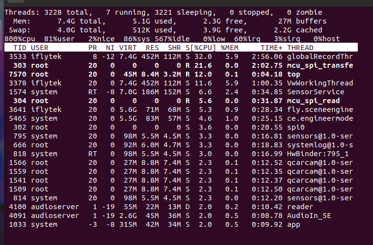
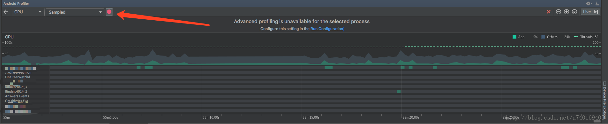
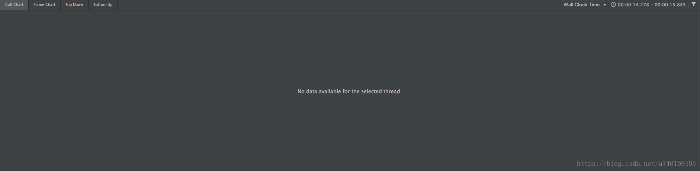
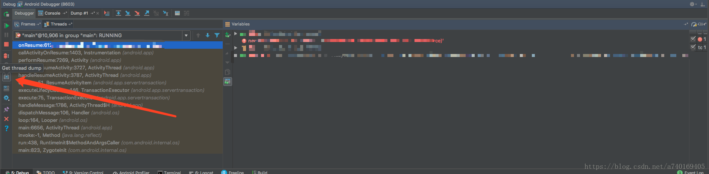
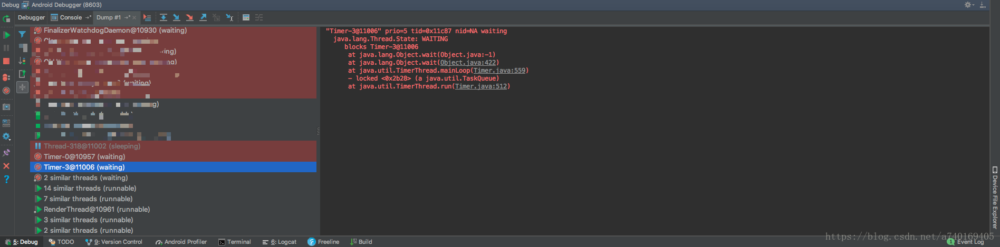
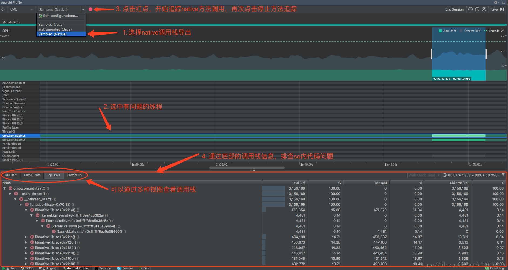

Android查看每个线程CPU占用情况，以及工作内容分析

Android应用开发阶段，有时候会发现应用占用CPU特别高，
本文将针对这种场景提出解决方案，排查Java线程问题以及Native线程问题。

Android应用开发阶段，有时候会发现应用占用CPU特别高，本文将针对这种场景提出解决方案，排查Java线程问题以及Native线程问题。

查看CPU占用率的命令

adb shell top

使用参数：
usage: top [-Hbq] [-k FIELD,] [-o FIELD,] [-s SORT] [-n NUMBER] [-m LINES] [-d SECONDS] [-p PID,] [-u USER,]

Show process activity in real time.

-H	Show threads
-k	Fallback sort FIELDS (default -S,-%CPU,-ETIME,-PID)
-o	Show FIELDS (def PID,USER,PR,NI,VIRT,RES,SHR,S,%CPU,%MEM,TIME+,CMDLINE)
-O	Add FIELDS (replacing PR,NI,VIRT,RES,SHR,S from default)
-s	Sort by field number (1-X, default 9)
-b	Batch mode (no tty)
-d	Delay SECONDS between each cycle (default 3)
-m	Maximum number of tasks to show
-n	Exit after NUMBER iterations
-p	Show these PIDs
-u	Show these USERs
-q	Quiet (no header lines)

Cursor LEFT/RIGHT to change sort, UP/DOWN move list, space to force
update, R to reverse sort, Q to exit.

命令打印:

各列含义:

PID：略
PR：在android N之前代表运行在哪个核上，在android N上代表优先级，当然可能设备厂商会进行自定义
CPU%：略
S：运行状态
#THR：线程数
VSS：Virtual Set Size  虚拟耗用内存（包含共享库占用的内存）
RSS：Resident Set Size 实际使用物理内存（包含共享库占用的内存）
PCY：调度策略优先级，SP_BACKGROUND/SP_FOREGROUND
UID：进程所有者的用户id
Thread：线程名称
Name：进程名

可以看出，CPU占用最高的是前两个，其中com.xxxxxx是我自己的应用包名。从Thread那一列可以看出Thread的名称。

查看线程工作

知道了具体哪个线程占用CPU高之后，再使用Android Studio的android profiler开启method record。导出结果后查看线程方法调用即可

android profiler无法导出

有时候，你发现一个线程CPU占用很高，但是，通过android profiler追踪调用栈的时候，显示下面这个结果：
No data available for the selected thread.

此时，可以通过打断点debug调试，导出所有线程的调用栈，比如在主线程的一个按钮点击事件里面，打个断点，当程序跑到断点处时，调出Debug面板，
点击左侧的Get thread dump按钮。

点击之后，会出现所有现成的调用栈列表，找到消耗CPU高的线程，在右侧查看其调用栈

如果出现上图的情况，调用栈并没有你的项目代码的时候，可以看看调用栈调用的对象有哪些，比如截图中有TimerThread类，则此时，可以把java堆内存导出来，
然后找TimerTread对象，并查看其引用，看看能不能找到项目中的类对象对其的引用。

Native线程问题

如果，在profiler里能看到某一个线程CPU占用非常高，而通过上面这些方法仍然无法定位到问题，那么，可以确定，这个线程是Native层创建的，此时应该排查各个so是否有线程问题。

如何查看到native线程的问题，需要Android系统在8.0及以上，Android Studio 版本在3.1及以上。
在8.0手机上复现线程问题之后，使用Android Studio的CPU Profiler，查看native线程调用栈。

https://developer.android.com/studio/profile/cpu-profiler?hl=zh-cn

google 文档

使用 CPU 性能分析器检查 CPU 活动

优化应用的 CPU 使用率能带来诸多好处，如提供更快、更顺畅的用户体验，以及延长设备电池续航时间。

您可以使用 CPU 性能分析器在与应用交互时实时检查应用的 CPU 使用率和线程活动，也可以检查记录的方法轨迹、函数轨迹和系统轨迹的详情。

CPU 性能分析器记录和显示的详细信息取决于您选择的记录配置：

    System Trace：捕获精细的详细信息，以便您检查应用与系统资源的交互情况。

    Method and function traces：对于应用进程中的每个线程，您可以了解一段时间内执行了哪些方法 (Java) 或函数 (C/C++)，以及每个方法或函数在其执行期间消耗的 CPU 资源。您
    还可以使用方法和函数轨迹来识别调用方和被调用方。调用方是指调用其他方法或函数的方法或函数，而被调用方是指被其他方法或函数调用的方法或函数。
    您可以使用这些信息来确定哪些方法或函数过于频繁地调用通常会消耗大量资源的特定任务，并优化应用的代码以避免不必要的工作。

    记录方法跟踪数据时，您可以选择“sampled”或“instrumented”记录方式。记录函数跟踪数据时，只能使用“sampled”记录方式。

