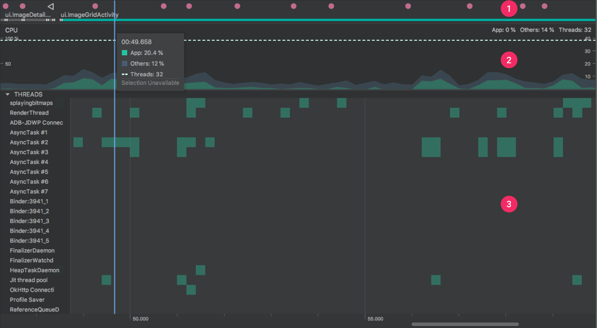

Android查看每个线程CPU占用情况，以及工作内容分析

Android应用开发阶段，有时候会发现应用占用CPU特别高，
本文将针对这种场景提出解决方案，排查Java线程问题以及Native线程问题。

Android应用开发阶段，有时候会发现应用占用CPU特别高，本文将针对这种场景提出解决方案，排查Java线程问题以及Native线程问题。

查看CPU占用率的命令

adb shell top

使用参数：
usage: top [-Hbq] [-k FIELD,] [-o FIELD,] [-s SORT] [-n NUMBER] [-m LINES] [-d SECONDS] [-p PID,] [-u USER,]

Show process activity in real time.

-H	Show threads
-k	Fallback sort FIELDS (default -S,-%CPU,-ETIME,-PID)
-o	Show FIELDS (def PID,USER,PR,NI,VIRT,RES,SHR,S,%CPU,%MEM,TIME+,CMDLINE)
-O	Add FIELDS (replacing PR,NI,VIRT,RES,SHR,S from default)
-s	Sort by field number (1-X, default 9)
-b	Batch mode (no tty)
-d	Delay SECONDS between each cycle (default 3)
-m	Maximum number of tasks to show
-n	Exit after NUMBER iterations
-p	Show these PIDs
-u	Show these USERs
-q	Quiet (no header lines)

Cursor LEFT/RIGHT to change sort, UP/DOWN move list, space to force
update, R to reverse sort, Q to exit.

命令打印:

各列含义:

PID：略
PR：在android N之前代表运行在哪个核上，在android N上代表优先级，当然可能设备厂商会进行自定义
CPU%：略
S：运行状态
#THR：线程数
VSS：Virtual Set Size  虚拟耗用内存（包含共享库占用的内存）
RSS：Resident Set Size 实际使用物理内存（包含共享库占用的内存）
PCY：调度策略优先级，SP_BACKGROUND/SP_FOREGROUND
UID：进程所有者的用户id
Thread：线程名称
Name：进程名

可以看出，CPU占用最高的是前两个，其中com.xxxxxx是我自己的应用包名。从Thread那一列可以看出Thread的名称。

查看线程工作

知道了具体哪个线程占用CPU高之后，再使用Android Studio的android profiler开启method record。导出结果后查看线程方法调用即可

android profiler无法导出

有时候，你发现一个线程CPU占用很高，但是，通过android profiler追踪调用栈的时候，显示下面这个结果：
No data available for the selected thread.

此时，可以通过打断点debug调试，导出所有线程的调用栈，比如在主线程的一个按钮点击事件里面，打个断点，当程序跑到断点处时，调出Debug面板，
点击左侧的Get thread dump按钮。

点击之后，会出现所有现成的调用栈列表，找到消耗CPU高的线程，在右侧查看其调用栈

如果出现上图的情况，调用栈并没有你的项目代码的时候，可以看看调用栈调用的对象有哪些，比如截图中有TimerThread类，则此时，可以把java堆内存导出来，
然后找TimerTread对象，并查看其引用，看看能不能找到项目中的类对象对其的引用。

Native线程问题

如果，在profiler里能看到某一个线程CPU占用非常高，而通过上面这些方法仍然无法定位到问题，那么，可以确定，这个线程是Native层创建的，此时应该排查各个so是否有线程问题。

如何查看到native线程的问题，需要Android系统在8.0及以上，Android Studio 版本在3.1及以上。
在8.0手机上复现线程问题之后，使用Android Studio的CPU Profiler，查看native线程调用栈。

https://developer.android.com/studio/profile/cpu-profiler?hl=zh-cn

google 文档

使用 CPU 性能分析器检查 CPU 活动

优化应用的 CPU 使用率能带来诸多好处，如提供更快、更顺畅的用户体验，以及延长设备电池续航时间。

您可以使用 CPU 性能分析器在与应用交互时实时检查应用的 CPU 使用率和线程活动，也可以检查记录的方法轨迹、函数轨迹和系统轨迹的详情。

CPU 性能分析器记录和显示的详细信息取决于您选择的记录配置：

    System Trace：捕获精细的详细信息，以便您检查应用与系统资源的交互情况。

    Method and function traces：对于应用进程中的每个线程，您可以了解一段时间内执行了哪些方法 (Java) 或函数 (C/C++)，以及每个方法或函数在其执行期间消耗的 CPU 资源。您
    还可以使用方法和函数轨迹来识别调用方和被调用方。调用方是指调用其他方法或函数的方法或函数，而被调用方是指被其他方法或函数调用的方法或函数。
    您可以使用这些信息来确定哪些方法或函数过于频繁地调用通常会消耗大量资源的特定任务，并优化应用的代码以避免不必要的工作。

    记录方法跟踪数据时，您可以选择“sampled”或“instrumented”记录方式。记录函数跟踪数据时，只能使用“sampled”记录方式。

CPU 性能分析器概览

如需打开 CPU 性能剖析器，请按以下步骤操作：

    依次选择 View > Tool Windows > Profiler 或点击工具栏中的 Profile 图标 。

    如果 Select Deployment Target 对话框显示提示，请选择需将您的应用部署到哪个设备上以进行性能剖析。如果您已通过 USB 连接设备但系统未列出该设备，请确保您已启用 USB 调试。

    点击 CPU 时间轴上的任意位置以打开 CPU 性能分析器。

当您打开 CPU 性能分析器时，它会立即开始显示应用的 CPU 使用率和线程活动。系统会显示类似于图 1 的界面。

图 1. CPU 性能分析器中的时间轴。

如图 1 所示，CPU 性能分析器的默认视图包括以下时间轴：

    事件时间轴：显示应用中的 activity 在其生命周期内不断转换经历各种不同状态的过程，并指示用户与设备的交互，包括屏幕旋转事件。如需了解如何在搭载 Android 7.1（API 级别 25）及更低版本的设备上启用事件时间轴，请参阅启用高级性能分析功能。
    CPU 时间轴：显示应用的实时 CPU 使用率（以占总可用 CPU 时间的百分比表示）以及应用当前使用的线程总数。此时间轴还会显示其他进程（如系统进程或其他应用）的 CPU 使用率，以便您可以将其与您应用的 CPU 使用率进行对比。您可以通过沿时间轴的横轴方向移动鼠标来检查历史 CPU 使用率数据。
    线程活动时间轴：列出属于应用进程的每个线程，并使用下面列出的颜色在时间轴上指示它们的活动。记录轨迹后，您可以从此时间轴上选择一个线程，以在轨迹窗格中检查其数据。
        绿色：表示线程处于活动状态或准备使用 CPU。也就是说，线程处于正在运行或可运行状态。
        黄色：表示线程处于活动状态，但它正在等待一项 I/O 操作（如磁盘或网络 I/O），然后才能完成它的工作。
        灰色：表示线程正在休眠且没有消耗任何 CPU 时间。 当线程需要访问尚不可用的资源时，就会出现这种情况。在这种情况下，要么线程主动进入休眠状态，要么内核将线程置于休眠状态，直到所需的资源可用。

    CPU 性能分析器还会报告 Android Studio 和 Android 平台添加到应用进程的线程的 CPU 使用率，这些线程包括 JDWP、Profile Saver、Studio:VMStats、Studio:Perfa 和 Studio:Heartbeat 等（不过，它们在线程活动时间轴上显示的确切名称可能有所不同）。Android Studio 报告此数据是为了方便您确定线程活动和 CPU 使用率什么时候是由应用的代码实际引发的

选择记录配置

在开始记录轨迹信息之前，请为需捕获的分析信息选择适当的记录配置：

    对 Java 方法采样：在应用的 Java 代码执行期间，频繁捕获应用的调用堆栈。分析器会比较捕获的数据集，以推导与应用的 Java 代码执行有关的时间和资源使用信息。

    基于采样的跟踪存在一个固有的问题，那就是如果应用在捕获调用堆栈后进入一个方法并在下次捕获前退出该方法，性能分析器将不会记录该方法调用。如果您想要跟踪生命周期如此短的方法，应使用插桩跟踪。
    跟踪 Java 方法：在运行时检测应用，从而在每个方法调用开始和结束时记录一个时间戳。系统会收集并比较这些时间戳，以生成方法跟踪数据，包括时间信息和 CPU 使用率。

    请注意，与检测每个方法相关的开销会影响运行时性能，并且可能会影响分析数据；对于生命周期相对较短的方法，这一点更为明显。此外，如果应用在短时间内执行大量方法，则分析器可能很快就会超出其文件大小限制，因而不能再记录更多跟踪数据。
    对 C/C++ 函数采样：捕获应用的原生线程的采样跟踪数据。如需使用此配置，您必须将应用部署到搭载 Android 8.0（API 级别 26）或更高版本的设备上。

    在内部，此配置使用 simpleperf 跟踪应用的原生代码。如需为 simpleperf 指定其他选项，如对特定设备 CPU 采样或指定高精度采样持续时间，您可以从命令行使用 simpleperf。
    轨迹系统调用：捕获非常翔实的细节，以便您检查应用与系统资源的交互情况。您可以检查线程状态的确切时间和持续时间、直观地查看所有内核的 CPU 瓶颈在何处，并添加需分析的自定义轨迹事件。当您排查性能问题时，此类信息至关重要。如需使用此配置，您必须将应用部署到搭载 Android 7.0（API 级别 24）或更高版本的设备上。

    使用此轨迹配置时，您可以通过检测代码，直观地标记性能分析器时间轴上的重要代码例程。如需检测 C/C++ 代码，请使用由 trace.h 提供的原生跟踪 API。如需检测 Java 代码，请使用 Trace 类。如需了解详情，请参阅检测您的应用代码。

    此跟踪配置建立在 systrace 的基础之上。您可以使用 systrace 命令行实用程序指定除 CPU 性能剖析器提供的选项之外的其他选项。systrace 提供的其他系统级数据可帮助您检查原生系统进程并排查丢帧或帧延迟问题。 