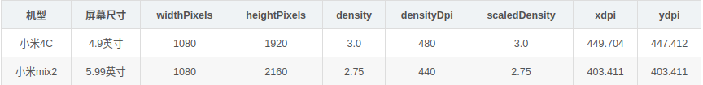
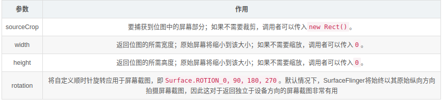

# 实际屏幕的DisplayMetrics信息



1. widthPixels：宽度 显示的数值是1080，就是说屏幕的宽度是1080px
2. heightPixels：高度
3. densityDpi：密度
4. density：密度比值（密度/标准密度，即480/160=3），单位英寸下可以容纳多少个点
5. scaledDensity：同density，用于文字缩放的计算也就是sp
6. xDpi：水平方向的真实密度，水平方向上1inch实际上容纳的点的数量
7. yDpi：垂直方向的真实密度


Android已经提供DisplayMetrics类可以很方便的获取分辨率。下面简要介绍DisplayMetrics类：

Andorid.util包下的DisplayMetrics类提供了一种关于显示的通用信息，如显示大小，分辨率和字体。

为了获取DisplayMetrics成员，首先初始化一个对象如下：

Display display = getWindow().getWindowManager().getDefaultDisplay();

DisplayMetrics outMetrics = new DisplayMetrics();

display.getMetrics(outMetrics);

注：构造函数DisplayMetrics不需要传递任何参数；调用getWindowManager()之后，会取得现有Activity的Handle，此时，getDefaultDisplay()方法将取得的宽高维度存放于DisplayMetrics对象中，而取得的宽高维度是以像素为单位(Pixel)，“像素”所指的是“绝对像素”而非“相对像素”。

这里很奇怪，和我们一般的理解不一样，这里是把测量的结果存放到outMetrics 中。outMetrics中就存放了，我们需要的屏幕的宽高数据，通过outMetrics.  后面就会出现很多有关屏幕信息的数据，例如常用的宽WidthPixels 和高 heightPixels；

int with = outMetrics.widthPixels/2;


## 截屏

### SurfaceControl.screenshot()用法

SurfaceControl.screenshot()是系统的截屏方法，属于系统API，对用户不开放，因此要使用的话需要系统的签名(platform.keystore文件)才能调用到。

在高版本的android上(例如android 11)，如果没有系统签名，即使用反射也会报找不到方法的异常，但是有系统签名的话，直接调用就行。

网上不少教程展示的是旧的调用方式，这些调用方式在高版本中已经不适用了

### 使用反射调用截屏

```java
DisplayMetrics mDisplayMetrics = new DisplayMetrics();
float[] dims = {mDisplayMetrics.widthPixels, mDisplayMetrics.heightPixels};
//调用screenshot()
try {
    Class<?> demo = Class.forName("android.view.SurfaceControl");
    Method method = demo.getDeclaredMethod("screenshot", int.class,int.class);
    mScreenBitmap = (Bitmap) method.invoke(null,(int) dims[0],(int) dims[1]);
} catch (Exception e) {
    e.printStackTrace();
}
//显示bitmap
ImageView image = findViewById(R.id.image);
image.setImageBitmap(mScreenBitmap);

```

### 直接调用screenshot方法截屏

```java
//获取屏幕尺寸
DisplayMetrics mDisplayMetrics = new DisplayMetrics();
float[] dims = {mDisplayMetrics.widthPixels, mDisplayMetrics.heightPixels};
//调用screenshot()
Bitmap mScreenBitmap = SurfaceControl.screenshot((int) dims[0],(int) dims[1]);
//显示bitmap
ImageView image = findViewById(R.id.image);
image.setImageBitmap(mScreenBitmap);
```

由于此方法不依赖于Activity，所以可以用来实现后台截屏的效果。但是要注意的是，调用此方法需要系统的签名(platform.keystore)，

或者增加android:sharedUserId="android.uid.system"

在后期的android版本中，已经取消了screenshot(width, height)方法，因此只传入两个int值的方式行不通了。

在剩下的screenshot()构造参数中，使用起来最方便的就是screenshot(Rect sourceCrop, int width, int height, int rotation)这个方法。

对于参数说明如下：



