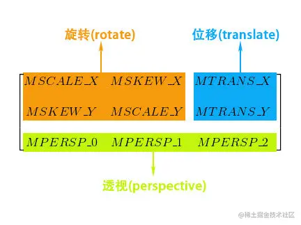

## Android 图形处理 —— Matrix 原理剖析

### Matrix 简介

Android 图形库中的 android.graphics.Matrix 是一个 3×3 的 float 矩阵，其主要作用是坐标变换

它的结构大概是这样的

其中每个位置的数值作用和其名称所代表的的含义是一一对应的

MSCALE_X、MSCALE_Y：控制缩放
MTRANS_X、MTRANS_Y：控制平移
MSKEW_X、MSKEW_X：控制错切
MSCALE_X、MSCALE_Y、MSKEW_X、MSKEW_X：控制旋转
MPERSP_0、MPERSP_1、MPERSP_2：控制透视

