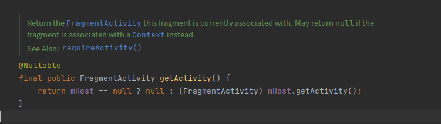
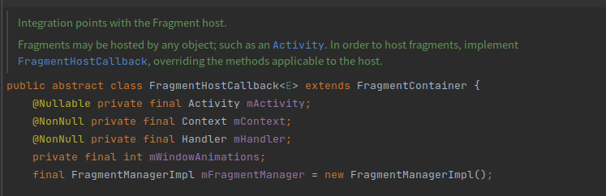
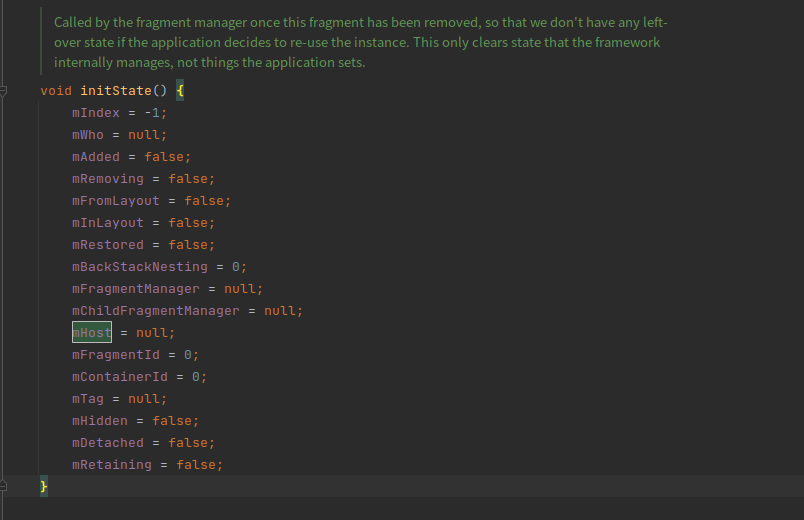
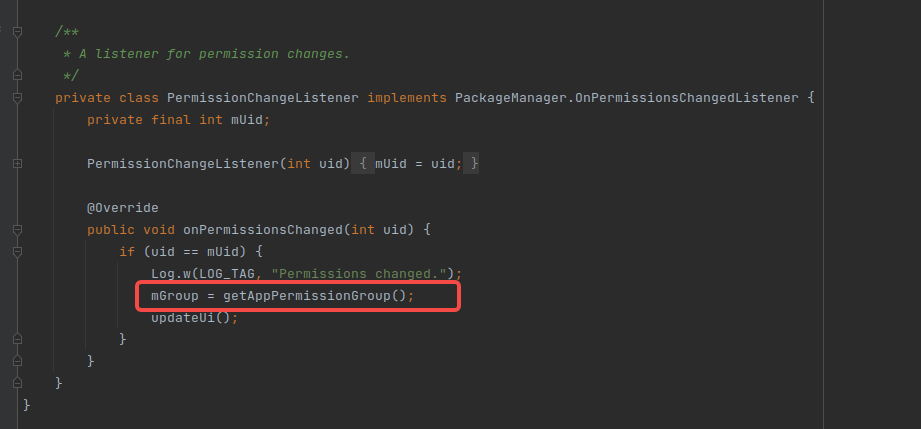
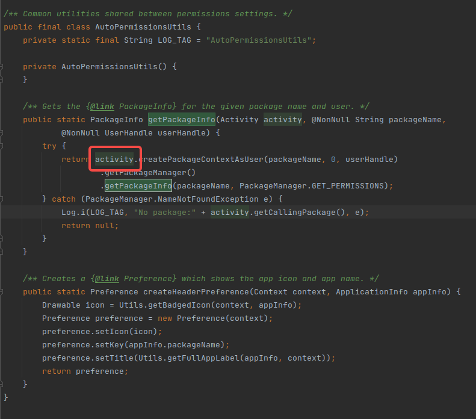

# 34196 BUG 分析

**原因 ： Fragment 中异步调用 getActivity() 方法的时候会出现空指针。**


### 1. 出现问题的log

```java
09-07 12:04:07.310  4602  4602 E AndroidRuntime: FATAL EXCEPTION: main
09-07 12:04:07.310  4602  4602 E AndroidRuntime: Process: com.android.permissioncontroller, PID: 4602
09-07 12:04:07.310  4602  4602 E AndroidRuntime: java.lang.NullPointerException: Attempt to invoke virtual method 'android.content.Context android.app.Activity.createPackageContextAsUser(java.lang.String, int, android.os.UserHandle)' on a null object reference
09-07 12:04:07.310  4602  4602 E AndroidRuntime: at com.android.packageinstaller.permission.ui.auto.AutoPermissionsUtils.getPackageInfo(AutoPermissionsUtils.java:44)
09-07 12:04:07.310  4602  4602 E AndroidRuntime: at com.android.packageinstaller.permission.ui.auto.AutoAppPermissionFragment.getAppPermissionGroup(AutoAppPermissionFragment.java:158)
09-07 12:04:07.310  4602  4602 E AndroidRuntime: at com.android.packageinstaller.permission.ui.auto.AutoAppPermissionFragment.access$400(AutoAppPermissionFragment.java:60)
09-07 12:04:07.310  4602  4602 E AndroidRuntime: at com.android.packageinstaller.permission.ui.auto.AutoAppPermissionFragment$PermissionChangeListener.onPermissionsChanged(AutoAppPermissionFragment.java:800)
09-07 12:04:07.310  4602  4602 E AndroidRuntime: at android.app.ApplicationPackageManager$OnPermissionsChangeListenerDelegate.handleMessage(ApplicationPackageManager.java:2937)
09-07 12:04:07.310  4602  4602 E AndroidRuntime: at android.os.Handler.dispatchMessage(Handler.java:103)
09-07 12:04:07.310  4602  4602 E AndroidRuntime: at android.os.Looper.loop(Looper.java:217)
09-07 12:04:07.310  4602  4602 E AndroidRuntime: at android.app.ActivityThread.main(ActivityThread.java:7400)
```

### 2. 出现问题的代码 ：


### 3. 问题代码分析

- 为什么会出现这种情况，按说当前 Activity 存在，在 Fragment 中使用 getActivity() 是可以拿到的，不应该为空



以看到 getActivity() 是通过 mHost 成员变量获取 activity ，假如 mHost 为 null , 就返回一个 Null 。说明此处是有可能返回null的。

1. mHost 是什么？
2. mHost 什么时候被初始化？
3. mHost 什么时候被至为null?
4. BUG 产生的原因是什么？

#### 3.1 mHost 是什么？

> mHost: 抽象类 android.app.FragmentHostCallback，继承之： android.app.FragmentContainer

```java
// Host this fragment is attached to.
FragmentHostCallback mHost;
```



#### 3.2 mHost 什么时候被初始化？

> mHost 传入，是在 FragmentManager.onCreateView的时候传入的，源码如下：

```java
public abstract class FragmentManager {
    
    @Override
    public View onCreateView(View parent, String name, Context context, AttributeSet attrs) {
        if (!"fragment".equals(name)) {
            return null;
        }
        ............... 
            // 省略部分源码
            // If we restored from a previous state, we may already have
            // instantiated this fragment from the state and should use
            // that instance instead of making a new one.

            if (fragment == null) {
                fragment = mContainer.instantiate(context, fname, null);
                fragment.mFromLayout = true;
                fragment.mFragmentId = id != 0 ? id : containerId;
                fragment.mContainerId = containerId;
                fragment.mTag = tag;
                fragment.mInLayout = true;
                fragment.mFragmentManager = this;
                fragment.mHost = mHost;
                fragment.onInflate(mHost.getContext(), attrs, fragment.mSavedFragmentState);
                addFragment(fragment, true);

            }
        ............... 
            // 省略部分源码
            return fragment.mView;
    }
}
```

#### 3.3 mHost 什么时候被至为null?

> Called by the fragment manager once this fragment has been removed, so that we don't have any left-over state if the application decides to re-use the instance. This only clears state that the framework internally manages, not things the application sets.
>
> Fragment已经`onDetach()`了宿主Activity。会被至null




#### 3.4 BUG 产生的原因是什么？

> 在pop了Fragment之后，该Fragment的异步任务仍然在执行，并且在执行完成后调用了getActivity()方法，这样就会空指针。我们的代码调用时机便是在一个异步任务中调用。源码如下



​       



### 4. 总结

到这里边边解释了 在使用 monkey 多次十万次测试，可能会出现 getActivity() NullPointException 的情况， 原因时Android 源码 permissioncontroller.AutoAppPermissionFragment 中的 监听权限变化的异步方法中获取了 activity 实例，但此时Fragment可能已经被Detach，造成了NPE异常。

### 5. 解决方案

1. 对于Fragment已经onDetach这种情况，我们应该避免在这之后再去调用宿主Activity对象，比如取消这些异步任务，此方法为最安全的方案。

2. 在Fragment基类里设置一个Activity mActivity的全局变量，在`onAttach(Activity activity)`里赋值，使用mActivity代替`getActivity()`，保证Fragment即使在`onDetach`后，仍持有Activity的引用（有引起内存泄露的风险，但是异步任务没停止的情况下，本身就可能已内存泄漏，相比Crash，这种做法“安全”些）

   ```java
   protected Activity mActivity;
   @Override
   public void onAttach(Activity activity) {
       super.onAttach(activity);
       this.mActivity = activity;
   }
   ```

   

