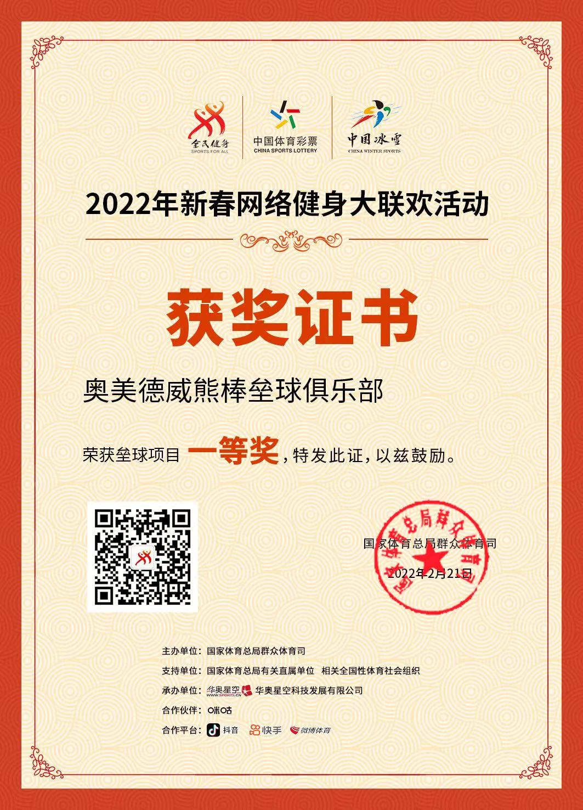
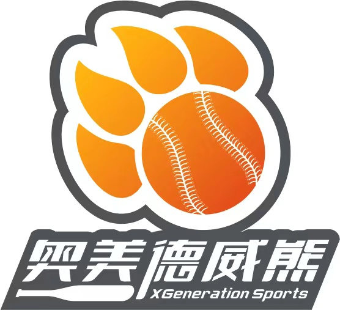

# 校宝 -- 微校页面搭建

1. 校区相册， 展示校区风采，提高家长好感度, 需要校区的照片, 最多支持20张，将展示在微校首页（必须添加）

   
   
2. 需要我们课程咨询前台工作人员的照片，微信 和电话， 将展示在微校首页提示给家长， 内容如下（必须添加）

    1. 对外头像
       
    2. 对外名字 : 刘然
    3. 对外昵称 : 然哥
    4. 微信号 : 13681188638
    5. 手机号 : 13681188638
3. 品牌介绍，1000 字以内的品牌介绍（可选内容）

   奥美德威能棒垒球俱乐部隶属于北京爱克斯时代体育文化有限公司旗下产业，成立于2015年，俱乐部秉承“健康、快乐、自信专业”的健康理念，经过多年来的发展，现已与北京多家知名企业区县教委、多家中小学校建立了长期合作关系，形成了完善的培训赛事运营体系，零事故完成各类合作业务，取得了客户的高度认可
   伴随着人们经济生活水平的提高、全民健身意识的提高、学生体质健康水平提高的需求。奥美德威能棒垒球俱乐部依靠多年来数位专业教练总结国际最为先进的教学方法，适合业余选手和幼儿、青少年训练等不同训练系统，保证学员可以享受到最先进的教学理念。同时力求传播科学运动，快乐生活，健康工作理念为教学使命
   奥美德威熊棒垒球俱乐部愿为广大群众及社会各界提供全方位的系列体育服务，使体育真正成为人民生活中的有机组成。
   更多内容 请参考: [https://mp.weixin.qq.com/s/tJgDbjcjEnjpPl0JK4iw7A]
4. 学校Logo，机构名称，微校名称（可重名），将在微校页面直接展示给家长（必须添加）

   机构/微校名称:奥美德威熊
   

   Logo:

5. 授课教师（可添加20人以内）（可选内容）
    1. 教师照片
    2. 教师名字
    3. 教师年限
    4. 对外职称
       刘然 : 创始人 丹佛大学 国青女垒队教练组成员
       
       熊英迪 : 主教练 丰台体校 荣获北京棒球联赛冠军

       孙筱明 : 主教练 广州体育学员 前广东垒球队队长

       郭欣 : 教练员 芦城体校 前北京市垒球队队员

       刘雅明 : 高级顾问 国家女垒队主教练 国际知名教练
                
       魏嫱 :   高级顾问 国家女垒队教练员 黄金一代国手
 
       刘立明 : 高级顾问 96年奥运会棒球教练组成员

       戴亚平: 高级顾问 国家女垒队队医 孩子的守护天使
    
       佟婉怡: 大连校区负责人
    
6. 在线商城，可以上架想向外展示的课程和商品，供访问者选购（可以上架试听课，主课等内容）（可选内容）  (晚点搭建)
7. 优秀作品（6个以内），优秀作品来源，教师课程下发的任务，学生提交完成的任务，提前创造这些内容，可以提高家长好感度（可选内容）( 优秀作品暂时不放)
8. 办学特色 （6个简单的标签）（可选内容）
    1. 体育育人
    2. 增强体魄
    3. 团结奋进
9. 打卡任务（可选内容）(暂时不做)
10. 家校入口内容，可开发的内容包括 上课记录， 报读课程， 请假申请， 课堂点评， 课后任务， 积分商城，约课。 以上内容需要根据实际情况选择是否开发

