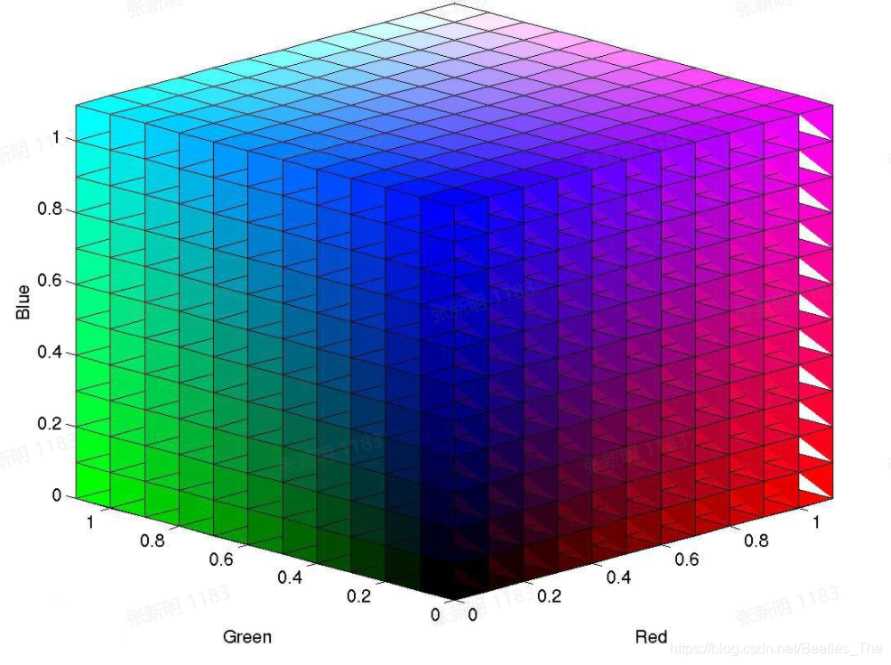
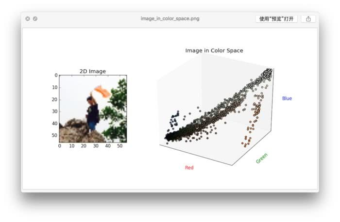
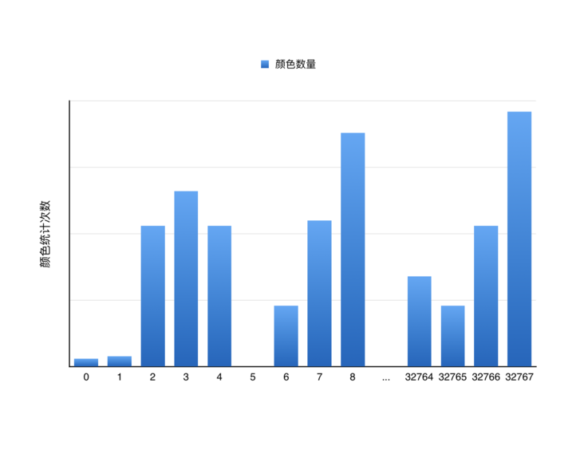
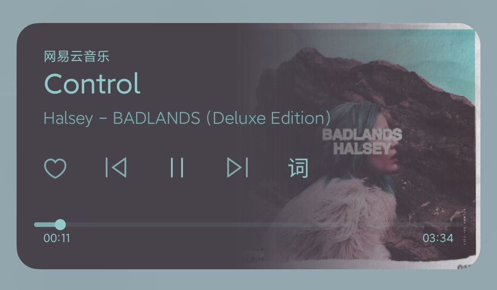
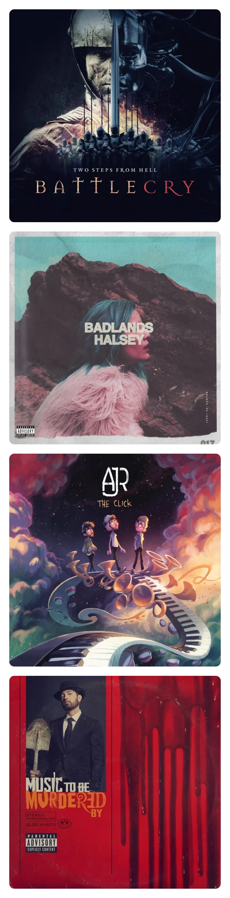
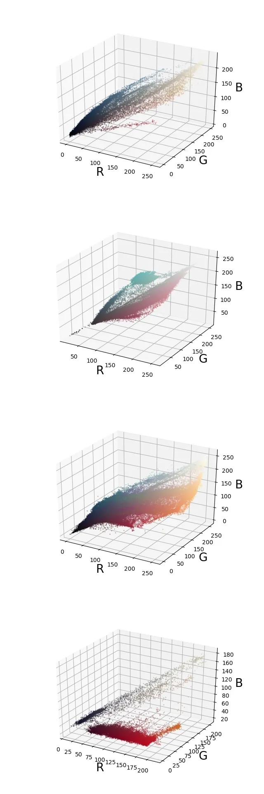
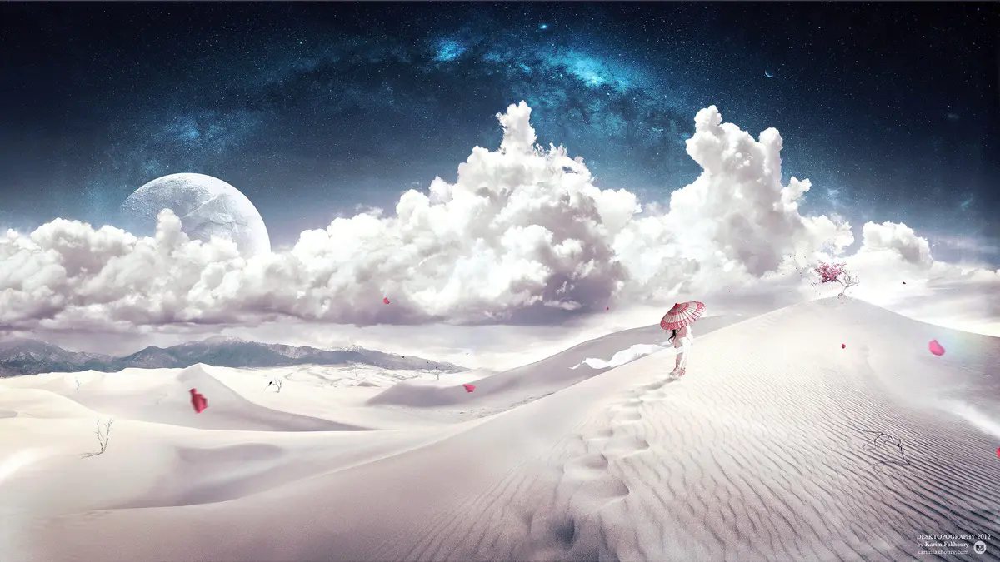

## Median Cut Algorithm

Median cut algorithm is an adaptive algorithm for color quantization to select the best representative subset of colors. 
It is used, for example, in the palette generation process.

The median cut algorithm is a popular solution for optimized palette generation [1].

The idea behind the median cut algorithm is to use each of the colors in the synthesized look-up table to represent the 

equal number of pixels in the original image. The algorithm subdivides the color space interactively into smaller and smaller boxes. 

In contrast to uniform subdivision, optimized palette generation algorithms divide the color space based on the distribution of the original colors. 

The algorithm starts with a box that encloses all the different color values from the original image. 

The dimensions of the box are given by the minimum and maximum of each of the color coordinates that encloses the box under consideration. 

The box is split just choosing the side...


## 根据一张图片获取主颜色的算法是什么样的?

写这种应用一般不用关心底层算法，直接调用 API 就行了，比如 Android 上就直接提供了 Palette 类来做这种提取：


```c
// bitmap 是一张图片，palette 就是量化后的调色板
Palette palette = Palette.from(bitmap).generate();
// 调色板提供了六种不同的选色方案，这里的 Vibrant 是其中一种
palette.getVibrantColor(); // 返回对应颜色
palette.getVibrantSwatch(); // 包含了使用这种背景色时，推荐的对应的正文色、标题色等信息
```
当然如果你要看 generate() 到底使用了什么算法的话，可以看[源代码](https://github.com/aosp-mirror/platform_frameworks_support/blob/b9cd83371e928380610719dfbf97c87c58e80916/palette/palette/src/main/java/androidx/palette/graphics/ColorCutQuantizer.java)。

目前的实现中使用的是 Median-Cut（中位切割）算法。
大致意思就是把所有像素按照跨度最大的通道排序，从中间位置切割成两组，然后对每一组像素再重复这个操作，直到达到你想要的数量为止，最后把每一组内的所有像素求平均。

量化 ：到底是最亮的、最暗的、对比度最高的……总之确定需求以后，先转成 HSL，就可以来排序了。

求较深、较浅、补色也一样，先转成 HSL，然后按照三者的定义来调整对应的通道就可以了。

## 什么是真彩色？

其实很简单，真彩色是用4个颜色的分量来表示的，分别是R(Red:红)、G(Green:绿)、B(Blue:蓝)、A(Alpha:透明度)，每个分量占用了1个字节，
所以真彩色中每个颜色要用4字节表示，于是有2的32次方种颜色。 然而，人眼并不需要如此多的颜色种类，256种足够了。
很显然2的8次方=256于是表示某种颜色只需要1byte，但是这其实只不过是个标识，这个标识应该指向一个具体的颜色的列表。
也就是说，这个列表里面的颜色都已经是确定了啦，就是256种不同的颜色。每次要取一种颜色只需要根据这个标识到列表中去取出来就可以了。

## 什么是颜色空间？

空间一般指三维空间，就是立体几何那个玩意，空间坐标系，就XYZ那玩意。现在假设不考虑透明度，只考虑RGB分量，
那么每个分量就自成一条坐标轴了，于是RGB坐标轴就形成了一个立体的坐标系，
这个坐标系就是所谓的颜色空间。大家都知道XYZ坐标体系中的点都可以三维坐标来表示——(x,y,z)，
同理，颜色空间中的颜色都能用颜色坐标来表示，即(r,g,b)。


## 图像的映射

正如上面所说，图像是各种颜色的容器，而颜色又可以被映射到颜色空间。

于是，图像中，从r分量的角度来看，在各种颜色组成的集合中，必有最大的r分量值和最小的r分量值，于是从最大的r值到最小的r值形成了一条边。

同理，最大的g值到最小的g值又形成了一条边，最大的b值到最小的b值还是形成了一条边，于是3条边就形成了1个立方体。

图像中所有的颜色都处于这个立方体中。

## 立方体的分裂

现在说的立方体并不仅限于第一个立方体，而是任何一个立方体。

立方体嘛，肯定有个最长边，或者最长边不止一个，反正就是找到最长的边就是了。

不过这样说有点抽象，说得直接一点就是找到RGB分量中最大值最小值相差最大的那个分量。

这个分量一旦知道了，你就可以把当前立方体中的颜色值按照该分量进行排序了。

因为获取某分量最大值和最小值只需要比较而已，但是该分量对应的颜色值还是无序的，你应该排序

## 为什么要排序呢

因为一排序，该分量就成了有序了，而有序就形成了该分量的梯度变化，而梯度变化的极限就是渐变。

3个分量都是梯度变化以后，那么各个颜色值也就成了逐渐的变化的形式了。


## 该怎么分裂

你知道每种颜色都对应至少1个像素，你需要把这些数量的像素一分为二。按照某个分量排好序以后，你需要把当前立方体中该分量较高的和较低的像素分开，

并且这两部分的像素数量尽量相等，没错这就是分裂所要达到的目的

## 这个分裂有啥用

这样做你可以把像素均匀地分布到各个颜色立方体中，分裂到最后的立方体可以得到该立方体的代表色，
也就是说该立方体中所有的像素点都是这样个颜色了，即，颜色接近的像素点被集中到了一起。
仔细想一下你会发现这样做并不会让图像所表达的内容变化太大，
不会变化太大就是说你现在所分裂出来的所有的小立方体所代表的颜色已经足够接近图像上面的各个颜色了，
当然，分裂出来的小立方体越多就越接近原图像中的各个颜色。
如此一来用中位切分法获取图像各个颜色的原理解释完毕。




当然，一张图像不可能包含所有颜色，我们将一张彩色图像所包含的像素投射到色彩空间中，可以更直观地感受图像中颜色的分布：





## 源码分析

## ColorCutQuantize量化颜色的步骤如下:

1. 创建一个颜色直方图来统计图片中的颜色，如下图：




图中横坐标代表的颜色为RGB555，rgb分量分别只有5bit，所以颜色总数为2的15次方，

所以源码中的mHistogram就是代表的这个直方图的数组，数组的索引其实也代表的就是对应的颜色。

将RGB888或ARGB8888转换为RGB555的目的是简化了需要统计的颜色数量，提高效率，但损失的精度对结果影响很小。


## 图像主色提取算法

我们在网易云上听歌, 略加设置就能看到这样的效果:




网易云是怎么提取出专辑封面主要颜色的呢 首先, 我们需要思考如何表示一张图片. 

图片是由一系列像素点组成的, 最简单的表示图片的方法就是用位图, 也即记录下每个像素点的 rgb 来表示 

所以我们可以用一个 width * height * 3 的数组来表示一张图片, 其中 width 和 height 分别表示宽高, 3 代表 r,g,b 三个通道我们以以下4张图片为例进行说明



将他们分别表示为 rgb 像素点, 以 rgb 作为 xyz 坐标, 标注在三维空间中即是这样:



以上是简要说明, 下面将介绍三种常见的图片主题色提取算法的具体实现:

## 中位切分

1. 将图片每个像素的 r,g,b 值分别作为 x,y,z 坐标, 标在空间坐标系中
2. 用一个最小的立方体框住所有点
3. 将立方体沿一平面切分, 该平面与立方体最长边方向垂直, 使切分得的两部分包含相同数量的像素点
4. 将分得的小立方体递归地按照 3. 的算法切分, 直至分得立方体个数等于所需颜色数即可
5. 将每个立方体中颜色做平均, 即得到最后的主色

其中, 在进行切分时可对待切割立方体做一个排序, 其中单位体积包含像素点越多的立方体越先被切割, 以提高效率


## Android Palette（调色板）

Palette是一个类似调色板的工具类，根据传入的bitmap，提取出主体颜色，使得图片和颜色更加搭配，界面更协调。

Palette 可以从一张图片中提取颜色，我们可以把提取的颜色融入到App UI中，可以使UI风格更加美观融洽。

比如，我们可以从图片中提取颜色设置给ActionBar做背景颜色，这样ActionBar的颜色就会随着显示图片的变化而变化。

android-support-v7-palette 里面的Palette是Android L SDK 中的新特性，可以使用 Palette 从图像中提取出突出的颜色(主色调)，

获取到颜色之后我们再将这个颜色值赋给 ActionBar、状态栏等。从而达到界面色调的统一，使界面美观协调。

Palette这个类中提取以下突出的颜色

Vibrant (有活力)
Vibrant dark(有活力 暗色)
Vibrant light(有活力 亮色)
Muted (柔和)
Muted dark(柔和 暗色)
Muted light(柔和 亮色)

## 使用

第一步

导入v7包下的palette： compile 'com.android.support:palette-v7:23.4.0'

第二步

我们需要通过一个Bitmap对象来生成一个对应的Palette对象。 Palette 提供了四个静态方法用来生成对象

● Palette generate(Bitmap bitmap)
● Palette generate(Bitmap bitmap, int numColors)
● generateAsync(Bitmap bitmap, PaletteAsyncListener listener)
● generateAsync(Bitmap bitmap, int numColors, final PaletteAsyncListener listener)

不难看出，生成方法分为generate(同步)和generateAsync(异步)两种，如果图片过大使用generate方法，可能会阻塞主线程，

我们更倾向于使用generateAsync的方法，其实内部就是创建了一个AsyncTask。

generateAsync方法需要一个PaletteAsyncListener对象用于监听生成完毕的回调。

除了必须的Bitmap参数外，还可以传入一个numColors参数指定颜色数，默认是 16。

第三步，得到Palette对象后，就可以拿到提取到的颜色值
● Palette.getVibrantSwatch()
● Palette.getDarkVibrantSwatch()
● Palette.getLightVibrantSwatch()
● Palette.getMutedSwatch()
● Palette.getDarkMutedSwatch()
● Palette.getLightMutedSwatch()

第四步，使用颜色，上面get方法中返回的是一个 Swatch 样本对象，这个样本对象是Palette的一个内部类，它提供了一些获取最终颜色的方法。

● getPopulation(): 样本中的像素数量
● getRgb(): 颜色的RBG值
● getHsl(): 颜色的HSL值
● getBodyTextColor(): 主体文字的颜色值
● getTitleTextColor(): 标题文字的颜色值
通过 getRgb() 可以得到最终的颜色值并应用到UI中。

getBodyTextColor() 和 getTitleTextColor() 可以得到此颜色下文字适合的颜色，这样很方便我们设置文字的颜色，使文字看起来更加舒服。

示例：这边有这样一张图片



我们使用Palette获取它的颜色

```java
public class MainActivity extends AppCompatActivity {
    TextView t1;
    TextView t2;
    TextView t3;
    TextView t4;
    TextView t5;
    TextView t6;

    @Override
    protected void onCreate(Bundle savedInstanceState) {
        super.onCreate(savedInstanceState);
        setContentView(R.layout.activity_main);

        t1 = (TextView) findViewById(R.id.t1);
        t2 = (TextView) findViewById(R.id.t2);
        t3 = (TextView) findViewById(R.id.t3);
        t4 = (TextView) findViewById(R.id.t4);
        t5 = (TextView) findViewById(R.id.t5);
        t6 = (TextView) findViewById(R.id.t6);
        Bitmap bitmap = BitmapFactory.decodeResource(getResources(), R.drawable.f);

        Palette.from(bitmap).generate(new Palette.PaletteAsyncListener() {
            //发生主线程    Palette调色板   总共六种颜色
            @Override
            public void onGenerated(Palette palette) {
                //柔和而暗的颜色
                int darkMutedColor = palette.getDarkMutedColor(Color.BLUE);
                //鲜艳和暗的颜色
                int darkVibrantColor = palette.getDarkVibrantColor(Color.BLUE);
                //亮和鲜艳的颜色
                int lightVibrantColor = palette.getLightVibrantColor(Color.BLUE);
                //亮和柔和的颜色
                int lightMutedColor = palette.getLightMutedColor(Color.BLUE);
                //柔和颜色
                int mutedColor = palette.getMutedColor(Color.BLUE);
                int vibrantColor = palette.getVibrantColor(Color.BLUE);

                t1.setBackgroundColor(darkMutedColor);
                t2.setBackgroundColor(darkVibrantColor);
                t3.setBackgroundColor(lightVibrantColor);
                t4.setBackgroundColor(lightMutedColor);
                t5.setBackgroundColor(mutedColor);
                t6.setBackgroundColor(vibrantColor);
            }
        });
    }
}
```


