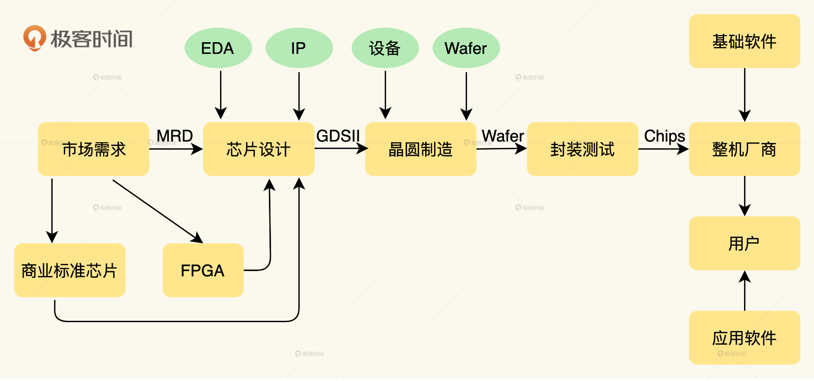
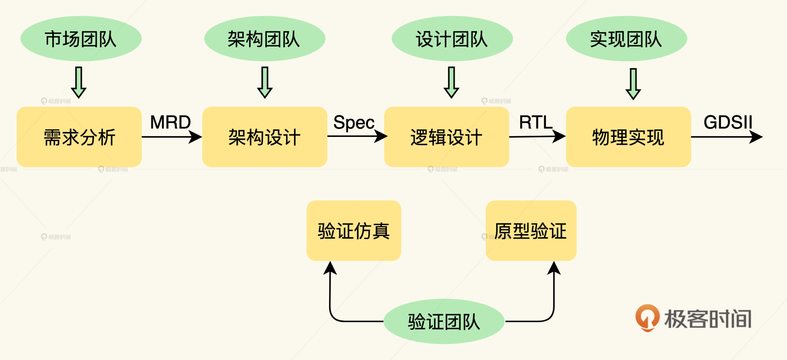
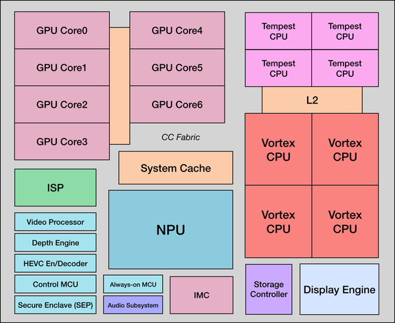
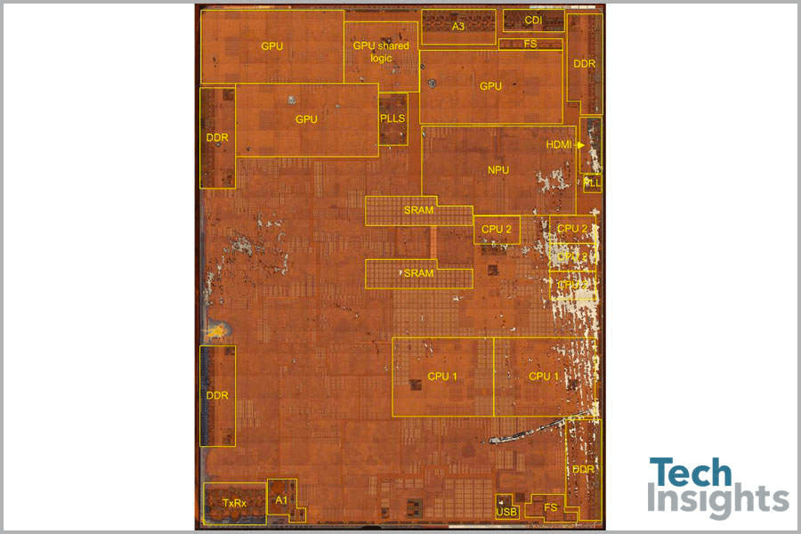
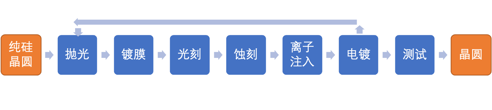

你可能要问，这个制造工艺代表什么呢？

我给你举个例子，对于 iPhone12 里用的应用处理器 A14，我们一般都说是 5nm 

的工艺。行内的人会留意到这是一个用台积电 N5 工艺生产的，面积为 88mm² 的芯片。

N5 工艺指的就是台积电 5nm 工艺。苹果披露 A14 应用处理器是一颗集成了 118 亿个晶体管的芯片。

如果是关心制造工艺的人，就会算一下，台积电 N5 工艺，官方的晶体管密度是 173 MTr/mm2，

就是每平方毫米的面积上可以集成 1.73 亿个晶体管。那么苹果在 88 平方毫米的面积上集成了 118 亿个晶体管，

是相当不错的数字了，算是非常高效地利用了最先进工艺带来的高密度。

当然，评价一颗芯片，不能这么简单地只看晶体管密度，至少还要看 PPA 衡量标准，也就是 

Power 功耗、 Performance 性能、Area 面积，这是后话，在接下来的课程中我会再讲到。

一部手机中的芯片：

芯片肯定不全是集成电路。芯片里面，大约只有 80% 属于集成电路，其余的都是光电器件、传感器和分立器件

，行业内把这些器件称为 O-S-D（Optoelectronic, Sensor, Discrete）。

你一定要花 2 分钟时间整体对照理解下。

## 颗芯片到底是如何诞生的

一颗芯片，是如何诞生的呢？其实一颗芯片项目就是一个标准的产品项目，项目的起点是市场需求分析，

接着是设计和制造，如果产品成功完成了商业落地，那么就可以开启下一代产品的迭代升级新周期了。

如果只看芯片设计，它主要包含需求分析、架构设计、逻辑设计、物理实现和验证等几个部分。

我就以苹果公司为例，先讲讲苹果是怎么走上自制芯片的道路的，然后再给你逐步揭秘芯片的设计流程。

买商业现成芯片，和定制芯片或者自制芯片之间，还有 FPGA 一个选择。

FPGA 可以通过硬件编程语言，把芯片内的标准阵列器件重新组合，

形成新的电路，完成类似定制芯片的功能，可以节省投片生产的开销和时间

代价就是单片的价格偏高，功耗偏高，因此 FPGA 在数据中心的应用较多，在手机终端领域极少。

苹果这种提供产品规格需求，由三星做设计服务和生产的这种模式，业内叫设计服务。

而且委托设计服务的边界，非常灵活，苹果公司可以完全不参与设计只提产品规格要求，

也可以自己完成部分设计，从一小部分到绝大部分都可以，其余再交给设计公司。

按照苹果架构师的回忆，三星实现了苹果要求的功能，但是最终的芯片并不是苹果想要的芯片。

这种芯片规格书与芯片成品之间的差距，就是架构师要背的锅了

需求分析

其实可以想见当时一定是有多个芯片公司，发现了手机应用处理器这个真实需求。

在芯片公司发现市场需求之后，通常会进行市场调查，总结出一个通用的市场需求清单出来。

一般这个需求清单，会包括主要应用场景分析、软件栈、竞争分析、性能与定位、需求量与投资回报比分析、行规与标准，

主要配套芯片的市场供应情况预测等多项内容。最终形成的就是一份市场需求文档。

每个公司的文档流程不一样，有的公司，在做市场需求文档之前，还要做商业需求文档，

重点在于分析投入产出比。在市场需求文档之后，还要做深入的产品需求文档和细分的功能需求文档。

在需求分析之后，通常会有一个立项决策会议，由内部管理层决策是否进行此产品的开发。

如果顺利通过立项决策，这个芯片项目就由市场部门，转交给研发部门。

架构设计

我们说，一个项目是否有商业价值，主要看需求分析。而一个芯片是否做得好，80% 是由架构设计决定的。
在拿到需求分析文档后，高层设计人员，往往是以架构师为主的团队，需要开会对产品需求逐条进行可行性分析，

并在此基础上确定基本架构和模块分解，最终设计出一个系统架构。

我可以给你看看，苹果 A12 的一张系统架构图，你可以感受一下。

芯片的大目标，就是对 Power 功耗、 Performance 性能、Area 面积，也就是业内常提到的 PPA 衡量标准，

要有明确的规划，这一般也就确定了要选择的制造工厂和工艺制程。

接着，芯片设计公司要把需要向供应商购买的 IP 和自研的 IP，把它们的交付时间和接口逐一确认。

苹果的 CPU 核一直是自研的，GPU，则从 IP 供应商那里购买过很长一段时间。
架构设计的输入是市场需求文档，输出是产品规格书。

下一步，逻辑设计也叫前端设计，就需要拿着产品规格书，去输出 RTL 代码，用以生成网表（Netlist）了。

我们在开头提到，在逻辑设计完成后，还要做物理实现，物理实现就是由 RTL 代码综合成门级网表，

然后生成 GDS II 文件的过程。这里的物理实现也叫后端设计，前端和后端设计这两个部分并没有统一严格的界限，

凡涉及到与物理工艺有关的设计我们就叫后端设计。我们先来看逻辑设计。
一般用硬件描述语言，例如 Verilog，将架构师的设计用编码实现

在设计的同时，验证也要并行进行。验证是芯片设计中最为耗时耗力的工序，

ARM 的技术白皮书有统计，一般一个项目的 40% 资源是用在验证阶段的。

逻辑综合

设计验证完成之后，还有一个步骤，叫逻辑综合 （Logic Synthesis），

就是用 EDA 工具把寄存器传输级设计 RTL 描述变网表（Netlist），非常类似于编译器把 C 语言翻译成机器语言的过程

从这一步开始，芯片的设计就和具体的晶圆代工厂和具体工艺绑定在一起，设计开始具有物理特征了。

对于半导体设计公司不难，但是却是 EDA 公司的核心产品之一。

在实现流程中，就背后算法而言，综合一定是最难最复杂的步骤。一个晶圆厂，并不仅仅要有先进工艺，

提供给设计公司的设计工具包 PDK（Process Design Kit）和 EDA 厂商的支持也非常重要。

整个逻辑设计阶段，你可以这样理解：

架构师写在文档上的指标与功能，是需要设计团队通过一行行的代码实现出来的。

后端设计的主要步骤可以总结为：布局规划 Floorplan→布局 Placement→时钟树综合 CTS→布线 Routing →物理验证。

规划之后，在指定区域摆放元器件，就是布局，而把各个元器件连接起来，就是布线。

一颗芯片的树状的时钟信号线路非常重要，往往需要单独布线，因此还有一个专门的名称：时钟树综合。

我说得简单，其实这就是在指尖上建高楼，在小小的芯片上放置上百亿个晶体管，纳米级的单位，

幸而有 EDA 工具辅助，这不是人力所及的工程。

一颗芯片做得好不好，在决策阶段取决于市场需求理解的是否深刻，

在逻辑设计阶段取决于工程师的能力强不强，而在物理实现阶段基本取决于 EDA 工具玩得好不好。

在芯片设计进入纳米时代之后，布局布线的复杂度呈指数增长，从布局规划到布局布线，时钟树综合，

每一步涉及到的算法在近年都有颠覆性的革新。这些步骤，都高度的依赖 EDA 工具。

要对 EDA 工具有深度理解，并且要理解 EDA 工具背后的方法学。

