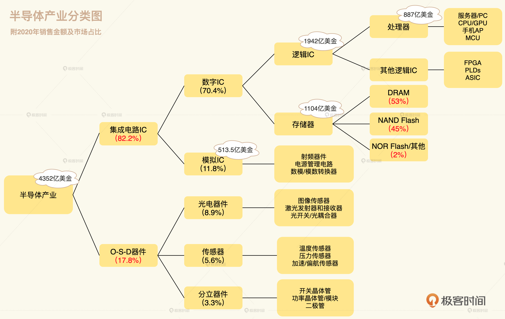
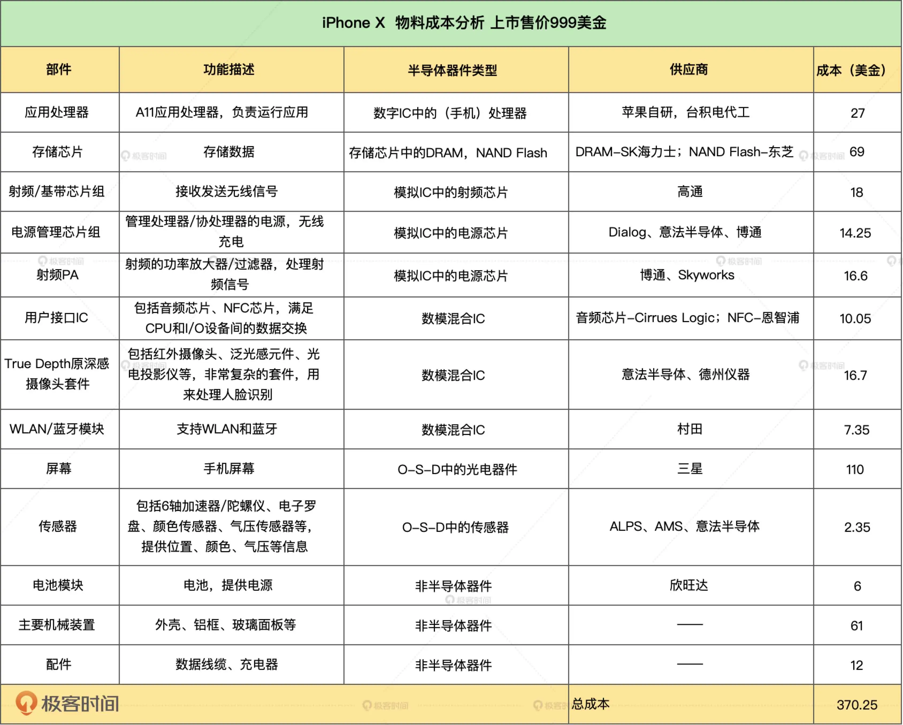

你可能要问，这个制造工艺代表什么呢？

我给你举个例子，对于 iPhone12 里用的应用处理器 A14，我们一般都说是 5nm 

的工艺。行内的人会留意到这是一个用台积电 N5 工艺生产的，面积为 88mm² 的芯片。

N5 工艺指的就是台积电 5nm 工艺。苹果披露 A14 应用处理器是一颗集成了 118 亿个晶体管的芯片。

如果是关心制造工艺的人，就会算一下，台积电 N5 工艺，官方的晶体管密度是 173 MTr/mm2，

就是每平方毫米的面积上可以集成 1.73 亿个晶体管。那么苹果在 88 平方毫米的面积上集成了 118 亿个晶体管，

是相当不错的数字了，算是非常高效地利用了最先进工艺带来的高密度。

当然，评价一颗芯片，不能这么简单地只看晶体管密度，至少还要看 PPA 衡量标准，也就是 

Power 功耗、 Performance 性能、Area 面积，这是后话，在接下来的课程中我会再讲到。

一部手机中的芯片：

芯片肯定不全是集成电路。芯片里面，大约只有 80% 属于集成电路，其余的都是光电器件、传感器和分立器件

，行业内把这些器件称为 O-S-D（Optoelectronic, Sensor, Discrete）。

你一定要花 2 分钟时间整体对照理解下。

## 颗芯片到底是如何诞生的
