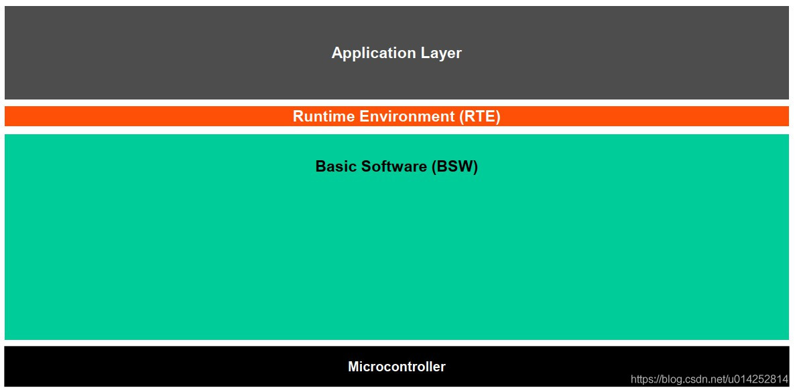
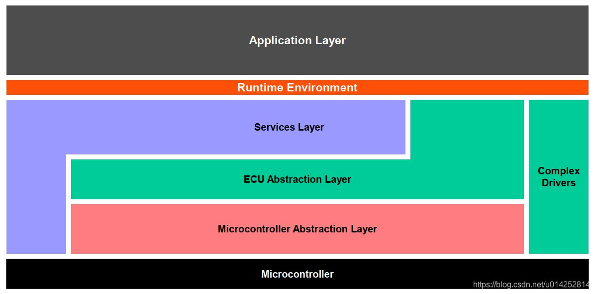
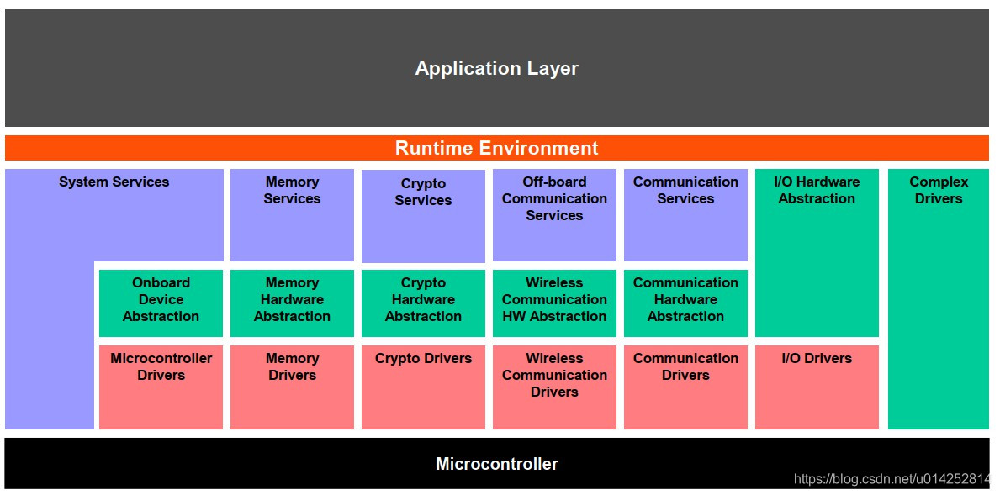

AUTOSAR的适应范围

适应于汽车电子ECU控制器

    与硬件交互的比较多
    通过车辆网络连接，如CAN、LIN、ETH、FlexRay
    具有有限计算能力和内存资源的微控制器（通常为16位或32位的MCU、单片机）
    ECU里面跑一个实时操作系统

分为三层

    Application Layer应用层
    Runtime Environment (RTE)运行时环境
    Basic Software (BSW)基础软件层

BSW可以细分

Application Layer应用层
Runtime Environment (RTE)运行时环境
Basic Software (BSW)基础软件层

    Services Layer服务层
    ECU Abstraction Layer ECU抽象层
    Microcontroller Abstraction Layer 微控制器抽象层

Complex Drivers复杂设备驱动

还可以再细分下去

Services Layer服务层

    System Services系统服务
    Memory Services内存服务
    Crypto Services加密服务
    Off-board Communication Services车外通信服务
    Communication Services通信服务（车内服务）

ECU Abstraction Layer ECU抽象层

    Onboard Device Abstraction板载设备抽象
    Memory Hardware Abstraction内存硬件抽象
    Crypto Hardware Abstraction加密硬件抽象
    Wireless Communication HW Abstraction无线通信硬件抽象
    Communication Hardware Abstraction通信硬件抽象

Microcontroller Abstraction Layer 微控制器抽象层

    Microcontroller Drivers 微控制器驱动
    Memory Drivers 内存驱动
    Crypto Drivers加密驱动
    Wireless Communication Drivers无线通信驱动
    Communication Drivers通信驱动
    I/O Drivers I/O驱动

微控制器抽象层是基本软件的最低软件层，它包含内部驱动程序，这些驱动程序是可以直接访问µC和内部外围设备的软件模块。

这一分层的作用：
使更高的软件层独立于µC

    µC 指微控制器，芯片

ECU抽象层（ECU Abstraction Layer）

ECU抽象层就是微控制器抽象层的驱动程序接口。它还包含用于外部设备的驱动程序。

它提供了一个用于访问外围设备和设备的API，而无需考虑其位置（内部/外部µC）及其与µC的连接（端口引脚，接口类型）

这一分层的作用：
使更高的软件层独立于ECU硬件布局

复杂设备驱动层（Complex Drivers Layer）

复杂设备驱动层位于硬件和RTE层之间

这一分层的作用：
提供集成特殊功能的可能性，例如 设备驱动程序，就是被标准化的东西放到了BSW，而没有被标准化的或者不可被标准化的放到了复杂设备驱动层

    在AUTOSAR规范中未指定的放到这一层
    具有很高的时序约束的软件模块放到这一层

服务层（Services Layer）

服务层是基础软件的最高层，这也适用于与应用程序软件的相关性：虽然ECU抽象层覆盖了对I/O信号的访问，但是服务层提供了：

    操作系统功能，就是AUTOSAR OS包含在服务层
    车辆网络通讯和管理服务
    内存服务 (NVRAM management)
    诊断服务（包括UDS通信，错误存储和故障处理）
    ECU状态管理，模式管理
    逻辑和临时程序流监视（看门狗管理器）

这一分层的作用：
为应用程序，RTE和基本软件模块提供基本服务

运行环境（Runtime Environment）

RTE是为应用程序软件（AUTOSAR软件组件和/或AUTOSAR传感器/执行器组件）提供通信服务的层。

在RTE上方，软件体系结构样式从“分层”更改为“组件样式”。

AUTOSAR软件组件通过RTE与其他组件（内部和/或内部ECU）和/或服务进行通信

这一分层作用：
使AUTOSAR软件组件独立于到特定ECU的映射

基础软件（基本软件）

基本软件可以细分为以下类型的服务：

    输入/输出（I/O）：标准化访问传感器，执行器和ECU车载外围设备
    内存Memory：标准化访问内部/外部存储器（非易失性存储器）
    加密Crypto：标准化访问密码原语，包括内部/外部硬件加速器
    通信Communication：标准化访问：车辆网络系统，ECU车载通信系统和ECU内部软件
    车外通讯Off-board Communication：标准化访问：车辆到X的通信，车辆无线网络系统，ECU车外通信系统
    系统 System:提供标准化的（操作系统，计时器，错误存储器）和特定于ECU的（ECU状态管理，看门狗管理器）服务和库功能

BSW软件模块内部驱动

内部设备位于微控制器内部。 内部设备的示例包括：

    内部EEPROM
    内部CAN控制器
    内部ADC

内部设备的驱动程序称为内部驱动程序，位于微控制器抽象层中
BSW软件模块外部驱动

外部设备位于微控制器外部的ECU硬件上。 外部设备的示例包括：

    外部EEPROM
    外部看门狗
    外部flash

外部设备的驱动程序称为外部驱动程序，位于ECU抽象层中。它通过微控制器抽象层的驱动程序访问外部设备。这样，AUTOSAR还支持集成在系统基础芯片（SBC）中的组件，例如收发器和看门狗。

示例：具有SPI接口的外部EEPROM的驱动程序通过SPI总线的处理程序/驱动程序访问外部EEPROM

例外：
内存映射的外部设备（例如外部闪存）的驱动程序可以直接访问微控制器。 这些外部驱动程序位于微控制器抽象层中，因为它们与微控制器有关。

BSW软件模块外部驱动

外部设备位于微控制器外部的ECU硬件上。 外部设备的示例包括：

    外部EEPROM
    外部看门狗
    外部flash

外部设备的驱动程序称为外部驱动程序，位于ECU抽象层中。它通过微控制器抽象层的驱动程序访问外部设备。这样，AUTOSAR还支持集成在系统基础芯片（SBC）中的组件，例如收发器和看门狗。

示例：具有SPI接口的外部EEPROM的驱动程序通过SPI总线的处理程序/驱动程序访问外部EEPROM

例外：
内存映射的外部设备（例如外部闪存）的驱动程序可以直接访问微控制器。 这些外部驱动程序位于微控制器抽象层中，因为它们与微控制器有关。

BSW的接口（interface）

接口（接口模块）包含从结构上放置在其下方的模块抽象的功能。 例如，接口模块，它从特定设备的硬件实现中抽象出来。
它提供了一个通用API，以访问特定类型的设备，而与该类型的现有设备的数量无关，并且与不同设备的硬件实现无关。

    接口不会更改数据内容
    通常，接口位于ECU抽象层中

示例：CAN通信系统的接口提供了一个通用API，以访问CAN通信网络，而该API与ECU中的CAN控制器数量无关，
并且与硬件实现方式（片上，片外）无关。

BSW数据处理函数（Handler）

处理程序是一种特定的接口，用于控制一个或多个客户端对一个或多个驱动程序的并发，多个和异步访问。 即 它执行缓冲，排队，仲裁，多路复用。

    处理程序不会更改数据的内容
    处理程序功能通常包含在驱动程序或接口中（例如SPIHandlerDriver，ADC驱动程序）

BSW管理器（manager）

管理器为多个客户端提供特定的服务。 在纯粹的处理程序功能不足以从多个客户端抽象的所有情况下，都需要使用它。

除了具有处理函数（Handler）功能外，管理器还可以评估和更改或调整数据内容（这时与handler的区别）

通常管理器位于服务层

示例：NVRAM管理器管理对内部和/或外部存储设备（例如闪存和EEPROM存储器）的并发访问。
它还执行分布式和可靠的数据存储，数据检查，提供默认值等

BSW 库（Libraries）

库是一些功能的集合

    可以由BSW模块（包括RTE），SW-C，库或集成代码调用
    在同一保护环境中在调用方的上下文中运行
    只能调用库
    可重入
    没有内部状态
    不需要任何初始化
    是同步的，即他们没有等待点

