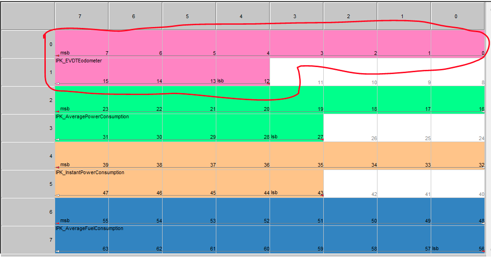
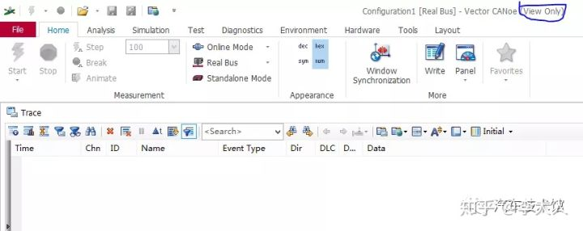
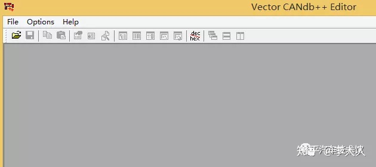
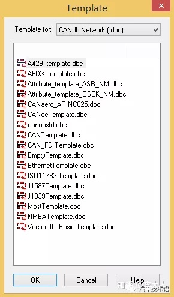
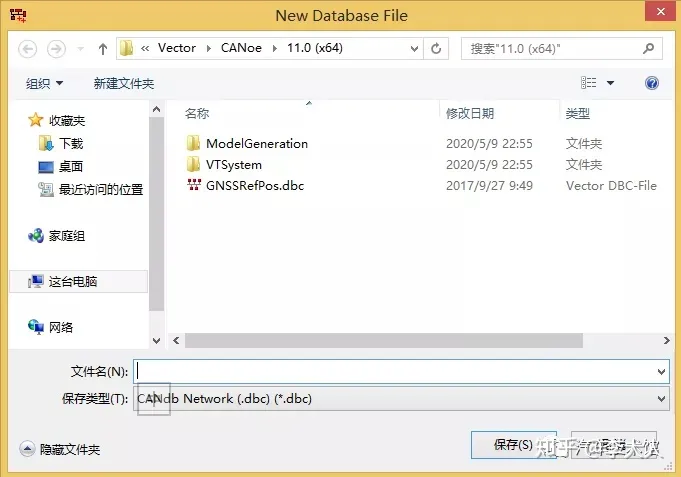
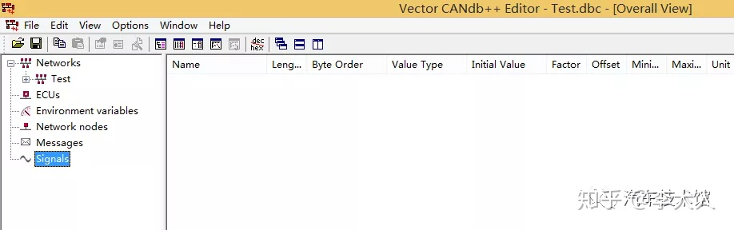

## DBC 

DBC是Database Can的缩写，其代表的是CAN的数据库文件，在这个文件中把CAN通讯的信息定义的非常完整清楚，而CAN网络的通讯就是依据这个文件的描述进行的，
所以DBC文件的作用非常强大，正是因为有了它才可以使得整个CAN网路的节点控制器无差错的协同同步开发。

如何创建一个DBC文件

若要创建一个DBC文件，那么首先就需要选择合适的工具，这里小编使用的工具是Vector公司的产品，配合CANoe一起使用的CANdb editor，是一款专门用来编辑DBC文件的软件，
如果你还没有选到合适的工具小编推荐你使用这个，确实挺好用的，可以直接在Vector的官网进行下载，软件本身是免费的，包括CANoe软件本身也是免费的，
只是如有你需要真正仿真使用的话则需要license，如果只是查看的话都是可以使用的。

比如我已经打开了一个CANoe的软件，但是没有license，只是这种情况下会提示 ”view only“ 而已，有很多编辑功能是禁用的。
好了，这是关于工具层面，小编就不多说了，我们言归正传，如何创建DBC文件。

1. 打开DBC编辑软件

这里小编是以自己的工具链说明的，实际操作中方法不尽相同，而且不止一种，大家可以多多探索。
在打开的CANoe工程中，选择菜单 Tool， 找到CANbd editor

点击CANdb editor后即可打开DBC编辑软件

2. 新建一个数据库文件

菜单中选择 ”file“ ，然后创建数据库文件，会出现如下的模板选择对话框

可以根据需要使用的环境选择相应的模板，比如在这里我们选择 ” CANoe template.bdc“，进入如下界面

为创建的数据库文件命名，这个自己定义，只要符合命名的规则即可。 创建好文件名称之后，则进入到了编辑界面。

3. 创建数值表
   创建数值表的意义是为了给后续创建的信号提供解释，怎么理解呢？举例来说，在信号的世界里，只有数值一说，信号可以有不同的数值，比如会有0、1、2、3等等，那么这些数值代表什么样的含义，就需要给它解释才能具有真正的物理意义，这就是数值表的意义，随着我们的讲解，大家会逐渐的明白。

创建数值表需要在数值表的视图中操作，通过主菜单的 "view"可以将视图切换到"value table"界面，打开value table界面之后，在空白处右键选择"new"即可新建。

[更多内容](https://zhuanlan.zhihu.com/p/141638034)

DBC数据库文件是用来描述CAN网络节点间数据通讯的一种文件，包含了CAN总线协议中协议数据及其所代表的具体意义。简单的讲，dbc文件描述了在CAN网络上有哪些报文信息；
这些报文上又携带了哪些信号信息；该报文是从哪个节点发出，哪个节点进行接收的等信息。是通讯的核心文件，通过创建一个DBC文件可以使你非常深刻的理解文件所包含的含义，
同时有助于你理解已经存在的DBC文件，本质上都是相通的。