# 汽车CAN网络及车辆信号

CAN，Controller Area Network，控制器局域网。

建立好局域网之后，各个终端之间就可以互相访问了，简单的说就是可以实现信息的交互了，信息之间的传递是通过网线来完成的。
而CAN通讯的出现也是借用网络的概念，所以它也是成为局域网，只不过它的局域网和我们电脑通常使用的局域网略有不同，CAN的信号传递介质是一对双绞线

各个节点都连接到一条CAN总线上，然后通过这一条总线实现信息的交互。

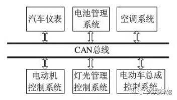

## 通常车上有两类CAN
1. 高速总线——速率500kb/s，主要面向实时性要求较高的控制单元。如发动机、电动机等。

2. 低速总线——速率100kb/s，主要针对车身控制的。如车灯、车门、防盗等信号的采集及反馈。采集的信号多但实时性差一些。

可以看到CAN连接了多个ECU, ECU，Electronic Control Unit 电子控制单元。汽车专用的微机控制器。比如发动机ECU，
专门负责控制发动机进气量、喷油量、排气量。相当于发动机的大脑，具有发送和接收信号、参数存储等功能。

每条CAN总线一般由2根线组成的双绞线构成，一根can_high，一根can_low。分别代表高电平和低电平。

把不同的控制模块分个类，每个类型用一根CAN总线控制。一般燃油车上有5条CAN总线：

动力总成CAN（PowerTrain CAN）PT CAN负责车辆动力，是整车CAN网络信号优先级和信号传输速率最高的一条CAN总线。
1. ECM（Engine Control Module） 发动机控制模块
2. SRS（Supplemental Restraint System） 电子安全气囊
3. BMS（Battery Management System） 电池管理系统
4. EPB （Electronic Park Brake），电子驻车系统

底盘控制CAN（Chassis CAN）CH CAN负责汽车底盘和四轮的制动／稳定／转向，所以网络信号优先级也是较高的。

1. ABS（Antilock Brake System），防抱死制动系统
2. ESP（Electronic Stability Program），车身电子稳定系统
3. EPS（Electric Power Steering），电子转向助力

车身控制CAN（Body CAN） Body CAN主要负责车身的安全性／舒适性硬件的管理和控制，网络信号优先级较低。

1. AC（Air Condition），空调
2. AVM（Around View Monitor），360环视
3. BCM（Body Control Module），天窗、车窗、雾灯、转向灯、雨刮等
4. IMMO（Immobilizer），发动机防盗系统
5. TPMS（Tier Pressure Monitoring System），胎压监控系统

娱乐系统CAN（Info CAN）Info CAN的优先级也相对较低。

1. VAES（Video Audio Entertainment System），车载娱乐中控
2. IPK（Instrument Pack），组合仪表、数字仪表

诊断控制CAN（Diagnose CAN）
1. T box（Telematic BOX），远程控制模块

CAN网关是整个CAN网络的核心，负责控制整车所有总线上各类信号的处理和转发。

CAN网关可以接收任何CAN总线传来的不同传输速率的网络信号，并将这些信号按一定标准处理后，广播到整车网络中。
如果有ECU订阅（接收）了这个信号，则ECU负责解析信号并做相应处理。

举个例子，比如仪表盘上显示发动机转速。

1. 发动机的转速信号先从PT CAN的ECM节点发出
2. CAN网关收到后，处理并广播ECM信号出去到其他4条总线
3. Info CAN上的仪表IPK节点接收了发送机转速信号，解析后显示到仪表盘上

   由于信号发送频率很快，因此会看到仪表盘上的转速指针一直在不停地偏动。

再举一个例子，安全带未扣，仪表端报警。

安全带未扣报警需满足两个条件：

1）车速大于20 2）安全带扣未扣，即无电压信号

1. 网关收到PT CAN上ECM节点发出来的车速信号，并收到Body CAN上的BCM发出来的安全带扣电压值为异常值
2. 网关收到信号后统一处理并广播出去
3. Info CAN上的仪表IPK节点接收后，解析信号，报警并显示到仪表盘上

上面只是两个简单的例子。实际上整车所有ECU单元基本是以毫秒级或微妙级的速度在源源不断发送和接收信号。

## CAN的信号结构

还是那句老话，只要是通讯就需要有结构，CAN通讯也不例外，CAN的通讯和LIN其实都是基于帧的，CAN通讯的帧结构如下

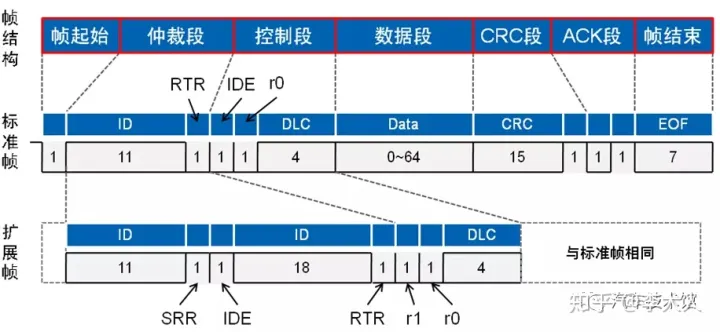

AN的帧分为两种：
标准帧和扩展帧。

这也分别对应着两个不同的协议：CAN2.0A和CAN2.0B，
由上图的结构可以看出，扩展帧和标准帧的区别在于ID的长度，标准帧是11位的长度，而扩展帧是29位的长度，具体的情况我们在后边介绍。

下面我们逐一地说明一下帧结构的组成部分：

帧起始:

帧起始是一个显性位电平，当总线空闲时，发送节点发送一个显性电平，所有的接收节点同步于该帧起始位。这里稍微补充一下，在CAN通讯中，
低电平代表的是显性电平，高电平代表的是隐性电平，所以，一个总线显性电平的信号如下：
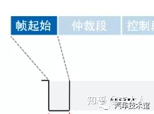

这一个显性电平的发出也代表着一帧信号的开始。

仲裁段:

由一开始我们分享给大家的帧结构可以看出，对于标准帧来说，仲裁段包含的部分是：ID和RTR，而对于扩展帧，仲裁段包含的部分是：ID、SRR、IDE和RTR
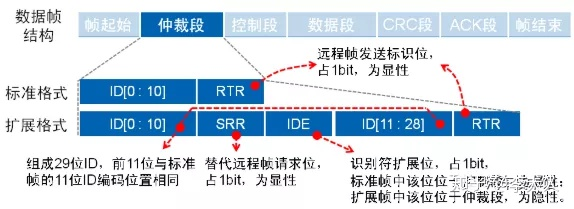

为什么这一段称为仲裁段呢？这里我们就要说一下CAN通讯的仲裁机制。
之前对CAN通讯有所了解的朋友应该知道，CAN通讯在收发数据的时候是没有像LIN那样的调度机制的，
理论上来说，任何一个CAN节点在任何一个时刻都可以向总线发送数据，那么如果多个节点同时向总线发送数据就需要对信号进行裁决，
所谓的裁决就是决定出来谁的可以发，谁的不可以发，因为只有一条总线，所以同一个时刻只能发送一帧消息。

在进行裁决的时候，依据就是信号的ID，总线会对ID进行逐位的比较，比较的过程中显性电平胜出，隐形电平退出发送。举例如下：

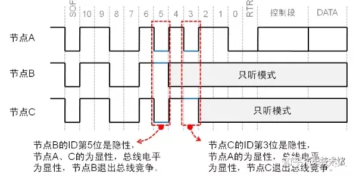

通过两次裁决之后，A节点最终获得了信息的发送权，B和C节点则在裁决过程中逐一地退出发送模式，这就是CAN信息的仲裁，所以这一段称之为仲裁段。
从这里大家应该也可以看出，其实CAN的ID就决定了这帧CAN消息发送的优先级，当然这也是在整车的网路架构开发时根据不同节点的应用定义出的优先级，然后再分配相应的ID。

CAN的ID的数值越小，其优先级越高,仲裁机制对于标准帧和扩展帧是一样的

仲裁段中除了ID外，还有RTR，这个位是为了区分数据帧和远程帧的，当RTR为显性电平时代表的是数据帧，当RTR为隐形电平时代表的是远程帧。既然RTR也在仲裁段内，
那么就会和消息的优先级有关系，如果在一帧消息内，ID都是完全一样的，到了RTR位的时候，数据帧是显性的，显然就击败了远程帧，所以同样ID下，
数据帧的优先级高于远程帧，其仲裁过程如下：

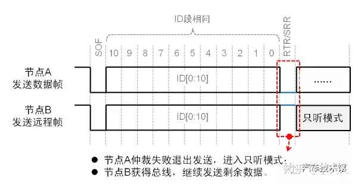

接下来我们再看IDE这个标志位，这个位存在于标准帧的控制段，而存在于扩展帧的仲裁段，这个位在两个帧当中的相对位置是一样的，都是第十三位，
所以在一个网络中如果既存在标准帧又存在扩展帧，而且两个帧类型的ID是一样的，那么标准数据帧的优先级是高于扩展数据帧的，因为仲裁到第十三位时，标准帧的IDE是显性电平，而扩展帧的IDE是隐性电平，所以标准数据位胜出。
在扩展帧当中还有一个SRR位，这个是在同样的位置替代远程请求帧的RTR的。

控制段:

两种类型的帧控制段的长度都是六位，在标准帧中的控制段包含IDE，保留位r0以及数据长度DLC；在扩展帧中的控制段包含保留位r0，r1以及数据长度DLC。

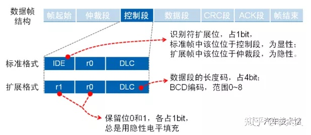

标准帧中包含的IDE在上一个章节中已经提到了，这里不再赘述。
保留位暂时没有特别的用途，所以一般都用隐性位填充。DLC代表的就是下一个部分数据段的长度，从编码的规则上来说是BCD编码，
可以表示的长度范围是0到8，根据具体的应用长度定义即可。

数据段:

这一块没有什么需要特别说明的了，根据需要传输的数据长度传输相应的字节即可。

每次传输最多只有八个字节，至于多帧传输的问题，我们在后边的文章中再给大家介绍说明。

CRC段:

CRC中文的意思是循环冗余校验，其目的就是要对这一帧信号中前面的部分进行校验，以保证数据传输的正确性，校验的部分包括：帧起始、仲裁段、控制段以及数据段。

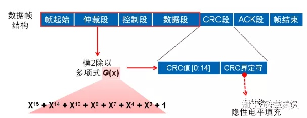

发送节点在发送数据时会把计算的校验值写到CRC段，接收节点在接收数据时，会在接收节点以同样的CRC校验方式进行计算，然后比对自己的计算结果和接收的计算结果，
以判断数据在传输的过程中是否出现了位丢失或者其它位错误的情况，是一种通讯安全的机制。和其他的累加和校验什么的都是类似的，只是CRC校验的原理稍微复杂一点，在校验的安全性上更高。

ACK段:
这一段和CRC是相关的，上一段进行了CRC校验的比对，如果CRC校验结果没有问题的话，接收节点会在总线发送一个显性电平。

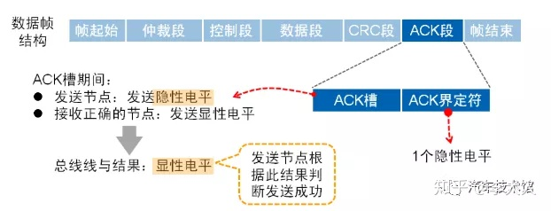

最终总线的电平状态是显性电平。

帧结束:

和一开始的帧起始相呼应，帧结束是由七个连续的隐性电平组成.

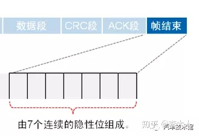

在各种类型的CAN帧中，不管是数据帧还是远程帧，数据帧还是扩展帧都是包含相同的帧起始和帧结束。

## CAN通讯的一些特点

它是一种多主总线，即每个节点机均可成为主机，且节点机之间也可进行通信。

通信介质可以是双绞线，通信速率最高可达1mb/s。

CAN总线通信接口中集成了CAN协议的物理层和数据链路层功能，可完成对通信数据的成帧处理，包括位填充、数据块编码、循环冗余校验、优先级仲裁等项工作。

数据段长度最多为8个字节，可满足通常工业领域中控制命令、工作状态及测试数据的一般要求。同时，8个字节不会占用总线时间过长，从而倮证了通信的实时性。

CAN协议采用crc检验并可提供相应的错误处理功能，保证了数据通信的可靠性。CAN总线所具有的卓越性能、极高的可靠性和独特设计，特别适合工业设备测控单元互连。因此备受工业界的重视，并已公认为最有前途的现场总线之一。

仪表如何获取如此多的信息

从上面的介绍我们可以看到，仪表可以显示的信息已经非常多，没错，这是仪表本身具备的能力，它可以显示出这么多的信息，那么这么多的信息都从哪里来呢？
下面举例来说。

仪表要显示发动机的转速，那就要实时的获取发动机的转速，而转速的测量一般都需要使用传感器，在现在的发动机中都是使用曲轴位置传感器测量发动机的转速的，
但是曲轴位置传感器又没有办法直接接到仪表上，因为曲轴位置传感器需要把信号直接传递给发动机的ECU用于发动机的控制，
那么仪表想要获取这个发动机的转速信息只能跟发动机的ECU去索取，既然仪表需要，发动机的ECU共享这个信息给仪表也不是什么大事，
关键的是要找一种方式，如何去共享比较合适，因为发动机的转速包含了太多的数值，最起码包含了0到8000转的这么一个范围，
也就是8000种可能性，如果想通过普通的电压信号表示基本是不可能的，所以最好的解决方式就是使用通讯信号，
通讯信号是最好的载体，可以表达更多的可能性，比如一个10位长度的信号可以有1024种可能性，就算你想把信息表达到10000，
分配14位的信号足够了。而上篇文章中我们分享的CAN基础知识中说到，一帧CAN消息就可以装载8字节的消息，

8个字节 = 64位

而我们想要表达一个转速信息，可能14位就足够了，只用了一帧CAN消息的四分之一不到，所以，对于CAN消息来说传递这样的消息简直是太轻松了，小菜一碟。因此，
通过CAN通讯，发动机的ECU把发动机转速这样的信息分享给仪表是一种很好的方式，而实际的应用中，现在大多数也都是这样应用的。

以上呢，我们只是举了一个简单的例子，当然发动机ECU要传递给仪表的信息远不止这么一个，还有可能比较熟悉的发动机水温信号和发动机机油压力信号，当然还有最为重要的就是发动机的故障状态，当发动机监测到一些故障之后会把相应的状态信息通过CAN总线发送给仪表，仪表根据具体的信息去点亮相应的故障灯。

除了发动机的ECU传递给仪表的这些信息之外，还有其它的很多信号，比如车门状态信息、安全带未系、灯光状态、转向灯状态、后备箱状态以及胎压信号等，这些都是有车身控制器BCM首先直接控制和获取，然后通过CAN总线传递给仪表的。

比如还有电子手刹状态，有没有开启自动驻车，这些状态是由电子驻车控制器EPB通过CAN总线发送给仪表的。

## 图解信号传递路径

上面说了那么多，有的朋友可能会说不太直观，还是没有办法一目了然的看到信号的传递过程，下面我们就以点亮发动机故障灯的例子来图解一下信息流。

首先，点亮发动机故障灯，根本原因是发动机出现了某些故障，所以，故障产生于发动机的ECU.

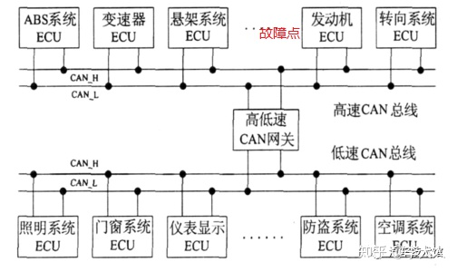

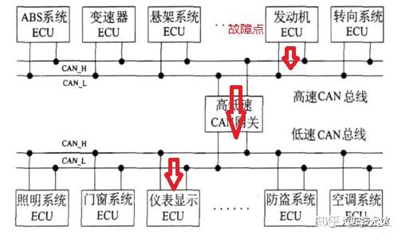

CANFD的应用越来越多，起因于车辆上需要的通讯数据越来越多，原有的CAN负载率逐年升高，但是原有的CAN通讯的架构已经非常的庞大，
如果全部推翻更换一个全新的通讯方式所要付出的代价实在是太大，所以CANFD不失为一个比较好的折中方案，既能兼容原有的CAN通讯，又不至于增加太高的成本，同时还可以大大提高数据的传输量。

下面是一些ECU单元及其信号：

360环视

    AVM故障状态类型AVM车速信息显示AVM就绪状态图像显示轨迹线AVM运行状态激活状态视角选择

ADAS

    快捷开关车道偏离

AEB

BMS

    备用电源模式备用电能使能状态车辆剩余电量输出电压整车电源负载程度预约充电开关预计充电时间每公里电池消耗能量回收模式电量模式设置充电模式设置充电插抢提示无线充电状态

Chime

ESP（车身电子稳定系统）

HUD

    HUD功能使能状态HUD显示跟车距离使能状态HUD显示限速HUD显示自适应巡航HUD显示告警HUD显示导航HUD显示电话

IPK

P2P点对点辅助泊车

    P2P视角状态P2P视角切换P2P分辨率显示退出P2P泊车

PDC

报警和警告

玻璃

刹车

    刹车开合度

车窗

    主驾车窗状态副驾车窗状态左后车窗状态右后车窗状态便捷控制遥控降窗遥控升窗门窗集控

车灯

    车灯状态

车门

    主驾车门状态

车速辅助

车锁

    车门锁模式

大气压监测

导航

倒车影像

    动态辅助线静态辅助线障碍物显示状态

电话

陡坡缓降

方向盘

氛围灯

服务状态

个性化设置

    伴我回家模式是否开启保持亮灯时间停车灯状态寻车指示设置持续时间舒适空调转向手感迎宾音开关

行车电脑

行人提醒

    危险行人ID危险行人横向相对距离危险行人横向相对速度危险行人纵向相对速度

后视镜

驾驶模式

    驾驶模式选择驾驶模式故障提醒

交通拥堵辅助

    交通拥堵系统工作状态交通拥堵路段与当前位置距离交通拥堵路段平均车速交通拥堵路段长度

空调

蓝牙

雷达

    各雷达状态各雷达障碍物范围

视频

胎压监测

    胎压初始化胎压测类型四轮胎压值四轮胎压状态胎压温度警告

天窗

外部灯光

无钥匙启动

巡航设置

音乐和语音

引擎

油耗电耗

油门

    油门位置

雨刮

    雨刮速度雨刮喷水雨刮模式雨刮状态倒车时自动开启后窗雨刮

整车系统

智能设备

自动驻车

座椅