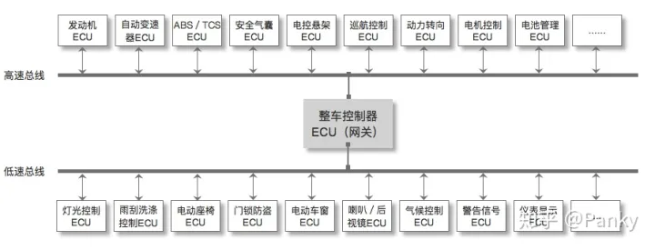
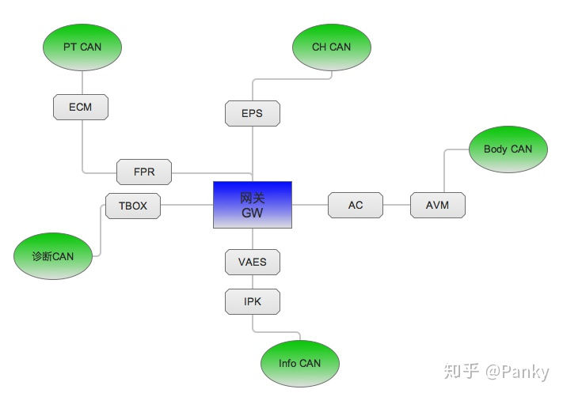
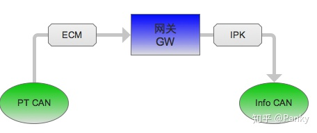
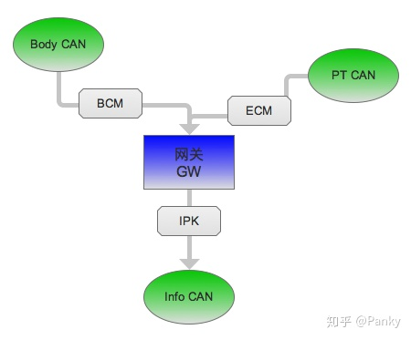

# 汽车CAN网络及车辆信号

CAN，Controller Area Network，控制器局域网。

通常车上有两类CAN：
1. 高速总线——速率500kb/s，主要面向实时性要求较高的控制单元。如发动机、电动机等。

2. 低速总线——速率100kb/s，主要针对车身控制的。如车灯、车门、防盗等信号的采集及反馈。采集的信号多但实时性差一些。

可以看到CAN连接了多个ECU, ECU，Electronic Control Unit 电子控制单元。汽车专用的微机控制器。比如发动机ECU，
专门负责控制发动机进气量、喷油量、排气量。相当于发动机的大脑，具有发送和接收信号、参数存储等功能。

每条CAN总线一般由2根线组成的双绞线构成，一根can_high，一根can_low。分别代表高电平和低电平。

把不同的控制模块分个类，每个类型用一根CAN总线控制。一般燃油车上有5条CAN总线：

动力总成CAN（PowerTrain CAN）PT CAN负责车辆动力，是整车CAN网络信号优先级和信号传输速率最高的一条CAN总线。
1. ECM（Engine Control Module） 发动机控制模块
2. SRS（Supplemental Restraint System） 电子安全气囊
3. BMS（Battery Management System） 电池管理系统
4. EPB （Electronic Park Brake），电子驻车系统

底盘控制CAN（Chassis CAN）CH CAN负责汽车底盘和四轮的制动／稳定／转向，所以网络信号优先级也是较高的。

1. ABS（Antilock Brake System），防抱死制动系统
2. ESP（Electronic Stability Program），车身电子稳定系统
3. EPS（Electric Power Steering），电子转向助力

车身控制CAN（Body CAN） Body CAN主要负责车身的安全性／舒适性硬件的管理和控制，网络信号优先级较低。

1. AC（Air Condition），空调
2. AVM（Around View Monitor），360环视
3. BCM（Body Control Module），天窗、车窗、雾灯、转向灯、雨刮等
4. IMMO（Immobilizer），发动机防盗系统
5. TPMS（Tier Pressure Monitoring System），胎压监控系统

娱乐系统CAN（Info CAN）Info CAN的优先级也相对较低。

1. VAES（Video Audio Entertainment System），车载娱乐中控
2. IPK（Instrument Pack），组合仪表、数字仪表

诊断控制CAN（Diagnose CAN）
1. T box（Telematic BOX），远程控制模块

CAN网关是整个CAN网络的核心，负责控制整车所有总线上各类信号的处理和转发。

CAN网关可以接收任何CAN总线传来的不同传输速率的网络信号，并将这些信号按一定标准处理后，广播到整车网络中。
如果有ECU订阅（接收）了这个信号，则ECU负责解析信号并做相应处理。

举个例子，比如仪表盘上显示发动机转速。

1. 发动机的转速信号先从PT CAN的ECM节点发出
2. CAN网关收到后，处理并广播ECM信号出去到其他4条总线
3. Info CAN上的仪表IPK节点接收了发送机转速信号，解析后显示到仪表盘上

   由于信号发送频率很快，因此会看到仪表盘上的转速指针一直在不停地偏动。

再举一个例子，安全带未扣，仪表端报警。

安全带未扣报警需满足两个条件：

1）车速大于20 2）安全带扣未扣，即无电压信号

1. 网关收到PT CAN上ECM节点发出来的车速信号，并收到Body CAN上的BCM发出来的安全带扣电压值为异常值
2. 网关收到信号后统一处理并广播出去
3. Info CAN上的仪表IPK节点接收后，解析信号，报警并显示到仪表盘上

上面只是两个简单的例子。实际上整车所有ECU单元基本是以毫秒级或微妙级的速度在源源不断发送和接收信号。

下面是一些ECU单元及其信号：

360环视

    AVM故障状态类型AVM车速信息显示AVM就绪状态图像显示轨迹线AVM运行状态激活状态视角选择

ADAS

    快捷开关车道偏离

AEB

BMS

    备用电源模式备用电能使能状态车辆剩余电量输出电压整车电源负载程度预约充电开关预计充电时间每公里电池消耗能量回收模式电量模式设置充电模式设置充电插抢提示无线充电状态

Chime

ESP（车身电子稳定系统）

HUD

    HUD功能使能状态HUD显示跟车距离使能状态HUD显示限速HUD显示自适应巡航HUD显示告警HUD显示导航HUD显示电话

IPK

P2P点对点辅助泊车

    P2P视角状态P2P视角切换P2P分辨率显示退出P2P泊车

PDC

报警和警告

玻璃

刹车

    刹车开合度

车窗

    主驾车窗状态副驾车窗状态左后车窗状态右后车窗状态便捷控制遥控降窗遥控升窗门窗集控

车灯

    车灯状态

车门

    主驾车门状态

车速辅助

车锁

    车门锁模式

大气压监测

导航

倒车影像

    动态辅助线静态辅助线障碍物显示状态

电话

陡坡缓降

方向盘

氛围灯

服务状态

个性化设置

    伴我回家模式是否开启保持亮灯时间停车灯状态寻车指示设置持续时间舒适空调转向手感迎宾音开关

行车电脑

行人提醒

    危险行人ID危险行人横向相对距离危险行人横向相对速度危险行人纵向相对速度

后视镜

驾驶模式

    驾驶模式选择驾驶模式故障提醒

交通拥堵辅助

    交通拥堵系统工作状态交通拥堵路段与当前位置距离交通拥堵路段平均车速交通拥堵路段长度

空调

蓝牙

雷达

    各雷达状态各雷达障碍物范围

视频

胎压监测

    胎压初始化胎压测类型四轮胎压值四轮胎压状态胎压温度警告

天窗

外部灯光

无钥匙启动

巡航设置

音乐和语音

引擎

油耗电耗

油门

    油门位置

雨刮

    雨刮速度雨刮喷水雨刮模式雨刮状态倒车时自动开启后窗雨刮

整车系统

智能设备

自动驻车

座椅