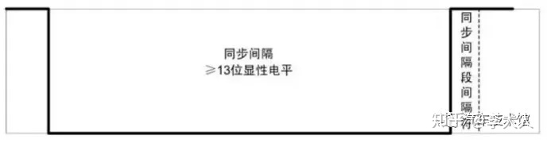
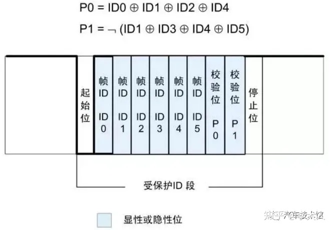
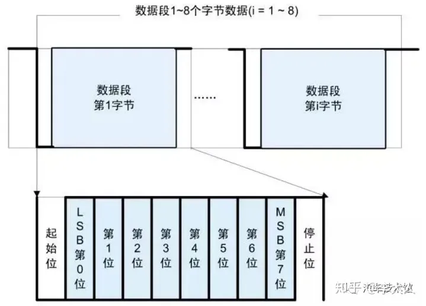
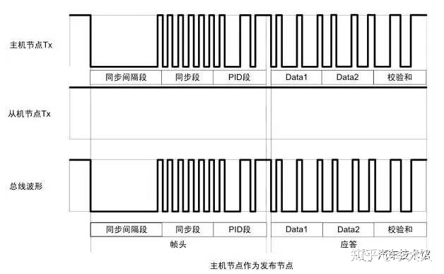
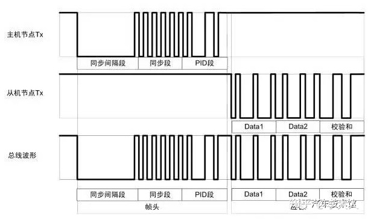
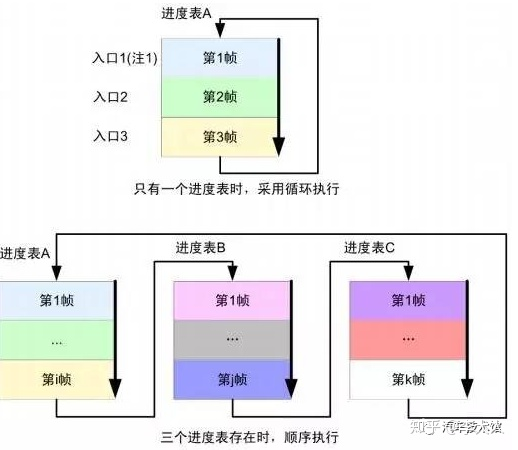

## 汽车Lin线路

LIN总线是为汽车分布式电子系统定义的低成本串行通信网络，是对CAN等其他汽车多路网络的补充，
适用于对网络带宽、性能或容错性要求不太高的应用。 LIN总线基于SCI(UART)数据格式，
采用单主控制器/多从设备的模式，是UART中的特例。

LIN总线工作原理:
LIN总线控制的控制单元一般分布在空之间，距离较短，数据传输为单线，最长数据线可达40m。
主节点配置1kω电阻端接12V电源，从节点配置30kΩ电阻端接12V电源。 每个节点通过电池的正端电阻向总线供电，
每个节点可以通过内部变送器拉低总线电压。

LIN主控单元连接到CAN数据总线，CAN数据总线监控数据传输过程和数据传输速率，发送信息标题，决定何时以及多少次向LIN数据总线发送信息。
LIN数据总线系统中的LIN控制单元和CAN总线直接起到“翻译”的作用，可以对LIN主控单元及其连接的LIN从控单元进行自诊断。

LIN总线主控单元控制总线导线上每个消息的开头，通过LIN总线主控单元发送一个信息头，该信息头由一个同步阶段和一个标识符字节组成，标识符字节可以传输2、4和8字节的数据。标识符用于确定主控制单元是否将数据传输到从控制单元。信息部分包含发送到从属控制单元的信息。
检查区可以为数据传输提供良好的安全性。检查区由主控单元的数据字节组成，位于信息的末尾。主总线控制单元LIN以循环方式发送当前信息。

在LIN数据总线系统中，LIN从控制单元的通信完全由LIN主控制单元控制。只有当LIN主控单元发出命令时，LIN从控单元才能通过LIN总线传输数据。每个控制单元、传感器和执行器相当于LIN从控制单元。传感器为信号输入装置，传感器内集成有电控装置，电控装置对测量值进行分析，
分析后的值通过LIN总线作为数字信号传输。有些传感器或执行器可以实现信息传输，即单线传输，LIN主控单元的插座上只有一个引脚。

## 什么是LIN总线

LIN是Local Interconnect Network的缩写，翻译成中文就是局域互联网络。大家应该知道CAN是Controller Area Network 的缩写，翻译成中文就是控制局域网络。
其实，说白了，两个都是局域网络，只是两个通讯的机制有所不同而已。

CAN的出现时间是20世纪的八十年代，而LIN的出现则到了二十世纪末，所以LIN的出现是明显晚于CAN的，那么LIN为什么会出现呢？这就要主要归因于LIN的成本优势了，
LIN的通讯虽然不如CAN 那么高端，但是它的价格明显低于CAN，而在整车的一些应用中则不需要CAN这么复杂的通讯方式，比如车灯，车门，一些简单的传感器和执行器，
那么使用LIN就是一种很好的选择，所以LIN才有了广泛的应用。

## LIN通讯的信号结构是什么样的？

了解过CAN通讯的朋友应该知道，通讯是基于帧的，LIN也不例外，也是基于帧的通讯，LIN的帧结构如下：

一个完整的LIN帧包含以下几个部分：

同步间隔段

同步间隔段至少是由13位的显性电平组成，由于帧中的所有间隙或者总线空闲时总线均保持隐性电平状态。
所以同步间隔段可以标志一个帧的开始。其中同步间隔段的间隔符至少为1位隐性电平。

一个完整的LIN帧包含以下几个部分：

同步间隔段
同步间隔段至少是由13位的显性电平组成，由于帧中的所有间隙或者总线空闲时总线均保持隐性电平状态。
所以同步间隔段可以标志一个帧的开始。其中同步间隔段的间隔符至少为1位隐性电平。

同步段

LIN同步以下降沿为判断标志，采用字节0x55（01010101b）进行同步。
在从机节点上可以不采用高精度的时钟，由此带来的偏差，需要通过同步段来进行调整。

受保护的ID-即PID
受保护的ID的前6位叫做帧的ID，加上两个奇偶校验码后称作受保护的ID。帧ID的取值范围为0x00~0x3f总共64个，帧ID标识了帧的类别和目的地。
从机任务会根据帧头ID作出反应（接收/发送/忽略应答）。其中P0与P1效验如下：

很多初次了解LIN通讯的朋友很容易搞混这里提到的PID的概念，因为一般在通讯中定义的都是frameID，而不是PID，尤其典型的就是LIN的描述文件LDF中，
定义的每一帧信号都是frameID，不会定义PID，一下子就会让很多人把这两个概念搞混。当然，从我们给大家分享的内容可以看出，
frameID和PID是存在一一对应的关系的，PID只是需要frameID通过算法加上第七位和第八位的数据之后组成的新字节的数值。
只有前六位是留给frameID定义的，所以这就是为什么frameID的范围只能到63的原因，六位能表示的最大值只有64啊！

有的朋友可能会问了，既然frameID和PID存在一一对应的关系，为什么还需两个数值呢，像CAN通讯一样使用一个CANID不就可以了吗？
大家知道在通讯的领域里面，一个很重要的要求就是安全，CAN通讯为什么使用双绞线，因为双绞线的差分信号可以相互检查，
确保信号传输的准确性，如果不是为了这种目的其实CAN单线也可以完成，无非就是把0和1在总线上表示出来，一条总线的高低电平就够了，
所以之所以双线也是为了信息的准确性和可靠性。对于LIN来说，就真的是单线的了，单线传输就很容易会受到干扰，把低电平弄成高的了，
把高电平弄成低的了，是有可能会发生的，所以大家看到PID是如何生成的，是把frameID的各个位进行于运算得来的，
如果某一位出现了问题，那么算出的PID和原来的就不一样了，这样就会发现出现了问题，所以它叫PID，受保护的ID。

## 数据段 

数据段可以包含1-8个字节，其中包含有两种数据类型，信号（singal）和诊断消息（diagnostic messages）。
信号由信号携带帧传递，诊断消息由诊断帧传递。

## 校验和段

校验和段是为了对帧传输内容进行校验。效验分为标准型效验与增强型效验。采用标准型还是增强型是由主机节点管理，目前的LIN通讯协议最新的是2.2A版本，在LIN2.0以上的通讯中，通讯使用的全部都是增强型校验，而诊断帧使用的则是标准型校验。而LIN2.0以下的版本中，所有的使用的都是标准型校验。

标准型校验是在计算校验和段的时候使用的计算数据只包含数据段的数据，根据数据段的定义可能是2、4、6、8个字节。

举例来说：校验和 = DATA0 + DATA1 +DATA2 +......+DATA7;

增强型校验是在计算校验和段的时候使用的计算数据不止包含数据段的数据还包含PID的数据。

举例来说：校验和 = DATA0 + DATA1 +DATA2 +......+DATA7 +PID;

因为校验和只有一个字节，所以计算校验和时超过八位的数据高位去除。

## LIN通讯的时候是如何工作的？

上面我们介绍了LIN的帧结构，有了帧结构后边我们就要给大家说一说总线怎么通讯起来了，
LIN的通讯是基于调度的，何为调度？就是必须要有一个总的协调者，这个协调者需要管理整个LIN总线的通讯情况，
而它就是主节点——一个LIN通讯中不可或缺的角色。

在一个LIN的帧结构中都包含一个frameID，这个frameID只有主节点可以发出，从节点虽然被定义了frameID，但是这个frameID永远都不会由自己发出，定义的目的只是让从节点知道，如果总线上出现了这个frameID就要知道这是自己的，这个时候需要自己做出响应，只要主节点不发送自己对应的frameID，自己永远不要响应。

既然这样那就好说了，主节点只要通过frameID的发送秩序来控制总线的通讯就可以了，主节点发出frameID一般分为两类

第一类：frameID后边跟着数据，这种帧一般都属于控制帧，用来给从节点发送控制信号的，从节点接收到这样的frameID的时候需要处理的是把总线的数据读取回来，针对响应的数据进行处理；

如下：

第二类：单纯的frameID，后边没有数据，这样的帧一般都是响应frameID，是需要从节点根据总线的framID进行响应，当从节点监测到总线出现自己的frameID时，
需要把自己需要响应的数据发送到总线上去，让主节点可以从总线读取到自己想要的数据。

既然有这样的机制，主节点想要调度所有的节点的时候，只要循环的发送不同的frameID就可以了，如下图所示：

## LIN通讯有哪些特点？

低成本：基于通用UART 接口几乎所有微控制器都具备LIN 必需的硬件；

极少的信号线即可实现国际标准ISO9141 规定；

传输速率最高可达20Kbit/s，一般才有19.2K；

单主控器/多从设备模式无需仲裁机制；

从节点不需晶振或陶瓷震荡器就能实现自同步，节省了从设备的硬件成本；

保证信号传输的延迟时间；

不需要改变LIN 从节点的硬件和软件就可以在网络上增加节点；

通常一个LIN 网络上节点数目小于12 个共有64 个标志符；
