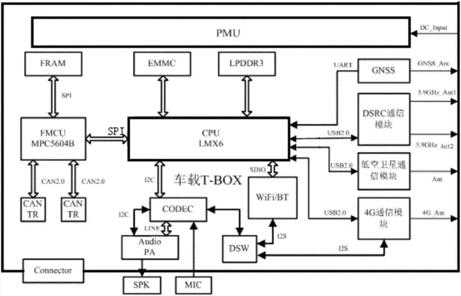

## 汽车TBox

TBox是车联网系统，专用汽车上，通俗来讲，就是用远距离通信和信息科学技术，

为汽车提供行车数据采集、远程查询和控制、监测故障等服务，例如它可以为车主提供故障诊断、

道路救援、远程开锁、控制空调等功能。

TBox系统有什么用：
1、采集存储行车数据和轨迹记录首先它可以收集并且将汽车的行驶数据和记录，然后存储在系统当中，并对这些数据进行解析，然后出现在显示屏上。

2、远程控制和查询汽车使用tbox系统可以远程查询和控制汽车，比如控制汽车开门、鸣笛、闪灯、打开空调、启动发动机等等，还可以查看汽车的定位。

3、其他作用除此之外它们还有三个实用但很少用的作用，比如道路救援、故障诊断、异常提醒等等。遭遇事故后tbox系统会自动拨打救援电话让用户得到及时救援。
出现故障时会及时的反馈；出现异常比如被拖走、防盗等等会报警提醒。

T-BOX,是英文Telematics BOX，简单理解就是通讯盒子。

TBox是车内通讯的设备，它通过网络和后台TSP平台进行联接。(Telematics Service Provider 汽车远程服务提供商)

网联汽车一般包含四部分：主机、汽车T-BOX、手机APP及后台系统。

其中主机主要用于车内，以及车辆信息显示；
TBox负责通讯，手机app和后台系统作为用户端完成信息的使用与操作。

汽车T-BOX用于用户获取车内运行状态等信息，并通过它来实现车内数据和后台系统的同步，
Tbox比较常见的应用如收集车主的车辆信息，并上传到TSP，TSP会把相关数据再推送到你的手机App，这样车主可以实时的跟踪车辆状态。

手机APP互联通信，实现后台系统/手机APP的车辆信息显示与控制。

举个例子：现在新能源车的远程泊车控制就是通过App操作时，TSP会把你的操作转化成命令下发到Tbox，Tbox再解析命令执行对应的操作来完成的。

汽车T-BOX与汽车通过CAN BUS总线通信，实现指令与信息的传递，从而获取到包括车辆状态、按键状态等信息以及传递控制指令等；通过音频连接，实现双方共用麦克与喇叭输出。
与手机APP是通过后台系统以数据链路的形式进行间接通信（双向）。T-BOX与后台系统通信还包括语音和短信两种形式，使用短信形式主要实现一键导航及远程控制功能。

一般前装Tbox与汽车CAN总线可以深度的绑定，通过各家车厂的私有协议进行传输

而后装的T-box终端则通过OBD模块和MCU，对私有协议的反向控制，来实现采集汽车的总线数据；

## 主流Tbox的功能

1、数据传输：T-box可以通过GPS模块对车辆位置进行定位，使用网络模块获取车辆相关信息，诸如：车况报告、行车报告、油耗统计、故障提醒、位置轨迹、驾驶行为、安全防盗、预约服务、远程找车等信息

2、远程控制 用户可以通过手机APP控制门开关、鸣笛闪灯、开启空调、启动发动机、车辆定位等等功能

通过不同的数据和远控功能，车主不仅仅可以及时获取车辆，还可以增添许多附加功能。
比如新能源车的车辆预热功能，用户可以设置时间，由汽车自行开始预热，和空调制冷制热，这样用户上车时车辆是一个舒适的温度状况，
如果车主将钥匙忘记在车内，或者不确定是否锁了车门但又离开车辆很远的时候，可以通过手机APP远程控制开锁和关锁。
在比较大的停车场，只需要用手机通过APP查看车辆的定位了解大致方位，再控制车辆鸣笛、闪灯就可以知道车辆的具体位置了。

现在车企可以增加许多的买点，从技术上都是通过车联网和app应用的数据传输实现的

3、安防服务功能 这一项主要是针对行车安全和防盗而设计的，包含了路边救援协助、紧急救援求助、车辆异动自动报警、车辆异常信息远程自动上传等服务。
这些功能意义非凡，关键时刻甚至可以救命。例如，碰撞自动求救功能，车辆碰撞触发安全气囊后，T-BOX会自动触发乘用车客户救援热线号码，
自动上传车辆位置信息至后台，同时后台将发信息给所有紧急联系人，短信中包含事故位置信息，以及事件信息，让事故车辆和人员得到及时的救援。

在智能汽车的时代背景下，要实现车联网，CAN总线和Tbox的结构是通讯的物理结点。

未来自动驾驶不断发展，技术越发成熟后，对汽车Tbox的需求会变得更加重要。

## JAC车联网TSP系统

该项目为江淮商用车车联网监控系统，从前装车厂T-BOX组装接入网开始，整个车辆联网周期都在TSP平台内运行。
拥有对车辆的数据的实时采集、监控、预警等基本功能。支持远程对车辆进行软件升级，指令下发等操作。

