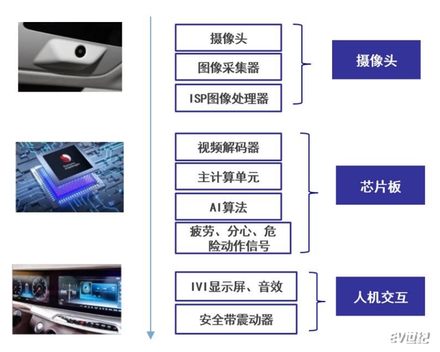
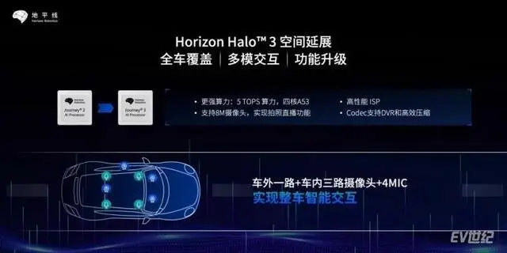

DMS，即Driver monitoring system驾驶员监测系统，是通过视觉识别及生理指标、
车辆信息处理，来监测驾驶员状态， 包括身份认证、疲劳、分心以及危险驾驶行为（如酒驾、通话和喝水）等。

据信达证券数据，2021 年我国 DMS 渗透率约 5.3%左右，预计 2026 年整体装配率有望达 35%，市场空间有望达到 44 亿元。
此外，由于自动驾驶仍将长期处于人机共驾的状态，视觉 DMS 系统也被作为了 L2+/L3 等高阶智驾的标配。

DMS 的快速普及背后，既有更成熟的产品技术支撑，也有政策法规的强制性推动，
全球四大汽车市场中的欧盟、中国、美国等在内的主要汽车市场都将DMS标配提升了日程。
其中，激进的欧盟还规定，自2023年起Euro NCAP 将在其五星级安全评估中包括对驾驶员直接监控的测试。

目前，在DMS前装方案方面，主要有软硬一体（多家供应商组合，独立的外挂ECU）、纯算法两种模式。

“高工汽车”此前一份报告指出，未来DMS系统的趋势是与座舱或域控制器集成，

通过在算力芯片嵌入DMS算法，来集成系统和控制成本。随着智能汽车的款式换代，依托旧车型平台的外挂ECU将被逐步淘汰。

这为SoC芯片厂商提供了发展机会，高通、英伟达、Mobileye以及本次上榜的地平线，都在推进这方面业务。

在快速爆发的国内市场，地平线相关方案的快速前装上车引人注目。作为国内领先的智能计算平台提供商，地平线是较早实现DMS嵌入式方案前装量产的厂商之一。

而除了单纯的DMS上车，地平线还在同一套方案中为驾乘人员提供了更多附加值，以2022年5月上市的奇瑞瑞虎8 Pro为例，该车依托地平线征程3芯片，

采用视觉+语音的多模态感知前融合技术，还提供了多模语音、视线、手势等更自然的车内交互，这也是业界首款实现全场景多模交互的智能汽车。

在包括DMS在内的智能驾驶领域，地平线已经与比亚迪、上汽、理想、长安、广汽、奇瑞等国内20余家车企展开落地合作。

截至2022年末，其征程系列芯片已实现定点或量产车型70+，出货量超过200w片