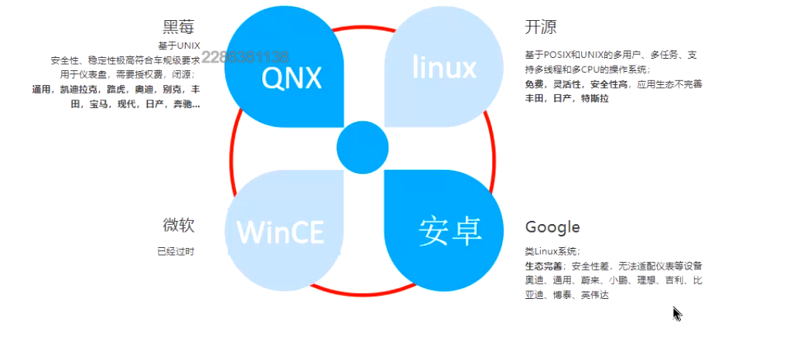
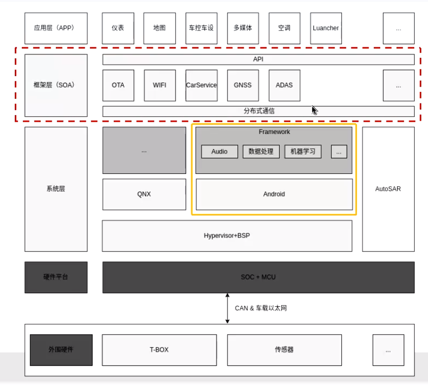
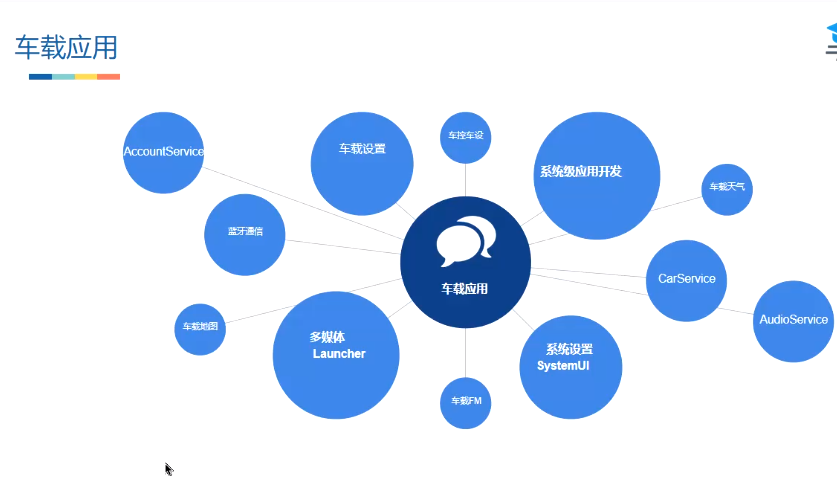

# 车载系统现状

黑莓 基于UNIX 安全性 稳定性高 符合车规就级别要求 用于仪表 闭源 需要收费 凯迪拉克 路虎 奥体 别克 丰田 宝马 现代
最重要的就是安全性

娱乐系统 
微软 WinCE 已经过时

Android 类Linux系统 生态系统 安全性差  无法适配仪表等设备 哀痛 蔚来 小鹏  理想 吉利

Linux 基于POSIX 和 UNIX的多用户  多任务 支持多线程 和 cpu 的操作系统 免费 灵活性高

车载系统的现状如图

## 架构

分布式通信 SOA 目前为止 没有统一标准 车载目前没有完完整整 可以通用复制的架构

不能随便安装应用 恶意应用 保证安全性 不允许随便安装引用

车载应用 和普通应用差别并不是很大 
区别就是Frameworok的 
普通应用 大量的适配
车载的编译开发本身没区别 编译 安装的方式不同

## 车载应用

## 车载涉及的那些缩写

1. BT	Bluetooth	蓝牙
2. GNSS	Global Navigation Satellite System	全球导航卫星系统
3. IVI	In Vehicle Infotainment	车载信息娱乐系统
4. MCU	Microcontroller Unit	微控制单元
5. OTA	Over the Air Technology	远程升级
6. DVR	Digital Video Recorder	行车记录仪
7. DMS	Driver Monitor System	驾驶员监测系统
8. RVC	Rear View Camera	倒车影像
9. APA	Automated Parking Assist	自动泊车辅助系统
10. USB	Universal Serial Bus	通用串行总线
11. SDK	Software Development Kit	软件开发工具包
12. API	Application Program Interface	应用程序编程接口
13. DSP	Digital Signal Processing	数字信号处理
14. ECU	Electronic Control Unit	电子控制单元
15. ESC	Electronic Stability Control	电子稳定控制系统
16. LDW	Lane Departure Warning	车道偏离预警
17. FCW	Forward Collision Warning	前碰撞预警
18. TSR	Traffic Sign Recognition	交通标志识别
19. AEB	Autonomous Emergency Braking	自动刹车辅助系统
20. EPB	Electrical Park Brake	电子驻车系统
21. GPS	Global Positioning System	全球定位系统

## 业务的缩写

CR（Change Request）是计算机与通信用语，用于记录和追踪缺陷、扩展请求和任何其他类型的产品变更请求。